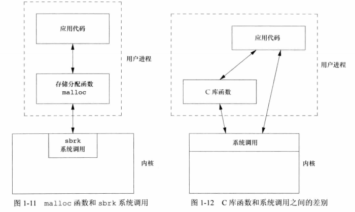

## <center>unix基础知识</center>

### 登录
* /etc/passwd 文件
* 口令文件
```
root:x:0:0:root:/root:/bin/bash

登录名:加密口令(x):数字用户ID(0):数字组ID(0):注释字段:起始目录(/root):shell程序(/bin/bash)

加密口令：x 代表用户密码会被加密保存在文件 /etc/shadow中

/etc/shadow

mongodb:*:17722:0:99999:7:::

用户名:
加密后的密码:
上次修改密码的时间(距离1970.1.1总天数):
两次修改密码间隔在最少天数，如果为0，没有限制:
两次修改密码间隔最多的天数，表示该用户的密码会在多少天后过期，如果为99999则没有限制:
提起多少天警告用户密码将过期:
在密码过期后多少天禁用此用户:
用户过期日期(从1970.1.1开始的总天数)，如果为0，则改用户永久保留:
保留

加密的密码格式
$id$salt$encrypted
id：加密算法 1代表MD5,5代表SHA-256,6代表SHA-512 
salt：密码学中的salt
encrypted：表示密码的hash
```

### 文件和目录
* 每当运行一个新程序时，所有的shell都为其打开3个文件描述符，即标准输入，标准输出，标准错误，默认连接向终端
* open ,read, write , lseek ,close 提供不带缓冲的I/O

### 线程
* 一个进程内的所有线程共享同一地址空间、文件描述符、栈及进程相关的属性

### 错误
* errno
  - 如果没出错，其值不会被例程清除
  - 任何函数都不会讲errno值设置为0
  - <errno.h>中定义的所有常量都不为0
* 出错恢复
  - 与资源相关的非致命出错：EAGAIN ENFILE ENOBUFS ENOLCK ENOSPC EWOULDBLOCK ENOMEM EBUSY
```c
#include <errno.h>
extern int *_errno_location(void);
#define errno (*_errno_location())

#include <string.h>
char *strerror(int errnum);
//返回值:指向消息字符串的指针

#include<stdio.h>
void perror(const char *msg); 
//基于errno的当前值，在标准错误上产生一个出错消息字符串，并且返回此字符串的指针
```

### 用户标识
* 组文件 /etc/group  
  - 口令文件包含了登录名和用户ID之间的映射关系
  - 组文件包含了组名和组ID之间的映射关系

```c
getuid() getgid()
```

### 信号
* 默认终止进程
* kill 产生信号
* 当向一个进程发送信号时，我们必须是那个进程的所有者或者超级用户
* signal函数捕捉信号

### 时间值
* time -p grep _POSIX_SOURCE */*.h > /dev/null

### 系统调用和库函数
* unix所使用的技术是为每个系统调用在标准C库中设置一个具有同样名字函数
