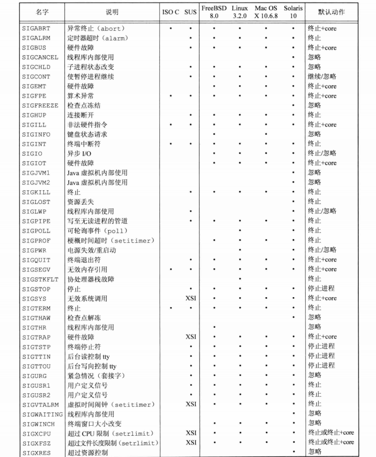

## <center>信号</center>

* <sys/signal.h> 或 <bits/signum.h>



### signal
* func 是常量SIG_IGN 常量SIG_DFL 或当接到此信号号要调用的函数的地址
```c
#include <signal.h>
void (\*signal(int isgno,void (\*func)(int)))(int);
//返回：成功，返回以前的信号处理配置，出错，SIG_ERR

typedef void Sigfunc(int);
Sigfunc *signal(int,Sigfunc *);
```
[example](signalo.c)
```s
$ ./signalo & #后台运行
$ kill -USR1 $(pidof signalo)
$ kill -USR2 $(pidof signalo)
$ kill $(pidof signalo)
```

* exec函数将原先设置为要捕捉的信号都更改为默认动作
* 当一个进程调用fork时，其子进程继承父进程的信号处理方式
```c
//仅当SIGINT和SIGQUIT当前未被忽略时，进程才会被捕捉他们
void sig_int(int),sig_quit(int);
if(signal(SIGINT,SIG_IGN)!=SIG_IGN)
  signal(SIGINT,sig_int);
if(signal(SIGQUIT,SIG_IGN)!=SIG_IGN)
  signal(SIGQUIT,sig_quit);
```

### 中断的系统调用
* 当捕捉到某个信号时，被中断的是内核中执行的系统调用
* 系统调用
  - 低速系统调用
  - 其他系统调用
