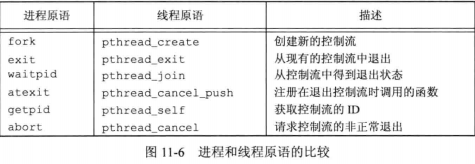

## <center>线程</center>

### 线程函数
* 返回
  - 从例程中返回，返回值是线程的退出码
  - pthread_exit
  - 被同进程其他线程取消

* pthread_cancel并不等待线程终止，它仅仅提出请求
* 线程清理处理程序，记录在栈中，执行顺序和注册时相反
  - 调用pthread_exit
  - 相应取消请求时
  - 用非零execute 参数调用pthread_cleanup_pop

* 线程分离 pthread_detach
  - 线程已经被分离，线程的底层存储资源可以在线程终止时立即被收回
  - 不能用pthread_join函数等待它的终止状态
* 顺序一致：把数据修改操作解释为运行线程的顺序操作步骤
```c
#include <pthread.h>
int pthread_equal(pthread_t tid1,pthread_t tid2);
//返回：相等 非0数值，否则 0
pthread_t pthread_self(void);
//返回：调用线程的线程ID
int pthread_create(pthread_t &tidp,const pthread_attr_t *restrict attr,
                  void *(*start_rtn)(void *),void *restrict arg);
//返回：成功 0 ，失败 错误码                  
void pthread_exit(void *rval_ptr);
int pthread_join(pthread_t thread,void **rval_ptr);//阻塞
//返回：成功，0，否则返回错误编号

void *thr_fn(void *arg)
{
  printids("new thread: ");
  return ((void *)0);
}


int pthread_cancel(pthread_t tid);// pthread_exit(PTHREAD_CANCELED)
//返回：成功 0 否则 错误编码
int pthread_cleanup_push(void (*rtn)(void *),void *arg);
void pthread_cleanup_pop(int execute);

int pthread_detach(pthread_t tid);
//返回：成功，0，失败 错误编码
```



### 互斥量
* 初始化 PTHREAD_MUTEX_INITIALIZER(适用于静态分配的互斥量)
* pthread_mutex_init attr =NULL 初始化默认值
* pthread_mutex_lock 阻塞直到获得锁
* pthread_mutex_trylock 成功 0 ，失败返回 EBUSY
* 死锁必要条件
  - 互斥条件
  - 不剥夺条件 已获得的资源不可被强占
  - 请求和保持条件 至少保持一个资源又提出新的资源请求
  - 循环等待条件
* pthread_mutex_timelock 超时返回错误码 ETIMEOUT
```c
#include <pthread.h>
int pthread_mutex_init(pthread_mutex_t *restrict mutex,const pthread_mutexattr_t *restrict attr);
int pthread_mutex_destroy(pthread_mutex_t *mutex);//删除malloc分配的互斥量
//返回：成功 0 否则 错误编码
int pthread_mutex_lock(pthread_mutex_t *mutex);
int pthread_mutex_trylock(pthread_mutex_t *mutex);
int pthread_mutex_unlock(pthread_mutex_t *mutex);
//返回：成功 0 否则 错误编码
#include <pthread.h>
#include <time.h>
int pthread_mutex_timelock(pthread_mutex_t *restrict mutex,const struct timespec *restrict tsptr);
//返回：成功 0 否则 错误编码
```
[example](mutexo1.c)

#### 读写锁
* pthread_rwlock_tryrdlock pthread_rwlock_trywrlock 可以获取锁时，返回0，否则返回EBUSY
* pthread_rwlock_rdlock 出错可能是读锁多
```c
#include <pthread.h>
pthread_rwlock_t rwlock = PTHREAD_RWLOCK_INITIALIZER;
int pthread_rwlock_init(pthread_rwlock_t *restrict rwlock,const pthread_rwlockattr_t *restrict attr);
int pthread_rwlock_destroy(pthread_rwlock_t *rwlock);
//阻塞式
int pthread_rwlock_rdlock(pthread_rwlock_t *rwlock); //读模式锁
int pthread_rwlock_wrlock(pthread_rwlock_t *rwlock); //写模式锁
int pthread_rwlock_unlock(pthread_rwlock_t *rwlock)；//解锁
int pthread_rwlock_tryrdlock(pthread_rwlock_t *rwlock); 
int pthread_rwlock_trywrlock(pthread_rwlock_t *rwlock);
//返回：成功 0 否则 错误编码
#include<pthread.h>
#include<time.h>
int pthread_rwlock_timedrdlock(pthread_rwlock_t *restirct rwlock,const struct timespec *restrict tsptr);
int pthread_rwlock_timedwrlock(pthread_rwlock_t *restrict rwlock,const struct timespec *restrict tsptr);
//返回：成功 0 否则 错误编码  超时ETIMEDOUT
```
[example](wrlocko.c)

#### 条件变量
* 条件变量与互斥量一起使用，允许线程以无竞争的方式等待特定的条件发生
* 条件本身是由互斥量保护的。线程在改变条件状态之前必须首先锁住互斥量，其他线程在获得互斥量之前不会察觉到这种改变。因为互斥量必须在锁定以后才能计算条件
* 调用者把锁住的互斥量传给函数，函数然后自动把调用线程放到等待条件的线程列表上，对互斥量解锁
* pthread_cond_wait 返回时，互斥量再次被锁住
* 解锁，保存线程标识符，挂起 原子操作，用互斥量锁住
```c
#include<pthread.h>
pthread_cond_t cond  = PTHREAD_COND_INITIALIZER;//静态分配的条件变量
int pthread_cond_init(pthread_cond_t *restrict cond,const pthread_condattr_t *restrict attr);//动态分配的条件变量
int pthread_cond_destroy(pthread_cond_t *cond);//反初始化
//返回：成 0 否则 错误编号
int pthread_cond_wait(pthread_cond_t *restrict cond,pthread_mutex_t *restrict mutex);
int pthread_cond_timedwait(pthread_cond_t *restrict cond,pthread_mutex_t *restrict mutex,const struct timespec *restrict tsptr);
int pthread_cond_signal(pthread_cond_t *cond);
int pthread_cond_broadcast(pthread_cond_t *cond);
//返回：成功 0 否则 错误编号

#include<sys/time.h>
#include<stdlib.h>
void maketimeout(struct timespec *tsp,long minutes)
{
  struct timeval now;
  gettimeofday(&now,NULL);
  tsp->tv_sec = now.tv_sec;
  tsp->tv_nsec = now.tv_usec*1000;
  tsp->tv_sec+= minutes*60;
}
```

#### 自旋锁
* 在获得锁之前一直处于忙等(自旋)阻塞状态
* pshared 表示进程共享属性
  - PTHREAD_PROCESS_SHARED 自旋锁能被可以访问底层内存的线程所获取
  - PTHREAD_PROCESS_PRIVATE 自旋锁就只能被初始化该锁的进程内部的线程所访问
```c
#include <pthread.h>
int pthread_spin_init(pthread_spinlock_t *lock,int pshared); 
int pthread_spin_destroy(pthread_spinlock_t *lock);
int pthread_spin_lock(pthread_spinlock_t *lock); // 0 被加锁
int pthread_spin_trylock(pthread_spinlock_t *lock); // 0 被加锁
int pthread_spin_unlock(pthread_spinlock_t *lock);
//返回：成功 0 否则 错误编号
```

#### 屏障
* 屏障允许每个线程等待，直到所有的合作线程都到达某一点
* pthread_barrier_init
  - count 继续运行之前必须到达屏障的线程数目
```c
#include <pthread.h>
int pthread_barrier_init(pthread_barrier_t *restrict barrier,const pthread_barrierattr_t *restrict attr,unsigned int count);
int pthread_barrier_destroy(pthread_barrier_t *barrier);
//返回：成功0否则错误编号
int pthread_barrier_wait(pthread_barrier_t *barrier);//表名线程已经完成工作，准备其他线程赶上来
//返回值：成功 0 或PTHREAD_BARRIER_SERRIAL_THREAD,否则 错误编号
```