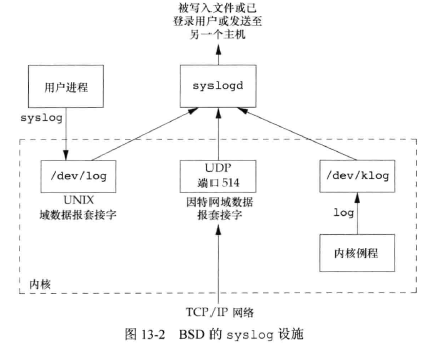
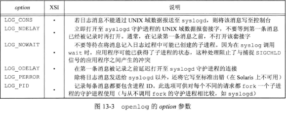
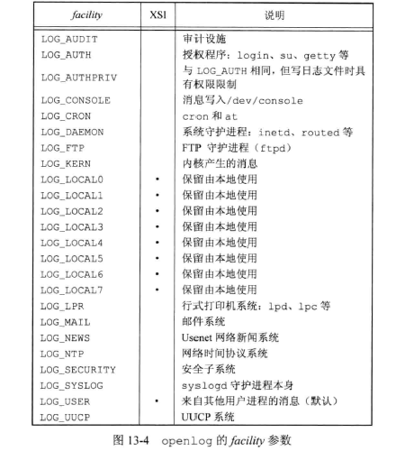
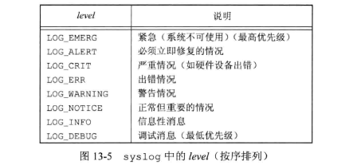

## <center>守护进程</center>

* 守护进程为什么没有？
* 守护进程的日志呢？

### 出错记录


```c
#include<syslog.h>
#include<stdarg.h>
void openlog(const char *ident,int option,int facility);
void syslog(int priority,const char *format,...);
void closelog(void);
int setlogmask(int maskptr);//设置进程的记录优先级屏蔽字
//返回值：前日志记录优先级屏蔽字值
void vsyslog(int priority,const char *format,va_list arg);
```








### [单实例守护进程](lockfileo.c)

### 守护进程
* 锁文件 /var/run/name.pid
* 配置选项 /etc/name.conf
* 命令行启动 /etc/rc*  或 /etc/init.d/* 启动，自动启动  /etc/inittab 中为该守护进程包括respawn及录项
* 更改配置文件后重启