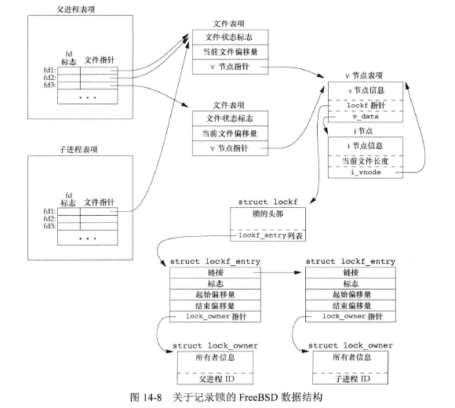
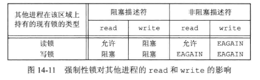
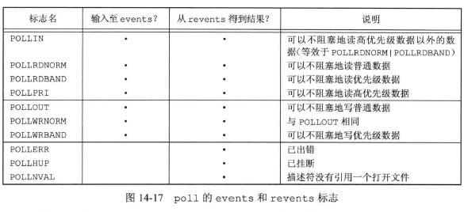
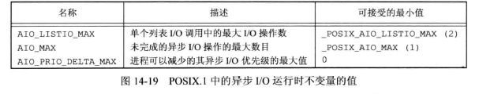
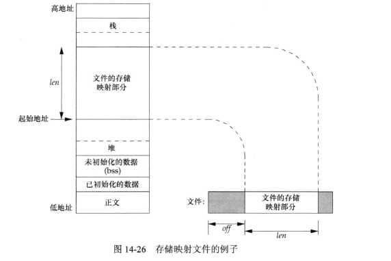

## <center>高级I/O</center>

### 非阻塞I/O
* open O_NONBLOCK
* fcntl O_NONBLOCK

* 终端驱动程序一次能接受的数据量随系统而变

### 记录锁

```c
#include<fcntl.h>
struct flock {
  short l_type;   /* F_RDLCK, F_WRLCK, F_UNLCK */
  short l_whence; /* SEEK_SET, SEEK_CUR, SEEK_END */
  off_t l_start;  /* offset in bytes,relation to l_whence * /
  off_t l_len;    /* length,in bytes;0 means lock to EOF */
  pid_t pid;      /* returned with F_GETLK */
}
int fcntl(int fd,int cmd,.../* struct flock *flockptr */);
//返回值：成功 依赖cmd，否则 -1
```
* 如果一个进程对同一个文件区已经有了一把锁，后来该进程又企图在同一文件区间再加一把锁，那么新锁会替换已有锁
* 加读锁，必须读打开；加写锁，必须写打开
* F_GETLK 判断由flockptr所描述的锁是否被另一把锁排斥(阻塞)。如果存在一把锁，阻止创建由flockptr所描述的锁，现有锁的信息重写flockptr指向的信息

* 锁的作用是阻止多个进程同时写同一个文件

* 锁的隐含继承和释放
  1. 锁与进程和文件两者关联
    - 当一个进程终止时，它所建立的锁全部释放
    - 描述符关闭，该进程通过这一描述符引用的文件上的任何一把锁都会释放(该进程的锁)
  
  2. 由fork产生的子进程不继承父进程设置的锁
  3. 在执行exec后，新程序可以继承原执行程序的锁

>FreeBSD实现
```c
fd1 = open(pathname,...);
write_lock(fd1,0,SEEK_SET,1);
if((pid=fork())>0)
{
   fd2=dup(fd1);
   fd3=open(pathname,...);
}else if(pid==0)
{
  read_lock(fd1,1,SEEK_SET,1);
}
pause();
```


* 建议性锁和强制性锁
 - 强制性锁：打开其设置组ID位，关闭其组执行位便开启 对该文件的强制性锁机制  
   `chmod(filename,(stat.st_mode & ~S_IXGRP | S_ISGID))`
 - 强制性锁会让内核检查每一个open,read和write,验证调用过程是否违背了正在访问的文件上的某一把锁



[example](enforcelocko.c)

### I/O多路转接(多路复用) 
[网络编程](../../tcp-ip/unix网络编程卷1/ch6.md)
[example](../../tcp-ip/server1.c)

* poll pselect select
* 如果碰到文件尾端，则select会认为该描述符是可读的，然后调用read，它返回0
* pselect 与select 区别
  1. 超时值 
    - select 用  timeval 秒和微秒 
    - pselect 用 timespec 秒和纳秒
  2. 超时值
    - pselect const 保证不会改变此值
  3. pselect 可选信号屏蔽值，sigmask==NULL ，同select同，在调用pselect时，以原子操作安装信号屏蔽字，返回时，恢复以前的信号屏蔽字
* poll 
  - nfds指定fdarray数组中的元素数
  - events成员我们设置
  - revents成员由内核设置
  - POLLHUP挂断后，就不能再写该描述符，但有可能仍可读取到数据
  - timeout
    - -1 永远等待 INFTIM,或捕捉到信号返回 -1 EINTY
    - 0 不等待
    - ＞0 等待timeout毫秒
  - 一个描述符是否阻塞不会影响poll是否阻塞
```c
#include<sys/select.h>
int select(int maxfdp1,fd_set *restrict readfds,fd_set *restrict writefds,fd_set *restrict exceptfds, struct timeval *restrict tvptr);
//返回：准备就绪的描述符数目，超时，返回0 出错 -1

int pselect(int maxfdp1,fd_set *restrict readfds,fd_set *restrict writefds,fd_set *restrict exceptfds,const struct timespec *restrict tsptr,const sigset_t *restrict sigmask);
//返回：准备就绪的描述符数目，超时，返回0 出错 -1

#include <poll.h>
struct pollfd {
  int fd;
  short events;
  short revents;
}
int poll(struct pollfd fdarray[],nfds_t nfds,int timeout);
//返回：准备就绪的描述符数目，超时，返回0，出错 -1
```



### 异步I/O

* sigevent
  - sigev_notify
    - SIGEV_NONE  异步完成后不通知进程
    - SIGEV_SIGNAL 异步完成后，产生由sigev_signo字段指定的信号
    - SIGEV_TRHEAD 当异步I/O请求完成时，该结构的sigev_notify_function字段指定的函数被调用，sigev_value为参数

* aio_fsync
  - op 
    - O_DSYNC  fdatasync [ch3](../ch3/README.md)
    - O_SYNC   fsync
* aio_return 每个异步操作只调用一次aio_return,一旦调用，可以释放掉包含I/O操作返回值的记录
```c
#include<aio.h>
struct aiocb{
  int                  aio_fildes;          /* file descriptor */
  off_t                aio_offset;          /* file offset for I/O */
  volatile    void     *aio_buf;            /* buffer for I/O */
  size_t               aio_nbytes;          /* number of bytes to transfer */
  int                  aio_reqprio;         /* priority */
  struct        aio_sigevent;        /* signal information */
  int                  aio_lio_opcode;      /* operation for list I/O */
};

struct sigevent {
  int                  sigev_notify;            /* notify type */
  int                  sigev_signo;             /* signal number */
  union sigval         sigev_value;             /* notify argument */
  void (*sigev_notify_function)(union sigval);  /* notify function */
  pthread_attr_t       *sigev_notify_attributes;/* notify attrs */
}

int aio_read(struct aiocb *aiocb); //进行异步读操作
int aio_write(struct aiocb *aiocb);//进行异步写操作
int aio_fsync(int op,struct aiocb *aiocb); //强制所有等待中的异步操作不等待而写入持久化的存储中
//返回：成功 0 出错 -1 或其他errno
int aio_error(const struct aiocb *aiocb);
//返回：0 成功，-1 或其他errno 失败 EINPROGRESS 异步读写或同步操作仍在等待

ssize_t aio_return(const struct aiocb *aiocb);
//返回：本身失败 -1 其他 read write fsync可能返回的值
int aio_suspend(const struct aiocb *const list[],int nent,const struct timespec *timeout);
//返回：成功0 出错 -1
int aio_cancel(int fd,struct aiocb *aiocb);
//返回：失败 -1   
// AIO_ALLDONE 所有操作在尝试取消前已经完成
// AIO_CANCELED 所有的操作已取消
// AIO_NOTCANCELED 至少一个要求的操作没有被取消

int lio_listio(int mode,struct aiocb *restrict const list[restrict],int nent,struct sigevent *restrict sigev);
//返回：成功 0 出错 -1
```


[example](rot13o.c)

### [readv和writev函数](../../tcp-ip/unix网络编程卷1/ch14.md#readv)

### [readn和writen函数](../../tcp-ip/unix网络编程卷1/ch3.md#readn)
* 读写指定的N直接数据，并处理返回值可能小于要求值的情况

### 存储映射I/O
* 能将一个磁盘文件映射到存储空间中一个缓冲上
* 当从缓冲区中取数据时，就相当于读文件中的相应字节
* 将数据存入缓冲区时，相应字节就自动写入文件
* 可以咋不使用read和write的情况下执行I/O

* mmap
  - addr 指定映射存储区的起始位置。通常为0，表示系统选择该映射区的起始地址 
  - len 指定要被映射文件的描述符
  - prot
    - PROT_READ 映射区可读
    - PROT_WRITE 映射区可写
    - PROT_EXEC 映射区可执行
    - PROT_NONE 映射区不可访问
  - flag
    - MAP_FIXED 返回值必须等于addr
    - MAP_SHARED 指定存储操作修改映射文件
    - MAP_PRIVATE 对映射区的存储操作导致创建该映射文件的一个私有副本
  - fd
  - off 文件的偏移量，为存储页长度的倍数

* msync
  - flags 
    - MS_ASYNC 简单的调试要写的页
    - MS_SYNC 等待写操作完成
    - MS_INVALIDATE 允许通知操作系统丢弃那些与底层存储器没有同步的页
  
* munmap 并不会使映射区的内容写到磁盘文件上
  - 对MAP_SHARED 区磁盘文件的更新，会在我们将数据写到存储区后的某个时刻，按内核虚拟存储算法自动进行
  - 在存储区解除映射后，对MAP_PRIVATE存储区的修改会被丢弃

* 在从输入缓冲区取数据字节时，内核自动读输入文件；在将数据存入输出缓冲区时，内核自动将数据写到输出文件中
```c
#include<sys/mman.h>
void *mmap(void *addr,size_t len,int prot,int flag,int fd,off_t off);
//返回：成功，返回映射区的起始地址，出错，返回MAP_FAILED

int mprotect(void *addr,size_t len,int prot); //更改一个现有映射的权限
//返回：成功 0 失败 -1

int msync(void *addr,size_t len,int flags);//冲洗到被映射的文件中
//返回成功0 失败 -1

int munmap(void *addr,size_t len);
//返回 成功0 出错 -1
```

[example](mmapo.c)


### 习题
14.5
```c
#include "apue.h"
#include <sys/select.h>
#include <poll.h>
void sleep_us(unsigned int nusecs){
  struct timeval tval;
  tval.tv_sec = nusecs /100000;
  tval.tv_usec=nusecs %100000;
  select(0,NULL,NULL,NULL,&tval);
}

void sleep_us(unsigned int nusecs){
  struct pollfd dummy;
  int timeout;

  if((timeout = nusecs / 1000)<=0)
    timeout=1;
  poll(&dummy,0,timeout);
}

```

14.10
  当文件具有给定操作系统默认的文件系统类型，上一次访问时间就会更新