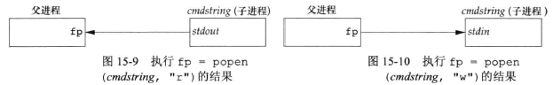
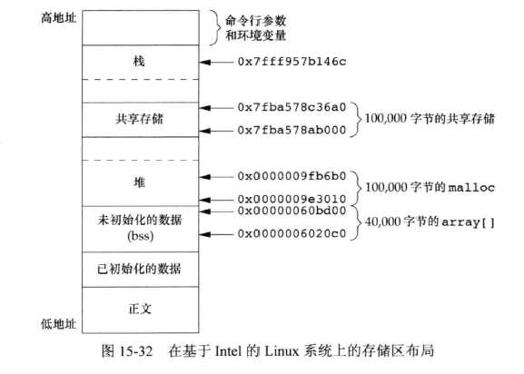

## <center>进程间通信</center>


### 管道
* 管道只能在具有公共祖先的两个进程之间使用
* pathconf 或 fpathconf 函数可以确定PIPE_BUF的值
* 若pclose的调用者已经为信号SIGCHLD设置了一个信号处理程序，则pclose中的watipid调用将返回一个EINTR
* popen决不应由设置用户ID或设置组ID程序调用，防止越权



### 协同进程
* 当一个过滤程序即产生某个过滤程序的输入，又读取该过滤程序的输出时，它就变成了协同进程
[example](xietong.c)

### FIFO
* 命名管道
* 不相关的进程也能交换数据
* [mode](../ch3/README.md#open)
* 当open一个FIFO时，非阻塞标志(O_NONBLOCK)会有：
  - 没指定O_NONBLOCK，只读open要阻塞到某个其他进程为写而打开这个FIFO为止，只写open要阻塞到某个其他进程为读而打开这个FIFO为止
  - 指定了O_NONBLOCK，只读open立即返回，只写可能会返回-1，errno=ENXIO
* write一个尚无进程为读而打开的FIFO，产生信号SIGPIPE
* 用途：
  - shell命令使用FIFO将数据从一条管道传送到另一条，无需创建临时文件
  - 客户-服务进程应用程序中FIFO用作汇聚点
```c
#include <sys/stat.h>
int mkfifo(const char *path,mode_t mode);
int mkfifoat(int fd,const char *path,mode_t make);
//返回：成功，0 失败 -1
```

```sh
mkfifo fifo1
prog3 < fifo1 &
prog1 < infile | tee fifo1 | prog2
```

[fifo](../../image/fifoserver.png)

### XSI IPC
* 创建IPC结构，指定一个键，这个键由内核变换成标识符
* 消息队列,信号量以及共享存储器
* ftok
  - 将path和id(项目id低8位)变换为一个键

* msgget/semget/shmget 
  - IPC_PRIVATE 或 IPC_CREAT 创建新队列 
  - IPC_CREAT + IPC_EXCL 位，创建新IPC结构，如果IPC结构已存在出错返回EEXIST
* msgctl/semctl/shmctl
* 流控制：如果系统资源(缓冲区)短缺，或者如果接收进程不能接收更多消息，则发送进程就要休眠，当流控制条件消失时，发送进程应自动唤醒
[auth](../../image/ipc_auth.png)
```c
#include<sys/ipc.h>
struct ipc_perm {
  uid_t uid;      /* owner's effective user id */
  gid_t gid;      /* owner's effective group id */
  uid_t cuid;     /* creator's effective user id */
  gid_t cgid;     /* creator's effective group id */
  mode_t mode;    /* access modes */
}
key_t ftok(const char *path,int id);
//返回值：成功 返回键，出错，返回(key_t) -1
```
[ipc_comp](../../image/ipc_comp.png)

### 消息队列
* msgset 创建一个新队列或打开一个现有队列
* msgctl 对队列执行多种操作
  - cmd
    - IPC_STAT 获取此队列msqid_ds结构，并将它存放在buf指向的结构中
    - IPC_SET
      - 将buf中的msg_perm的uid,gid,mode及msg_qbytes复制到队列相关的msqid_ds结构中
      - 只有下列两种进程执行
        - 有效用户id等于msg_perm.cuid或msg_perm.uid 
        - 超级用户特权的进程
    - IPC_RMID 从系统中删除该消息队列以及仍在改队列中的所有数据。立即生效

* msgsnd
 - ptr 指向mymesg结构的指针
 - flag
   - IPC_NOWAIT 非阻塞，遇到队列已满等问题返回EAGAIN错误
   - 阻塞：有空间可以容纳要发送的消息；从系统中删除了此队列(EIDRM)；捕捉到一个信号，并从处理程序返回(EINTR)
 - 没有维护引用计数器
 - nbytes ptr中数据的长度

* msgrcv 
  - type 
    - 0 返回队列中的第一个消息
    - ＞ 0 返回队列中消息类型为type的第一个消息
    - ＜ 0 返回队列中小于等于type绝对值的最小的消息
  - flag 
    - IPC_NOWAIT 如果没有指定消息，返回-1，errno=ENOMSG
```c
#include <sys/msg.h>
struct msqid_ds {
  struct ipc_perm  msg_perm;
  msgnum_t         msg_qnum;   /* 队列中的消息数 */
  msglen_t         msg_qbytes; /* max of bytes on queue */
  pid_t            msg_lspid;  /* pid of last msgsnd() */
  pid_t            msg_lrpid;  /* pdi of last msgrcv() */
  time_t           msg_stime;  /* last-msgsnd() time */
  time_t           msg_rtime;  /* last-msgrcv() time */
  time_t           msg_ctime;  /* last-change time */
}

struct mymesg{
  long mtype;      /* positive message type */
  char mtext[512]; /* message data,of length nbytes */
}

int msgset(key_t key,int flag);
//返回：成功，消息队列ID，出错 -1

int msgctl(int msqid,int cmd,struct msqid_ds *buf);
//返回：成功 0 出错 -1

int msgsnd(int msqid,const void *ptr,size_t nbytes,int flag);
//返回值，成功 0 出错 -1

ssize_t msgrcv(int msqid,void *ptr,size_t nbytes,int flag);
//返回：成功，消息数据部分的长度，出错 -1
```

[影响消息队列的系统限制](../../image/msgqueue.png)

### 信号量

* 计数器，用于为多个进程提供对共享数据对象的访问
* 资源值的测试及减1操作应当是原子操作
* semget 获得信号量ID
  - nsems 是该集合中的信号量数，引用现有集合(一个客户进程)，则将nsems指定为0

* semctl
  - semnum 0~nsems-1
  - cmd
    - IPC_STAT 取semid_ds结构，并存储在由arg.buf指向的结构中
    - IPC_SET 按arg.buf指向的结构中的值，设置 sem_perm.uid,sem_perm.gid,sem_perm.mode 同消息队列
    - IPC_RMID 同消息队列
    - GETVAL 返回成员semnum的setval值
    - SETVAL 设置成员semnum的setval值。由arg.val指定
    - GETPID 返回成员semnum的sempid值
    - GETNCNT 返回成员semnum的semncnt值
    - GETZCNT 返回成员semnum的semzcnt值
    - GETALL 取该集合中所有的信号量，这些字存储在arg.array指向的数组中
    - SETALL 将集合中所有的信号量设置成arg.array指向的数组中的值

* semop 自动执行信号量集合上的操作数组,具有原子性
  - SEM_UNDO 处理在未释放资源条件下进程终止的情况
```c
#include <sys/sem.h>
struct semid_ds {
  struct ipc_perm           sem_perm;
  unsigned short            sem_nsems;
  time_t                    sem_otime; /* last-semop() time */
  tiem_t                    sem_ctime; /* last-change time */
  ...
}

struct {
  unsigned short  semval;  /* semaphore value,always >=0 */
  pid_t           sempid;  /* pid for last operation */
  unsigned short semncnt;  /* processes awaiting semval>curval */
  unsigned short semzcnt;  /* processes awaiting semval==0 */
  ...
}

union semun {
  int val;  /* for SETVAL */
  struct semid_ds * buf; /* for IPC_STAT and IPC_SET */
  unsigned short * array; /* for GETALL and SETALL */
}

struct sembuf {
  unsigned short sem_num; /* member in set (0,1,...,nsems-1) */
  short          sem_op;  /* operation(negative,0 or pasitive ) */
  short          sem_flg; /* IPC_NOWAIT,SET_UNDO */
}
int semget(key_t key,int nsems,int flag);
//返回值：若成功，返回信号量ID，出错，-1
int semctl(int semid,int semnum,int cmd,.../*union semun arg*/);
//返回值：成功 0 失败 -1 （除GETALL,其他get返回相应值）

int semop(int semid,struct sembuf semoparray[],size_t nops);
//返回：成功 0 出错 -1

```

### 共享内存

* XSI共享存储没有相关的文件，存储段是内存的匿名段
* shmget 创建或引用一个现有的存储段
  - 正引用现存的段，size=0
  - 新建段内容初始化为0
* shmctl 对共享存储段操作
  - cmd 
   - IPC_STAT 获取->buf
   - IPC_SET  bug -> shm_perm.uid,shm_perm.gid,shm_perm.mode  ,必须有效用户id等于shm_perm.cuid或shm_perm.uid,超级用户
   - IPC_RMID 删除该共享存储段，不能shmat 与该段连接，权限同上
   - SHM_LOCK
   - SHM_UNLOCK
* shmat 连接共享内存到它的地址空间
  - addr
    - 0 段连接到由内核选择的第一个可用地址上
    - 非0  且没指定SHM_RND，则此段连接到addr所指定的地址上
    - 非0  且指定了SHM_RND，此段连接到(addr-(addr mod SHMLBA))所表示的地址

* shmdt 与addr指定放到段分离 shm_nattach -1
```c
#include <sys/shm.h>
struct shmid_ds {
  struct ipc_perm      shm_perm;
  size_t               shm_segsz;   /* size of segment in bytes */
  pid_t                shm_lpid;    /* pid of last shmop() */
  pid_t                shm_cpid;    /* pid of creator */
  shmatt_t             shm_nattach; /* number of current attaches */
  time_t               shm_atime;   /* last-attach time */
  time_t               shm_dtime;   /* last-detach time */
  time_t               shm_ctime;   /* last-change time */
}

int shmget(key_t key,size_t size,int flag);
//返回：成功，共享存储ID，出错 -1
int shmctl(int shmid,int cmd,struct shmid_ds *buf);
//返回：若成功，0 出错 -1
void *shmat(int shmid,const void *addr,int flag);
//返回：若成功，返回指向共享存储段的指针，出错，-1
void *shmdt(const void *addr);
//返回：成功 0 失败 -1
```



[特殊用途](devnull.c)

* 匿名存储映射
  - MAP_ANON fd=-1
  - 创建一个可以与后代进程共享的存储区
```c
if((area=mmap(0,SIZE,PROT_READ|PROT_WRITE,MAP_ANON|MAP_SHARED,-1,0))==MAP_FAILED)
```

### POSIX信号量
* 解决XSI信号量接口的几个缺点
  - POSIX更高新能的实现
  - POSIX没有信号量集
  - POSIX删除时更完美