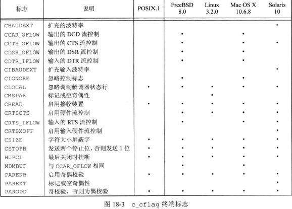
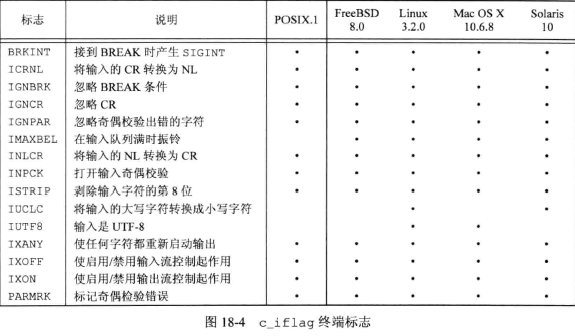
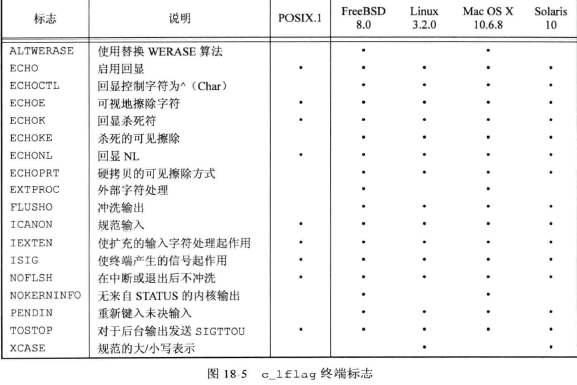
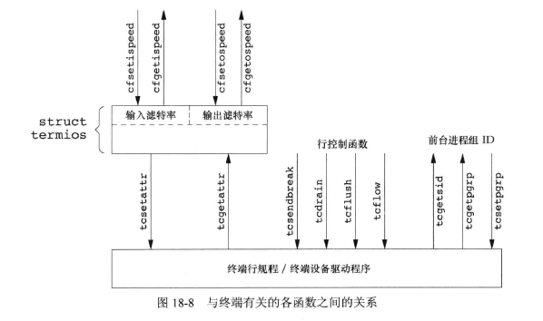
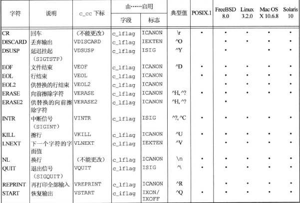
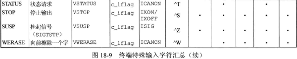
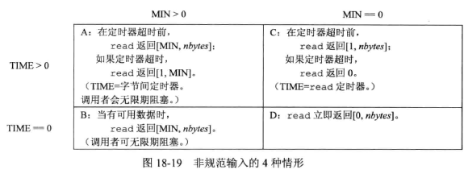

## <center>终端I/O</center>












```c
#include <stdio.h>
char *ctermid(char *ptr);
//返回：成功，返回指向终端控制终端名的指针，出错，返回空指针
#include<unistd.h>
int isatty(int fd);//判断文件描述符是否引用一个终端设备
//返回：若未终端设备，返回1，否则，0
char *ttyname(int fd);
//返回：指向终端路径名的指针，若出错，返回NULL
```
### 规范模式
* 对每个读请求，终端驱动程序最多返回一行
* 读返回：
 - 所请求的字节数已读到时，读返回。无需读一个完整的行。如果读了部分行，那么也不会丢失任何信息，下一次读从前一次读的停止出开始
 - 当读到一个行界定符时，读返回。 
   - NL  EOL EOL2 EOF  ICRNL+ 未设置IGNCR ->CR
   - EOF被处理后被丢弃，其他返回给调用者
 - 捕捉到信号，并且该函数不再自动重启

[getpass](getpass.c)

### 非规范模式
* `c_lflag &=ICANON`
* 在非规范模式中，输入数据不装配成行，不处理下列特殊字符：  
  `ERASE KILL EOF NL EOL EOL2 CR REPRINT STATUS WERASE`
* 当已读了指定量的数据后，或者已经超过了给定量的时间后，即通知系统返回
  c_cc 数组的两个变量：MIN TIME   c_cc[VMIN] c_cc[VTIME]

* MIN TIME
  - MIN > 0, TIME > 0
   - TIME 指定一个字节间定时器，只在第一个字节被接收时启动
   - 当接收到MIN或在超时时，返回字节(至少一个字节)，否则阻塞
  - MIN > 0, TIME = 0
   - read 在接收到MIN个字节之前不返回(>=M)。
  - MIN = 0, TIME > 0
   - TIME指定一个调用read时启动读定时器
   - 在接收到一个字节或者该定时器超时时，read返回(>=0)
  - MIN = 0, TIME = 0
   - 如果有数据可用，read返回所要求的字节数，如果无数据可用，read返回0



[ttytest](ttytest.c)

### 窗口大小

```c
#include <termios.h>
struct winsize {
  unsigned short ws_row;
  unsigned short ws_col;
  unsigned short ws_xpixel;
  unsigned short ws_ypixel;
}
```