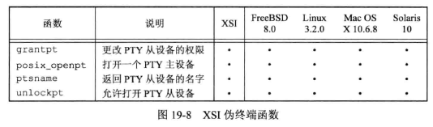

## <center>伪终端</center>

* posix_openpt 打开伪终端主设备
  - oflag 位屏蔽字   
    - O_RDWR 读写
    - O_NOCTTY 防止主设备成为调用者的控制终端
* grantpt 把从设备节点的用户ID设置为调用者的实际用户ID，设定其组ID为一非指定值，通常是可以访问该终端设备的组
  - 对个体所有者是读/写，对组所有者是写(0620)

* unlockpt 准许对伪终端从设备的访问，从而允许应用程序打开该设备



```c
#include <stdlib.h>
#include <fcntl.h>
int posix_openpt(int oflag);
//返回：成功，返回下一个可用的PTY主设备文件描述符，出错 -1

int grantpt(int fd);
int unlockpt(int fd);
//返回：成功 0 出错 -1

char *ptsname(int fd);
//返回：若成功，返回指向PTY从设备的指针，若出错，返回NULL
```

* 在linux , Mac OS X 和 Solaris 系统中，当调用ptys_open时，从设备成为新会话的控制终端 