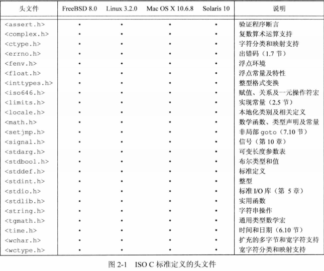
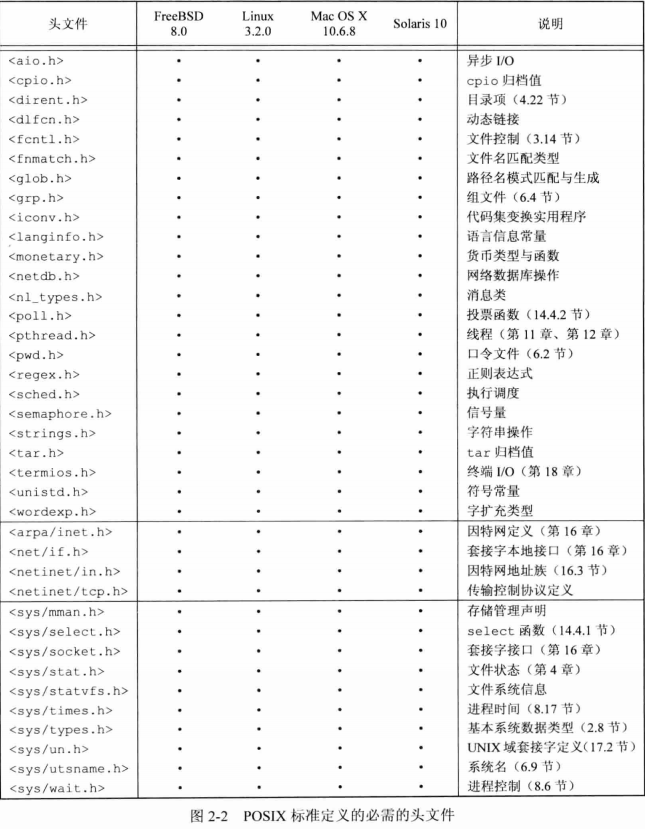
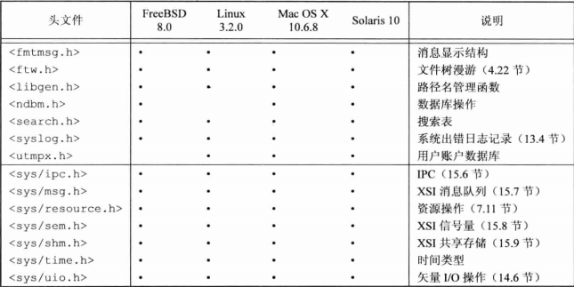
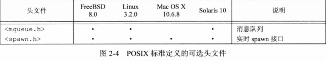
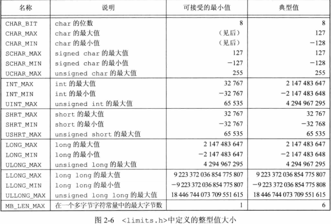
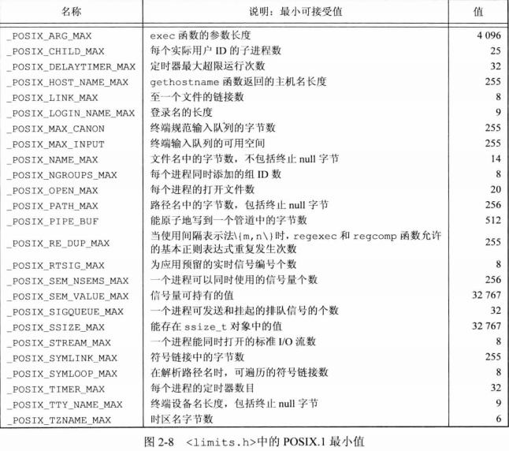

## <center>Unix标准及实现</center>

### ISO C


### IEEE POSIX







### Single UNIX Specification

### 限制

1. 编译时限制(头文件)
2. 与文件或目录无关的运行时限制(sysconf函数)
3. 与文件或目录有关的运行时限制(pathconf和fpathconf函数)

### ISO限制
* iso c定义的所有编译时限制都列在头文件<limits.h>中，这些常量在一个给定系统中并不会改变


* FOPEN_MAX 定义在<stdio.h>中定义


```c
#include <unistd.h>
long sysconf(int name);
long pathconf(const char *pathname,int name);
long fpathconf(int fd,int name);
//返回:若成功，返回相应值，若出错，返回-1，errno置为EINVAL，不确定值返回-1但不设置errno的值
```