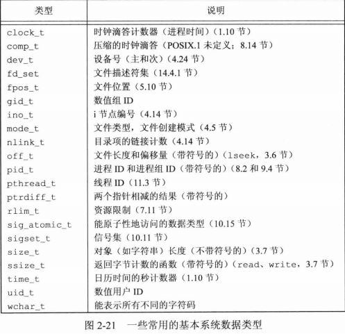

## <center>Unix标准及实现</center>

### ISO C


### IEEE POSIX


### Single UNIX Specification

### 限制

1. 编译时限制(头文件)
2. 与文件或目录无关的运行时限制(sysconf函数)
3. 与文件或目录有关的运行时限制(pathconf和fpathconf函数)

### ISO限制
* iso c定义的所有编译时限制都列在头文件<limits.h>中，这些常量在一个给定系统中并不会改变


* FOPEN_MAX 定义在<stdio.h>中定义


```c
#include <unistd.h>
long sysconf(int name);
long pathconf(const char *pathname,int name);
long fpathconf(int fd,int name);
//返回:若成功，返回相应值，若出错，返回-1，errno置为EINVAL，不确定值返回-1但不设置errno的值
```

### 选项
* 编译时选项定义在<unistd.h>
* 与文件或目录无关的运行时选项用sysconf函数来判断
* 与文件或目录有关的运行时选项通过调用 pathconf或fpathconf函数来判断
* _POSIX  -> _SC/_PC    
* _XOPEN  -> _SC_XOPEN/_PC_XOPEN

* 如果符合常理的 定义值为0，则必须调用sysconf、pathconf或fpathconf来判断相应选项是否受到支持

### 功能测试宏

* _POSIX_C_SOURCE 及 _XOPEN_SOUECE 被称为功能测试宏，编译时，希望它只与POSIX的定义相关

### 基本系统数据类型

* 头文件 <sys/types.h> 中定义了某些与实现有关的数据类型，它们被称为基本系统数据类型，用typedef定义，以_t结尾



* 如果出现冲突，POSIX.1 服从 ISO C 标准