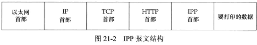
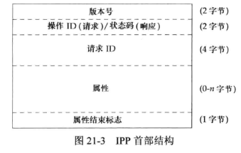
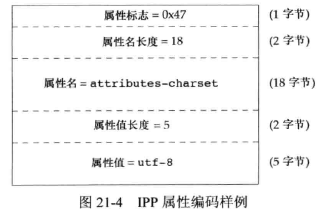
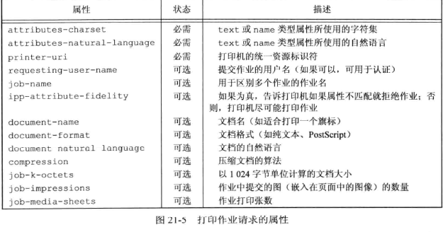
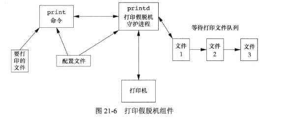

## <center>与网络打印机通信</center>

* IPP建立在超文本传输协议(HTTP)之上。
* IPP是请求响应协议
* 在首部，整数以有符号二进制补码以及大端字节序方式存储
* IPP首部包含了文本和二进制混合数据,属性名存储为文本,数据大小存储为二进制整数
* ^M \r\n





```http
//请求
//开始行
POST /ipp HTTP/1.1\r\n   
//首部行
Content-Length: 21931\r\n
Content-Type: application/ipp\r\n
Host: phaser8560:631\r\n\
\r\n


//响应报文
//开始行
HTTP/1.1 200 OK\r\n
//首部行
Content-Type: application/ipp\r\n
Cache-Control: no-cache, no-store, must-revalidate\r\n
Expires: THU, 26 OCT 1995 00:00:00 GTM\r\n
Content-Length: 215\r\n
Server: Allegro-Software-RomPager/4.34\r\n
\r\n
```

