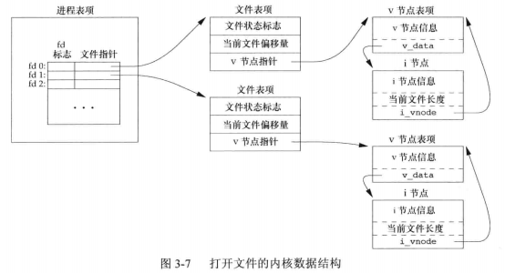
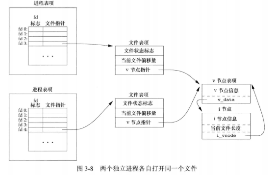
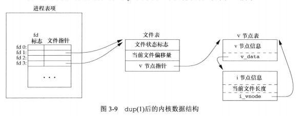
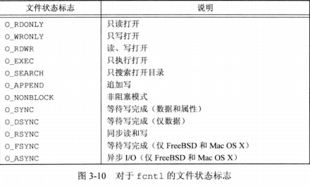

## <center>文件I/O</center>

### 函数 open 和 openat

```c
#include <fcntl.h>
int open(const char *path,int oflag,...);
int openat(int fd,const char *path,int oflag,...);
//返回：若成功，返回文件描述符，出错，返回-1
```

* oflag
 - O_RDPNLY
 - O_WRONLY
 - O_RDWR
 - O_EXEC
 - O_SEARCH
 - O_APPEND
 - O_CLOEXEC
 - O_CREAT 不存在则创建它
 - O_DIRECTORY
 - O_EXCL
 - O_NOCTTY
 - O_NOFOLLOW
 - O_NONBLOCK
 - O_SYNC
 - O_TRUNC 如果文件存在，且为只写或读写成功打开，则其长度截断为0
 - O_TTY_INIT
 - O_DSYNC
 - O_RSYNC

* 由open 和 openat 函数返回的文件描述符一定是最小的未用描述符

### 函数creat
```c
#include <fcntl.h>
int creat(const char *path,mode_t mode);
//等价于:
open(path,O_WRONLY|O_CREAT|O_TRUNC,mode);
//返回：若成功，返回为只写打开的描述符，若出错，返回-1

open(path,O_RDWR | O_CREAT | O_TRUNC, mode);
```

### 函数 close
* 关闭一个文件时还会释放改进程加在改文件上的所有记录锁
* 当一个进程终止时，内核自动关闭它所有的打开文件
```c
#include <unistd.h>
int close(int fd); //若成功，返回0，若出错，返回-1
```

### 函数lseek
* 当打开一个文件时，除非指定O_APPEND选项，否则该偏移量被设置为0
* whence 
  - SEEK_SET 开始 + offset
  - SEEK_CUR 当前 + offset
  - SEEK_END 文件长度 + offset

* 位于文件中但没有写过的字节都被读为0(空洞)
```c
#include<unistd.h>
off_t lseek(int fd,off_t offset,int whence);
//返回：成功，新的文件偏移量，出错，返回-1
```

* od -c file.hole 观察该文件的实际内容 -c 以字符方式打印文件内容


### 函数read
```c
#include <unistd.h>
ssize_t read(int fd,void *buf,size_t nbytes);
//返回：读到的字节数，若已到文件尾，返回0，出错，返回-1
```

### 函数write
```c
#include <unistd.h>
ssize_t write(int fd,const void *buf,size_t nbytes);
//返回：若成功， 返回已写的字节数，若出错，返回-1
```

## 文件共享 

原子操作

###  pread 和 pwrite
[pthread](../../linux/进程管理.md)



* 每个打开文件(或设备)都有一个v节点(v-node)结构，v节点包含了文件类型和对此文件进行各种操作函数的指针
* 对大多数文件，v节点还包含了改文件的i节点(i-node,索引节点)
* 进程表项 -> 文件表项 -> v节点表项(虚拟文件系统？)

* 两个独立进程各自打开同一文件


* 每次写操作之前，都将进程的当前偏移量设置到该文件的尾端处
* pread 和 pwrite
```c
#include <unistd.h>
ssize_t pread(int fd,void *buf,size_t nbytes,off_t offset);
//返回：读到的字节数，若已到文件尾，返回0，出错返回-1，相当于lseek后read 
ssize_t pwrite(int fd,const void *buf,size_t nbytes,off_t offset);
//返回值：若成功，返回已写的字节数，若出错，返回-1
```
### 函数dup和dup2

```c
#include <unistd.h>
int dup(int fd);
int dup2(int fd,int fd2);  
//返回：若成功，返回新的文件描述符，若出错，返回-1
//dup(fd)  == fcntl(fd,F_DUPFD,0)
//dup(fd,fd2) == close(fd2);fcntl(fd,F_DUPFD,fd2);
```
* 复制一个现有的文件描述流
* 由dup返回的新文件描述符一定是当前可用文件描述符中的最小值
* 这些函数返回的新文件描述符与参数fd共享同一个文件表项
* dup2是原子操作，而close和fcntl包括两个函数调用
* dup2和fcntl有一些不同的errno


### 函数sync、fsync和fdatasync
* 延迟写：先写入缓冲区
* 保证磁盘上实际文件系统与缓冲区中内容的一致性(sync,fsync,fdatasync)
* sync只是将所有修改过的快缓冲区排入写队列，然后返回，并不等待实际写磁盘操作结束
* fsync只对由文件描述符fd指定的一个文件起作用，并等待磁盘操作结束才返回
* fdatasync类似fsync,但只影响文件的数据部分
```c
#include <unistd.h>
int fsync(int fd);
int fdatasync(int fd);
//返回：成功 0，失败 -1
void sync(void);
```

### 函数fcntl
* 可以改变已经打开文件的属性
```c
#include <fcntl.h>
int fcntl(int fd,int cmd,.../*int arg **/);
//返回：若成功，则依赖于cmd,若出错，返回-1
```

* 5中功能
  - 复制一个已有的描述符(cmd = F_DUPFD 或 F_DUPFD_CLOEXEC)
  - 获取/设置文件描述符标志 (cmd=F_GETFD 或 F_SETFD)
  - 获取/设置文件状态标志 (cmd=F_GETFL 或 F_SETFL)
  - 获取/设置异步I/O所有权(cmd=F_GETOWN或F_SETOWN)
  - 获取/设置记录锁 (cmd=F_GETLK 、 F_SETLK 或 F_SETLKW)

* 文件描述符标志：体现进程的文件描述符的状态，fork进程时，文件描述符被复制，目前只有一种文件描述符 FD_CLOEXEC
* 文件状态标志：是体现进程打开文件的一些标志，fork时不会复制file结构，指向同一个file

* F_GETFL fd的文件状态标志



* O_ACCMODE 读写文件操作时，用于取出flag的低2位
* F_SETFL  可以更改的几个标志是:O_APPEND  O_NONBLOCK  O_SYNC  O_DSYNC O_RSYNC  O_FSYNC O_ASYNC
* F_GETOWN 获取当前接收SIGIO 和 SIGURG 信号的进程ID 或进程组ID

* /dev/tty 当前终端
* 5<>temp.foo 表示在文件描述符5上打开文件temp.foo 以供读写

### 函数ioctl

```c
#include <unistd.h>
#include <sys/ioctl.h>
int ioctl(int fd,int request,...);
//返回：若出错，返回-1，若成功，返回其他值
```

### /dev/fd
* 打开文件 /dev/fd/n 等效于复制描述符n(假定描述符n是打开的)
* fd = open("/dev/fd/0",mode) 相当于 fd = dup(0)

```c
filter file2 | cat file1 - file3 | lpr

filter file2 | cat file1 /dev/fd/0 file3 | lpr 
```