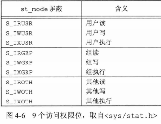

## <center>文件和目录</center>

### 函数stat、fstat、fstatat 和 lstat

```c
#include <sys/stat.h>

int stat(const char *restrict pathname,struct stat *restrict buf);

int fstat(int fd,struct stat *buf);

int lstat(const char *restrict pathname,struct stat *restrict buf); 
//符号链接时，返回链接本身的信息
int fstatat(int buf,const char *restrict pathname,struct stat *restrict buf,int flag);//相对路径
//返回：若成功，返回0，出错返回-1

struct stat {
  mode_t            st_mode; /*file type & mode (permissions) */
  ino_t             st_ino;  /*i-node number(serial number) */
  dev_t             st_dev;  /*device number(file system) */
  dev_t             st_rdev; /*device number for special files */
  nlink_t           st_nlink;/*number of links */
  uid_t             st_uid;  /*user Id of owner */
  gid_t             st_gid;  /*group Id of owner */
  off_t             st_size; /*size in bytes,for regular files */
  struct timespec   st_atime;/*time of last access */
  struct timespec   st_mtime;/*time of last modification */
  struct timespec   st_ctime;/*time of last file status change */
  blksize_t         st_blksize;/*best I/O block size */
  blkcnt_t          st_blocks;/*number of disk blocks allocated */
};

struct timespec {
  time_t tv_sec;
  long tv_nsec;
  ...
};

#define S_IFMT //屏蔽字
#define S_ISDIR(mode) (((mode)&S_IFMT)==S_IFDIR) //宏

```

* 文件类型
  - 普通文件
  - 目录文件
  - 块特殊文件
  - 字符特殊文件
  - FIFO
  - 套接字
  - 符号链接


### 设置用户ID和设置组ID




* 当用名字打开任一类型的文件时，对该名字中包含的每一个目录，包括可能隐含的当前工作目录都应有执行权限  
  /usr/include/stdio.h  ->  /、/usr、/user/include  
  对一个不具有执行权限的目录，shell绝不会在该目录下找到可执行文件

* 为了在一个目录中创建一个新文件，必须对该目录具有写权限和执行权限
* *为了删除一个现有文件，必须对包含该文件的目录具有写权限和执行权限，对该文件本身不需要有读写权限*
* exec 执行的文件必须对该文件本身具有执行权限，该文件还必须是一个普通文件
* 权限检查 - 进程执行文件，进程id匹配用户id/用户组id ->匹配权限

### 函数access和faccessat
* open打开文件，内核以进程的有效用户ID和有效组ID为基础执行访问权限测试
* 实际用户 - 登录用户

```c
#include <unistd.h>
int access(const char *pathnanme,int mode);
int faccessat(int fd,const char *pathname,int mode,int flag);
//返回：成功，返回0，失败，返回-1

```

mode | 说明
-----|-----
F_OK | 文件是否存在
R_OK | 测试读权限
W_OK | 测试写权限
X_OK | 测试执行权限

* faccessat 
  - pathname 参数为绝对路径 和 fd参数取值为AT_FDCWD而pathname参数为相对路径
  - flag 设置为 AT_ACCESS，访问检查有效用户id和有效组ID

* 权限

11 | 10 | 9 | 8 | 7 | 6 | 5 | 4 | 3 | 2 | `1` | 0
---|----|---|---|---|---|---|---|---|---|---|---
`S`  | `G`  | `T` | `r` | `w` | `x` | `r` | `w` | `x`| `r` | `w` | `x`

* S 代表设置但该位置没有设置执行位，s代表设置执行位
* 加SUID和SGID，在程序的可执行位被设置时起作用
  - chmod u + s filename 设置SUID位
  - chmod u - s filename 去掉SUID位
  - chmod g + s filename 设置SGID位
  - chmod g - s filename 去掉SGID位

### 函数umask

* umask函数为进程设置文件模式创建屏蔽字，并返回之前的值

```c
#include <sys/stat.h>
mode_t umask(mode_t cmask);//返回：之前的文件模式创建屏蔽字
```

* 更改进程的文件模式创建屏蔽字并不影响父进程的屏蔽字
* 屏蔽字8进制数，一位代表一种要屏蔽的权限
* umask -S 打印符号格式

屏蔽位|含义
-----|-----
0400 | 用户读
0200 | 用户写
0100 | 用户执行
0040 | 组读
0020 | 组写
0010 | 组执行
0004 | 其他读
0002 | 其他写
0001 | 其他执行


### 函数 chmod、fchmod、fchmodat
* 更改现有文件的访问权限

```c
#include <sys/stat.h>
int chmod(const char *pathname,mode_t mode);
int fchmod(int fd,mode_t mode);
int fchmodat(int fd,const char *pathname,mode_t mode,int flag);
//返回：若成功，返回0，出错返回-1
```

mode    | 说明
--------|-----------------------
S_ISUID | 执行时设置用户ID
S_ISGID | 执行时设置组ID
S_ISVTX | 保存正文(粘着位)
--------|-----------------------
S_IRWXU | 用户(所有者)读、写和执行
S_IRUSR | 用户(所有者)读
S_IWUSR | 用户(所有者)写
S_IXUSR | 用户(所有者)执行
--------|-----------------------
S_IRWXG | 组读、写和执行
S_IRGRP | 组读
S_IWGRP | 组写
S_IXGRP | 组执行
--------|----------------------
S_IRWXO | 其他读、写和执行
S_IROTH | 其他读
S_IWOTH | 其他写
S_IXOTH | 其他执行

### 黏着位
* 如果对一个目录设置了黏着位，只有对该目录具有写权限的用户并且满足下列条件之一，才能删除或重命名该目录下的文件
  - 拥有此文件
  - 拥有此目录
  - 是超级用户

### 函数 chown、fchown、fchownat和lchown
* 更改文件的用户ID和组ID，如果两个参数owner或group中的任意一个是-1，则对应的ID不变
* lchown和fchownat(设置了AT_SYMLINK_NOFOLLOW标志)更改符号链接本身的所有者，而不是该符号链接所指向的文件的所有者
* 你可以更改你所拥有的文件的组ID，但只能改到你所属的组
```c
#include <unistd.h>
int chown(const char *pathname,uid_t owner,gid_t group);
int fchown(int fd,uid_t owner,gid_t group);
int fchownat(int fd,const char *pathname,uid_t owner,gid_t group,int flag);
int lchown(const char *pathname,uid_t owner,gid_t group);
//返回：成功，返回0，出错，返回-1
```

* 符号链接文件长度是在文件名中的实际字节数
* st_blksize 对文件I/O较合适的块长度
* st_blocks 是所分配的实际512字节块块数

### 文件中的空洞
* 由设置的偏移量超过文件尾端，并写入了某些数据后造成的
* 复制会将所有空洞填满，实际数据字节皆填0
```c
ls -l file.hole file.nohole
du -s file.hole file.nohole //多小哥512字节块
wc -c file.hole  //计算文件中的字节数
```

### 文件截断

```c
#include <unistd.h>
int truncate(const char *pathname,off_t length);
int ftruncate(int fd,off_t length);
//返回：成功，0，出错，-1
```

### 文件系统

### 函数link、linkat、unlink、unlinkat、remove

* unlink：打开该文件的进程个数为0，链接计数为0，删除文件的内容
```c
#include <unistd.h>
int link(const char *existingpath,const char *newpath);
int linkat(int efd,const char *existingpath,int nfd,const char *newpath,int flag);
int unlink(const char *pathname);
int unlinkat(int fd,const char *pathname,int flag);

#include <stdio.h>
int remove(const char *pathname);
//返回：若成功，返回0，若出错，返回-1
```

### 函数rename和renameat

```c
#include <stdio.h>
int rename(const char *oldname,const char *newname);
int renameat(int oldfd,const char *oldname,int newfd,const char *newname);
//返回：若成功，返回0，若出错，返回-1
```

* oldname是文件而不是目录，为该文件或符号链接重命名
  - newname已存在