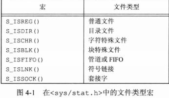
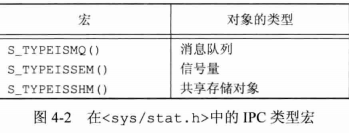

## <center>文件和目录</center>

### 函数stat、fstat、fstatat 和 lstat

```c
#include <sys/stat.h>

int stat(const char *restrict pathname,struct stat *restrict buf);

int fstat(int fd,struct stat *buf);

int lstat(const char *restrict pathname,struct stat *restrict buf); 
//符号链接时，返回链接本身的信息
int fstatat(int buf,const char *restrict pathname,struct stat *restrict buf,int flag);//相对路径
//返回：若成功，返回0，出错返回-1

struct stat {
  mode_t            st_mode; /*file type & mode (permissions) */
  ino_t             st_ino;  /*i-node number(serial number) */
  dev_t             st_dev;  /*device number(file system) */
  dev_t             st_rdev; /*device number for special files */
  nlink_t           st_nlink;/*number of links */
  uid_t             st_uid;  /*user Id of owner */
  gid_t             st_gid;  /*group Id of owner */
  off_t             st_size; /*size in bytes,for regular files */
  struct timespec   st_atime;/*time of last access */
  struct timespec   st_mtime;/*time of last modification */
  struct timespec   st_ctime;/*time of last file status change */
  blksize_t         st_blksize;/*best I/O block size */
  blkcnt_t          st_blocks;/*number of disk blocks allocated */
};

struct timespec {
  time_t tv_sec;
  long tv_nsec;
  ...
};

#define S_IFMT //屏蔽字
#define S_ISDIR(mode) (((mode)&S_IFMT)==S_IFDIR) //宏

```

* 文件类型
  - 普通文件
  - 目录文件
  - 块特殊文件
  - 字符特殊文件
  - FIFO
  - 套接字
  - 符号链接





