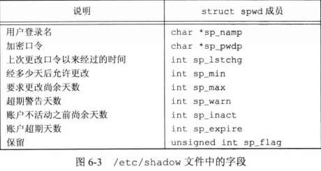
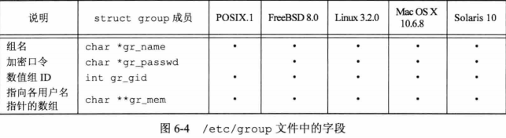
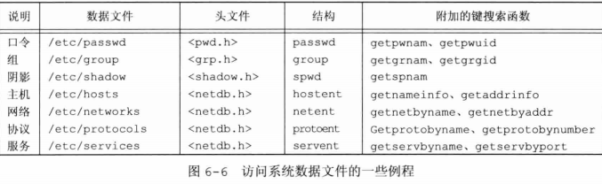
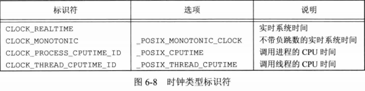
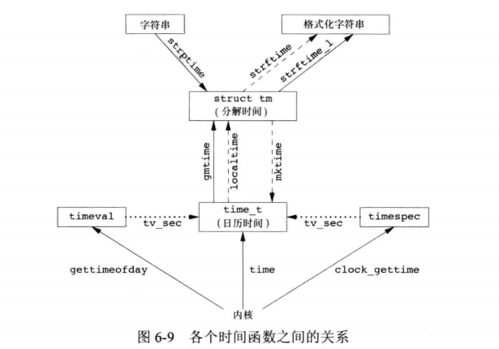
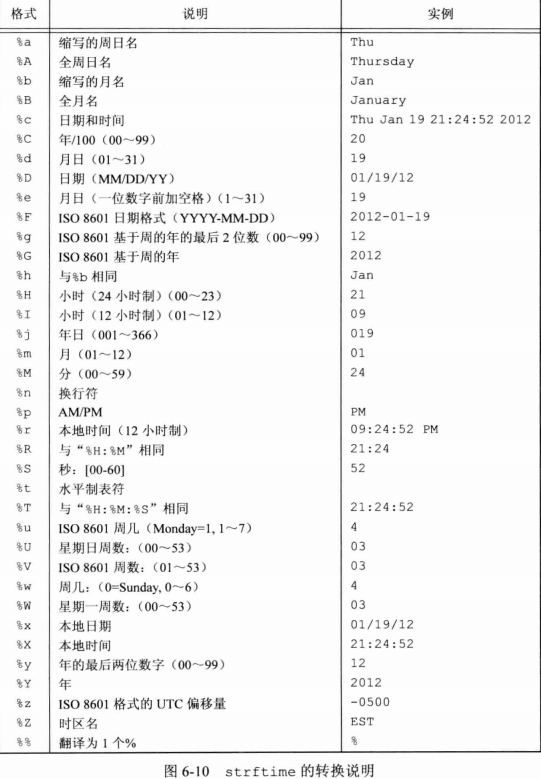
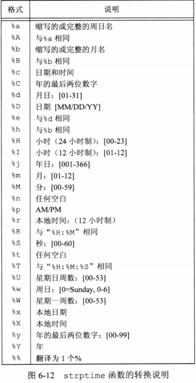

## <center>系统数据文件和信息</center>

### 口令文件 /etc/passwd
* finger 用户名
* vipw 允许管理员使用该命令编辑口令文件

[passwd](../../image/passwd.png)

```c
#include <pwd.h>

struct passwd
{
  char *pw_name;		/* Username.  */
  char *pw_passwd;		/* Password.  */
  __uid_t pw_uid;		/* User ID.  */
  __gid_t pw_gid;		/* Group ID.  */
  char *pw_gecos;		/* Real name.  */
  char *pw_dir;			/* Home directory.  */
  char *pw_shell;		/* Shell program.  */
};

struct passwd *getpwuid(uid_t uid);
struct passwd *getpwnam(const char *name);
//返回：成功，返回指针，出错，返回NULL

struct passwd *getpwent(void);//返回口令文件的下一个记录项
//返回：成功，返回指针，出错或到达文件尾端，返回NULL
void setpwent(void);//反绕它所使用的文件定位到文件开始处
void endpwent(void);//关闭这些文件
```

### 阴影口令 /etc/shadow



* 只有用户登录名和加密口令这两个字段是必须的
* login passwd 需要访问

```c
#include <shadow.h>

struct spwd
{
  char *sp_namp;             /* Login name.  */
  char *sp_pwdp;             /* Encrypted password.  */
  long int sp_lstchg;        /* Date of last change.  */
  long int sp_min;           /* Minimum number of days between changes.  */
  long int sp_max;           /* Maximum number of days between changes.  */
  long int sp_warn;          /* Number of days to warn user to change
				   the password.  */
  long int sp_inact;         /* Number of days the account may be
				   inactive.  */
  long int sp_expire;        /* Number of days since 1970-01-01 until
				   account expires.  */
  unsigned long int sp_flag; /* Reserved.  */
};

struct spwd *getspnam(const char *name);
struct spwd *getspent(void);
//返回：成功，返回指针，出错，返回NULL
void setspent(void);
void endspent(void);
```

### 组文件 /etc/group
* gr_mem 指针数组，每个指针指向一个属于改组的用户名，以null结尾


```c
#include <grp.h>
struct group
{
  char *gr_name;   /* Group name.	*/
  char *gr_passwd; /* Password.	*/
  __gid_t gr_gid;  /* Group ID.	*/
  char **gr_mem;   /* Member list.	*/
};
struct group *getgrgid(gid_t gid);
struct group *getgrnam(const char *name);
//返回：成功，返回指针，出错，返回NULL

struct group *getgrent(void);
//返回：成功，返回指针，出错或到达文件尾端，返回NULL
void setgrent(void);
void endgrent(void);
```

### 附属组ID

* 不仅将进程的有效组ID与文件的组ID相比较，而且也将所有附属组ID与文件的组ID相比较

```c
#include <unistd.h>
int getgroups(int gidsetsize,gid_t grouplist[]);
//返回：若成功，返回附属组ID数量，出错，-1

#include <grp.h>
#include <unistd.h>
int setgroups(int ngroups,const gid_t grouplist[]);

#include <grp.h>
#include <unistd.h>
int initgroups(const char *username,gid_t basegid);
//会调用getgrent setgrent  endgrent  setgroups
//basegid 是username在口令文件中的组ID
//返回：若成功，返回0，出错，返回-1
```

### 其他数据文件

* /etc/services 记录各网络服务器所提供服务的数据文件
* /etc/protocols 记录协议信息的数据文件
* /etc/networks 记录网络信息的数据文件

* 一般情况，每个数据文件至少有3个函数 
 - get：读取下一个记录
 - set: 打开相应数据文件(如果尚未打开),然后反绕文件
 - end: 关闭相应数据文件



### 登录账户记录

* 登录时，login程序填写此结构，并写入/var/run/utmp文件中,同时添加到/var/log/wtmp文件
* 注销时，init将utmp相应记录擦除，新纪录写入wtmp
* who 读取 utmp
* last 读取 wtmp 
```c
struct utmp {
  char ut_line[8]; /* tty line */
  char ut_name[8]; /* login name */
  long ut_time; /* seconds since epoch */
}
```

### 系统标识

```c
#include <sys/utsname.h>
struct utsname {
  char sysname[];  /* name of the operation system */
  char nodename[]; /* name of this node */
  char release[];  /* current release of operating system */
  char version[];  /* current version of this release */
  char machine[];  /* name of hardware type */
}

int uname(struct utsname *name);
//返回：成功，非负值，出错，-1
#include <unistd.h>
int gethostname(char *name,int namelen);
//返回：成功，0，出错，-1
```

* hostname 获取或设置主机名 /etc/rc 

### 时间和日期例程
* UTC (公元1970年1月1日00:00:00)这一特定时间以来经过的秒数，time_t
* POSIX1.1 时钟通过clockid_t类型进行标识
```c
#include <time.h>

struct tm
{
  int tm_sec;			/* Seconds.	[0-60] (1 leap second) */
  int tm_min;			/* Minutes.	[0-59] */
  int tm_hour;			/* Hours.	[0-23] */
  int tm_mday;			/* Day.		[1-31] */
  int tm_mon;			/* Month.	[0-11] */
  int tm_year;			/* Year	- 1900.  */
  int tm_wday;			/* Day of week.	[0-6] */
  int tm_yday;			/* Days in year.[0-365]	*/
  int tm_isdst;			/* DST 夏令时.CST 北京时间	[-1/0/1]*/

# ifdef	__USE_MISC
  long int tm_gmtoff;		/* Seconds east of UTC.  */
  const char *tm_zone;		/* Timezone abbreviation.  */
# else
  long int __tm_gmtoff;		/* Seconds east of UTC.  */
  const char *__tm_zone;	/* Timezone abbreviation.  */
# endif
};

time_t time(time_t *calptr);
//返回：成功，时间值，出错，-1
struct tm *gmtime(const time_t *calptr); //统一的时间
struct tm *localtime(const time_t *calptr); //本地时间
//返回：指向分解的tm结构的指针，出错，范湖NULL

size_t strftime(char *restrict buf,size_t maxsize,const char *restrict format,const struct tm *restrict tmptr);//使用TZ环境变量指定的区域
size_t strftime_l(char *restrict buf,size_t maxsize,const char *restrict format,const struct tm *restrict tmptr,locale_t locale);//类似printf
//返回：若有空间，返回存入数组的字符数，否则，返回0

char *strptime(const char *restrict buf,const char *restrict format,struct tm *restrict tmptr);//把字符串时间转换成分解时间
//返回：指向上次解析的字符的下一个字符的指针，否则 null
```


```c
#include <sys/time.h>


int clock_gettime(clockid_t clock_id,struct timespec *tsp);//用于获取指定时钟的时间
int clock_getres(clockid_t clock_id,struct timespec *tsp);//把tsp指向的timespec结构初始化为与clock_id参数对应的时钟精度
int clock_settime(clockid_t clock_id,const struct timespec *tsp);//对特定的时钟设置时间
//返回值：成功，0，出错，-1
int gettimeofday(struct timeval *restirct tp,void *restrict tzp);//返回值，总是0
```

* stime 设置系统时间 (System V)
* settimeofday 设置系统时间 (BSD)



* localtime,mktime,strftime都受到环境变量TZ的影响 2019-11-03T12:17:53.607Z

* 两个连续的百分号产生一个百分号
* %V 如果包含了1月1日的那一周包含了新一年的4天或更多天，那么该周是 一年中的第一周，否则为上一年的最后一周


