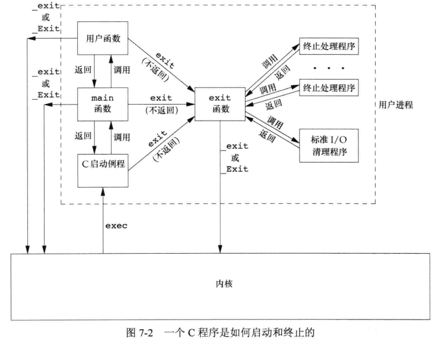
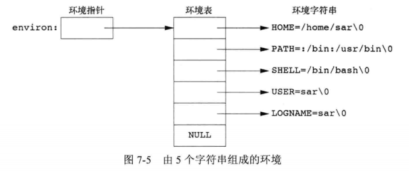

## <center>进程环境</center>

### 进程终止
* 内核使程序执行的唯一方法是调用一个exec函数，进程自愿终止的唯一方法是显示或隐式调用_exit或_Exit。或非自愿地由一个信号使其终止
* atexit 登记终止处理程序,每登记一次被调用一次，调用次序和登记顺序相反
```c
#include<stdlib.h>
int atexit(void (*func)(void));
//返回：若成功，返回0，若出错，返回非0
```



### 命令行参数
* 调用exec进程可将命令行参数传递给该新函数。
* echo程序不回显第0个参数
* argv[argc] == NULL 

### [环境表](paramo.c)

* extern char **environ
* getenv 和 putenv函数访问特定的环境变量


### c程序的存储空间布局


* 正文段：CPU执行的机器指令部分，可共享，只读
* 初始化数据段
* 未初始化数据段(bss=block started by symbol) 程序开始执行前初始化为0或null
* 栈
* 堆

* 32为intel x86处理器上的Linux，正文段从 0x08048000单元开始，栈底在0xC0000000

```s
$ size /usr/bin/cc /bin/sh  #报文正文段、数据段和bss段的长度 十进制总长,十六进制总长(字节)
#   text	   data	    bss	    dec	    hex	filename
#  902817	   8048	   9728	 920593	  e0c11	/usr/bin/cc
#  143301	   4792	  11312	 159405	  26ead	/bin/sh

```