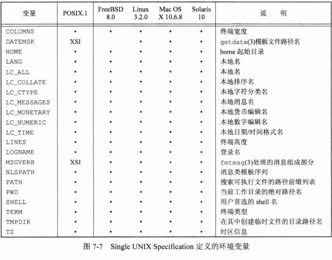
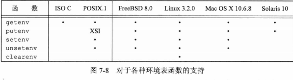
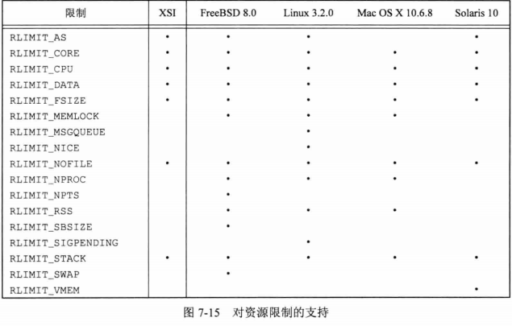

## <center>进程环境</center>

### 进程终止
* 内核使程序执行的唯一方法是调用一个exec函数，进程自愿终止的唯一方法是显示或隐式调用_exit或_Exit。或非自愿地由一个信号使其终止
* atexit 登记终止处理程序,每登记一次被调用一次，调用次序和登记顺序相反
```c
#include<stdlib.h>
int atexit(void (*func)(void));
//返回：若成功，返回0，若出错，返回非0
```


### 命令行参数
* 调用exec进程可将命令行参数传递给该新函数。
* echo程序不回显第0个参数
* argv[argc] == NULL 

### [环境表](paramo.c)

* extern char **environ
* getenv 和 putenv函数访问特定的环境变量


### c程序的存储空间布局


* 正文段：CPU执行的机器指令部分，可共享，只读
* 初始化数据段
* 未初始化数据段(bss=block started by symbol) 程序开始执行前初始化为0或null
* 栈
* 堆

* 32为intel x86处理器上的Linux，正文段从 0x08048000单元开始，栈底在0xC0000000

```s
$ size /usr/bin/cc /bin/sh  #报文正文段、数据段和bss段的长度 十进制总长,十六进制总长(字节)
#   text	   data	    bss	    dec	    hex	filename
#  902817	   8048	   9728	 920593	  e0c11	/usr/bin/cc
#  143301	   4792	  11312	 159405	  26ead	/bin/sh

```

### 共享库
* 用动态链接方法将程序与共享库函数相链接
* gcc -static file.c 阻止使用共享库
* gcc 默认使用共享库
* 未声明函数的默认返回值为int
* 使用sbrk系统调用实现
### 存储空间分配
```c
#include <stdlib.h>
void *malloc(size_t size);               //分配指定字节，初始值不确定
void *calloc(size_t nobj,size_t size);   //指定数量 指定长度的对象分配 nobj*size，初始化为0
void *realloc(void *ptr,size-t newsize); //复制原内容，新增区域内的初始值不确定
//返回：成功，非空指针，出错，NULL
void free(void *ptr);
```
* 替代的存储空间分配程序
  1. libmalloc ISO C
  2. vmalloc 
  3. quick-fit 快速适配
  4. jemalloc FreeBSD 多线程
  5. TCMalloc  线程-本地高数缓冲来避免锁开销
  6. alloca 当前函数的栈帧上分配存储空间

### 环境变量
* 环境表和环境字符串放在栈顶
* 只能影响当前进程及其后生成和调用的任何子进程的环境
* setenv 必须分配存储空间
  - 设置name=value
  - 如果name存在，rewrite:
    - 非0，先删除现有定义
    - 0， 不删除现有定义
* 增加新的name (首次增加，环境表会从栈到堆中)
  - environ -> 环境表 -> name=value 
  - 字符串 中的环境表使用malloc重新分配空间  
  - name=value 字符串的指针存放在环境表末尾，加null
  - environ  指向新的环境表地址
```c
#include <stdlib.h>
char *getenv(const char *name); 
//返回：指向与name关联的value的指针，若未找到null

int putenv(char *str); // name=value 新增或替换原name
//返回：成功0，出错，非0
int setenv(const char *name,const char *value,int rewrite);
int unsetenv(const char *name);
//返回：成功0，出错，-1
```




### 函数setjmp 和 longjmp
* goto 只能在函数内部实现跳转
* setjmp
  - jmp_buf 存放调用longjmp时能用来恢复栈状态的所有信息
* 自动变量、寄存器变量和易失变量，不确定，声明为全局变量或静态变量的值在执行longjmp时保持不变
```c
#include <setjmp.h>
int setjmp(jmp_buf env);
//返回：直接调用，0，从longjmp返回，非0（val）
void longjmp(jmp_buf env,int val);
```

### 函数getrlimit和setrlimit
* 资源限制
* 指定一个资源以及指向下一个结构的指针
* 任何一个进程都可将一个软限制值更改为小于或等于其硬限制值
* 任何一个进程都可降低其硬限制值，但它必须大于或等于其软限制值，不可逆
* 只有超级用户进程可以提高硬限制值
* RLIM_INFINITY 指定一个无限量的限制
```c
#include <sys/resource.h>
struct rlimit {
  rlim_t rlim_cur; /* soft limit : current limit */
  rlim_t rlim_max; /* hard limit : maximum value for rlim_cur */
}
int getrlimit(int resource,struct rlimit *rlptr);
int setrlimit(int resource,const struct rlimit *rlptr);
//返回：成功，0，出错，非0
```


[limits展示代码](limito.c)
* 说明
 1. RLIMIT_AS 进程总的可用存储空间的最大长度(字节)。影响到sbrk函数和mmap函数
 2. RLIMIT_CORE core文件的最大字节数，0 阻止创建core文件
   - ulimit -c 0 阻止系统生成core文件
   - ulimit -a 检查生成core文件的选项是否打开
   - /etc/.bash_profile
 3. RLIMIT_CPU CPU时间的最大量值(秒),超过向改进程发送SIGXCPU
 4. RLIMIT_FSIZE 可以创建的文件的最大字节数。超过向改进程发送 SIGXFSZ
 5. RLIMIT_MEMLOCK 一个进程使用mlock能够锁定在存储空间中的最大字节数

 ### 习题
 7.4 argv不是全局变量，不可实现
 7.5 当C程序解引用一个空指针出错时，执行该程序的进程将终止
 7.6 ISO C并不保证0值与浮点0或空指针的值相同
 7.7 可执行文件包含了用于调试core文件的符号表信息(nm -C a.out)，strip命令可删除