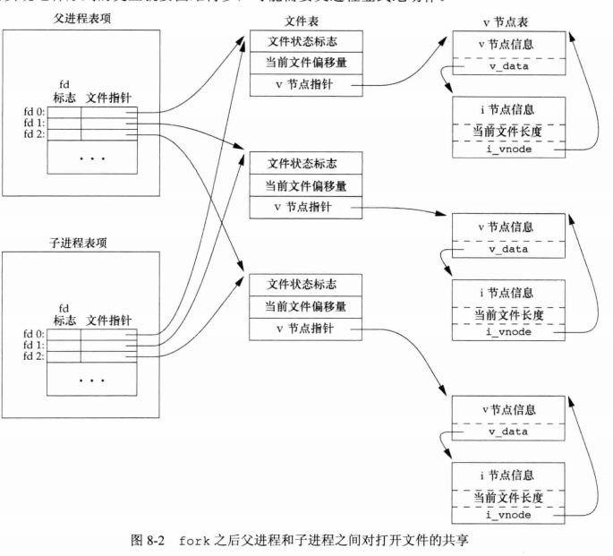
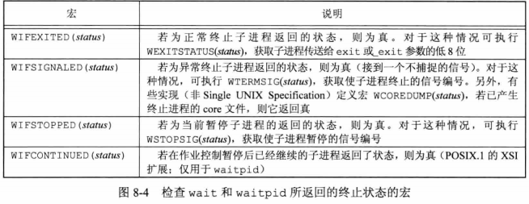
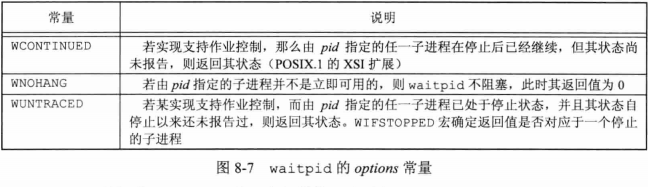
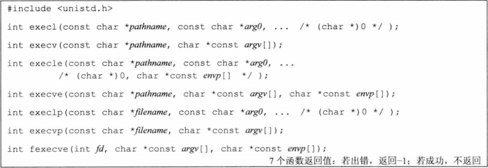
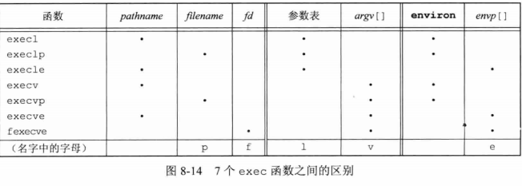
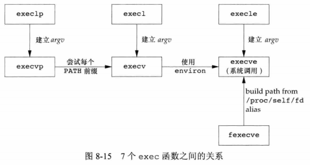
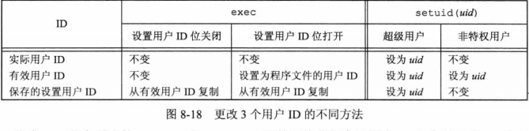
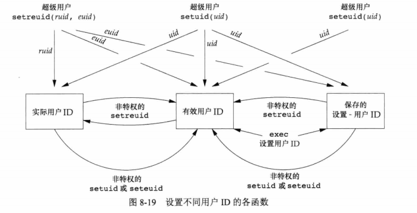

## <center>进程控制</center>

### 进程标识
* /sbin/init.d 启动一个UNIX系统
* /etc/rc* 或 /etc/inittab 文件 以及 /etc/init.d 中的文件
* init是普通的用户进程，超级用户特权运行

* 子进程获得父进程的数据空间，堆和栈的副本。共享正文段

* strlen不包含终止null字节，sizeof包含
* 缓冲区也复制，注意行缓冲和全缓冲,当每个进程终止时，其缓冲区中的内容都被写到相应文件中
* 父进程和子进程每个相同的打开描述符共享一个文件表项
```c
#include <unistd.h>
pid_t getpid(void);  
pid_t getppid(void); //返回值：调用进程的父进程id
uid_t getuid(void);  //返回值：调用进程的实际用户id
uid_t geteuid(void); //返回值：调用进程的有效用户id
gid_t getgid(void);
gid_t getegit(void);

pid_t fork(void); //返回：子进程返回0，父进程返回子进程Id，出错，-1
```



* 父进程和子进程之间的具体区别
  - fork的返回值
  - 进程ID不同
  - 父进程ID不同
  - 子进程的tms_utime,tms_stime,tms_cutime,tms_ustime的设置为0
  - 子进程不继承父进程设置的文件锁
  - 子进程的未处理闹钟被清除
  - 子进程的未处理信号集设置为空集

###  函数exit

* 正常终止方式
  - main函数中return
  - exit
  - _exit  或 _Exit 函数
  - 进程的最后一个线程在其启动例程中执行return
  - 进程的最后一个线程调用 pthread_exit函数，0
* 异常终止
  - abort SIGARBT
  - 当进程接收到某些信号时
  - 最后一个线程取消对‘取消’请求作出相应

* 不管如何终止，最后都会执行内核中的同一段代码，关闭所有描述符，释放它所有使用的存储器
* 如果子进程正常终止，父进程可以获得子进程的退出状态
* 在一个进程终止时，内核逐渐检查所有活动，以判断它是否是正要终止进程的子进程，如果是，则该进程的父进程ID就变为1
* 僵尸进程：已经终止，但是其父进程尚未对其进行善后处理的进程
* init只要有一个子进程终止，就会调用wait函数取得其终止状态

### 函数wait和waitpid
* 进程终止(正常或异常)，内核向父进程发送 SIGCHID信号
* statloc 终止状态
* 终止状态是由内核产生，退出状态是函数？正常终止，退出成为终止状态？
* waitpid
 - pid == -1 等待任一子进程
 - pid > 0 等待进程ID与pid相等的子进程
 - pid == 0 等待组ID等于调用进程组ID的任意子进程
 - pid < -1 等待组ID等于pid绝对值的任一子进程

 - 可等待一个特定的进程
 - 提供一个wait非阻塞版本
 - 通过WUNTRACED和WCONTINUED选项支持作业控制
```c
#include <sys/wait.h>
pid_t wait(int *statloc);
pid_t waitpid(pid_t pid,int *statloc,int options);
//返回：成功，进程id，出错，0 或-1
```
[codes](waito.c)





* 令子进程脱离父进程，直接由init进程掌控
  - 第二个子进程充当父进程的子进程，但已经与父进程脱离关系
[code](waitto.c)

### 函数exec
* 调用exec并不创建新进程，只是用磁盘上的一个新程序替换了当前进程的正文段，数据段，堆段和栈段
* p -> filename  l->list v->argv[] e->envp[]



```s
# xargs 将标准输入转换为命令行参数
# grep 不能在目录中进行模式搜索， -type f 列表只包含普通文件
>find /usr/share/man  -type f -print | xargs grep getrlimit
>find /usr/share/man  -type f -print | xargs bzgrep getrlimit
```

* 新进程从调用进程继承了下列属性
  1. 进程ID和父进程ID
  2. 实际用户ID和实际组ID
  3. 附属组ID
  4. 进程组ID
  5. 回话ID
  6. 控制终端
  7. 闹钟尚余留时间
  8. 当前工作目录
  9. 根目录
  10. 文件模式创建屏蔽字
  11. 文件锁
  12. 进程信号屏蔽
  13. 未处理信号
  14. 资源限制
  15. nice值
  16. tms_utime tms_stime tms_cutime tms_cstime

  17. 描述符看是否使用fcntl设置了 FD_CLOEXEC ,是则关闭，否打开，默认否


[execve](execo.c)

### 更改用户ID和更改组ID
* 最小特权(least privilege)
* setuid 
  - 有特权 
  - 无特权 uid=有效用户ID或实际用户ID，设置有效用户ID=uid
* exec
```c
#include <unistd.h>
int setuid(uid_t uid);
int setgid(gid_t gid);
//返回：成功 0 出错 -1

//交换实际用户ID和有效用户ID的值
int setreuid(uid_t ruid,uid_t euid);
int setregid(gid_t rgid,gid_t egid);
//返回：成功 0 出错 -1

//更改有效用户id和有效组id
int seteuid(uid_t uid);
int setegid(gid_t gid);
//返回：成功 0 出错 -1
```




### 解释器文件

* 例子
[testinterp](testinterp.sh)

[interpo](interpo.c)

* 形式 `#! pathname[optional-argument]`
 - argv[0] = pathname
 - argv[1] = optional-argument 
* `#! pathname -f myfile` 从myfile中定位改解释器文件 