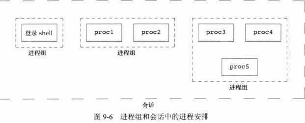
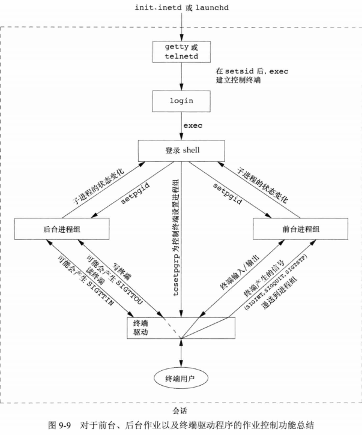
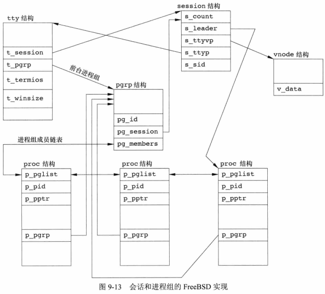

## <center>进程关系</center>

### tcgetpgrp tcsetpgrp 和 tcgetsid


* 会话首进程：创建会话的进程
* 通知内核哪一个进程组是前台进程组
* 一个会话有一个控制终端或伪控制终端
* 控制进程：建立与控制终端连接的会话首进程
* 前台进程组，后台进程组
* setsid
  - 该进程变成新会话的会话首进程，此时，该进程是新会话的唯一进程
  - 该进程成为一个新进程组的组长进程
  - 该进程没有控制终端，如果在调用setsid之前该进程有一个控制终端，那么这种联系也被切断
  - 如果该调用进程已经是一个进程组的组长，则此函数返回出错
```c
#include <unistd.h>
pid_t setsid(void);  //建立一个新会话
pid_t tcgetpgrp(int fd); //返回前台进程组Id，并与在fd上打开的终端相关联
//返回：若成功，返回前台进程组，若出错，-1
int tcsetpgrp(int fd,pid_t pgrpid);//设置前台进程组id，pgrpid必须属于同一会话
//返回：成功 0 出错 -1

#include <termios.h>
pid_t tcgetsid(int sid);//获得会话首进程的进程组ID
//成功，返回会话首进程的进程组ID，出错 -1
```

* 当启动一个后台作业时，shell赋予它一个作业标识符，并打印一个或多个进程ID
  当作业完成而键入回车时，shell通知作业已经完成
* 只有前台作业接收终端输入
* SIGTTIN 后台作业读终端引发错误
* SIGTTOU 后台作业输出终端引发错误
* SIGCONT 继续进程
* SIGHUP 挂断信号
* tpgid 前台进程组id
* 控制作业
  - jobs 作业列表
  - fg %[number] 继续执行作业
  - kill -9 %[number] 杀死作业
  - CTRL + Z 挂起
  - Ctrl+C 产生 SIGINT
  - Ctrl+\ 产生 SIGQUIT
  - Ctrl+Z 产生 SIGTSTP
  - stty tostop 禁止后台作业输出至控制终端
  - ssty 
* 前台进程组ID是终端的一个属性，而不是进程的属性

```sh
>ps -o pid,ppid,pgid,sid,tpgid,comm
# PID  PPID  PGID   SID TPGID COMMAND
# 29299 29279 29299 29299 29901 bash
# 29901 29299 29901 29299 29901 ps

```


### 孤儿进程组
* 不是孤儿进程组：该组中有一个进程，其父进程在属于同一会话的另一个组中。保证可以重启

[举例](orphano.c)

### FreeBSD

