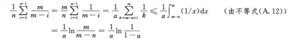

## 
散列表

### 开发寻址法
 * 定理11.6
   给定一个装载因子为`α=n/m<1`的开发寻址散列表，并假设是均匀散列的，则对于一次不成功的查找，其期望的探查次数至多为`1/(1-α)`  

   Pr{X≥i}=(n/m)·((n-1)/(m-1))···((n-i+2)/(m-i+2))≤(n/m)^(i-1)=α^(i-1)
   E[X]=∑(α^i)=1/(1-α)
 * 定理11.8
   对于一个装载因子为α＜1的开发寻址散列表，一次成功查找中的探查期望次数至多为`1/αln(1/(1-α))` 
   