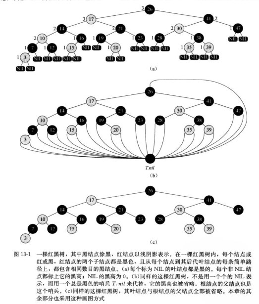
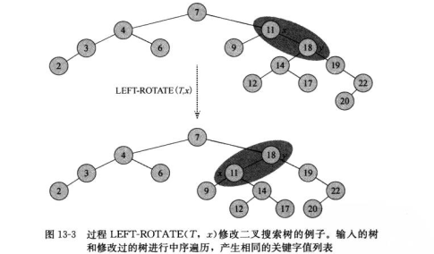
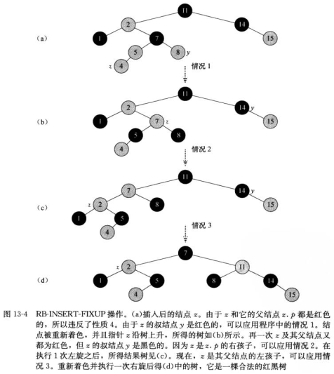

## <center>红黑树</center>

### 基本性质
  * 二叉搜索树
  * 每个结点或是红色的，或是黑色的
  * 根节点是黑色的
  * 每个叶节点(NIL)是黑色的
  * 如果一个结点是红色的，则它的两个子节点都是黑色的
  * 对每个结点，从该结点到其所有后代叶节点的简单路径上，均包含相同数目的黑色结点
  
  * 推论
    - `h≤2lg(n+1)` 根据黑高至少是h/2,所以n≥2^(h/2)-1


### 基本操作
  * LEFT-ROTATE(T,x)

  ```
  LEFT-ROTATE(T,x)
     y=x.right
     x.right=y.left
     if y.right≠T.nil
        y.left.p=x
     y.p=x.p
     if x.p==T.nil
        T.root=y
     elseif x==x.p.left
        x.p.left=y
     else x.p.right=y
     y.left=x
     x.p=y
  ```
  

  * RB-INSERT(T,x)

  ```
  RB-INSERT(T,z)
     y=T.nil
     x=T.root
     while x≠T.nil
        y=x
        if z.key＜x.key
           x=x.left
        else 
           x=x.right
     z.p=y
     if y==T.nil
        T.root=z
     elseif z.key<y.key
        y.left=z
     else
        y.right=z
     z.left=T.nil
     z.right=T.nil
     z.color=RED
     RB-INSERT-FIXED(T,z)
  ```

  * RB-INSERT-FIXED(T,z)

  ```
  RB-INSERT-FIXED(T,z)
     while z.p.color==RED
        if z.p==z.p.p.left
           y=z.p.p.right
           if y.color==RED
              z.p.color=BLACK
              y.color=BLACK
              z.p.p.color=RED
              z=z.p.p
           elseif z==z.p.right
              z=z.p
              LEFT-ROTATE(T,z)
           z.p.color=BLACK
           z.p.p.color=RED
           RIGHT-ROTATE(T,z.p.p)
    else(same as then clause 
    	 with "right" and "left" exchanged)
    T.root.color=BLACK
  ```

  


  *  RB-TRANSPLANT(T,u,v)
  ```
  RB-TRANSPLANT(T,u,v)
     if u.p==T.nil
        T.root=v
     elseif u==u.p.left
        u.p.left=v
     else 
        u.p.right=v
     v.p=u.p
  ```

  * RB-DELETE(T,x)

  ```
  RB-DELETE(T,x)
    y=z
    y.original.color=y.color
    if z.left==T.nil
       x=x.right
       RB-TRANSPLANT(T,z,z.right)
    elseif z.right==T.nil
       x=x.left
       RB-TRANSPLANT(T,z,z.left)
    else 
       y=TREE-MINIMUM(z.right)
       y.original.color=y.color
       x=y.right
       if y.p==z
          x.p=y
       else
          RB-TRANSPLANT(T,y,y.right)
          y.right=z.right
          y.right.p=y
       RB-TRANSPLANT(T,z,y)
       y.left=z.left
       y.left.p=y
       y.color=z.color
    if y.original.color==BLACK
       RB-DELETE-FIXUP(T,x)
  ```

  * RB-DELETE-FIXUP(T,x)

  ```
  RB-DELETE-FIXUP(T,x)
     while x≠T.nil and x.color==BLACK
        if x==x.p.left
           w=x.p.right
           if w.color==RED
              w.color=BLACK
              x.p.color=RED
              LEFT-ROTATE(T,x,p)
              w=x.p.right
           if w.left.color==BLACK and w.right.color==BLACK
              w.color=RED
              x=x.p
           elseif w.right.color==BLACK
              w.left.color=BLACK
              w.color=RED
              RIGHT-ROTATE(T,w)
              w=x.p.right
             w.color=x.p.color
             x.p.color=BLACK
             w.right.color=BLACK
             LEFT-ROTATE(T,x,p)
             x=T.root
        else(same as then clause with "right" and "left" exchanged)
    x.color=BLACK
  ```

  


### 代码
[红黑树头文件](../codes/rbtree.h)  
[示例文件](../codes/rbtree.cpp)
    