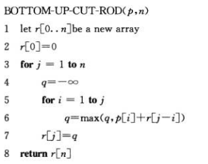
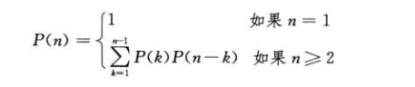
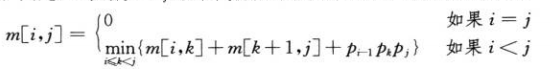
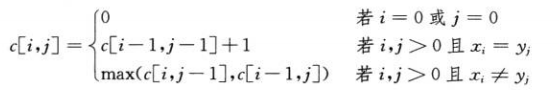
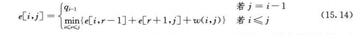

### 卡塔兰数(Catalan)
```
//递推式
h(n)=h(1)*h(n-1)+h(2)*h(n-2)+...+h(n-1)*h(1), n>=2;
//解
h(n)=C(2n-2,n-1)/n,n=1,2,3,...
//求解方法-多项式


```


### f(n)=f(n-1)+f(n-2)
* 上台阶，每次一步或两步，则剩一步f(n-1),剩两步f(n-2),最后剩余的步数分情况

### 方法
   - 刻画一个最优解的结构特征
   - 递归的定义最优解的值
   - 计算最优解的值，通常采用自底向上的方法
   - 利用计算出的信息构造一个最优解

### 原理
   - 最优子结构
   - 重叠子问题

### 钢条切割问题(左右对称，只取一边)

### 矩阵链乘法


```cpp
pair<vector<vector<int>>, vector<vector<int>>> Matrix_Chain_Order(const vector<int> &temp_Vec) {
    auto temp_n = temp_Vec.size() - 1;
    vector<vector<int>> temp_VecM, temp_VecS;

    temp_VecM.resize(temp_n + 1);
    temp_VecS.resize(temp_n + 1);

    for(auto &i : temp_VecM) {
        i.resize(temp_n + 1);
    }
    for (auto &i : temp_VecS) {
        i.resize(temp_n + 1);
    }

    for(auto i = 1; i <= temp_n; ++i) {
        temp_VecM[i][i] = 0;
    }

    for(auto l = 2; l <= temp_n; ++l) {
        for (auto i = 1; i <= temp_n - l + 1; ++i) {
            auto j = i + l - 1;
            temp_VecM[i][j] = INT_MAX;

            for(auto k = i; k <= j - 1; ++k) {
                auto temp_q = temp_VecM[i][k] + temp_VecM[k + 1][j] + temp_Vec[i - 1] * temp_Vec[k] * temp_Vec[j];

                if(temp_q < temp_VecM[i][j]) {
                    temp_VecM[i][j] = temp_q;
                    temp_VecS[i][j] = k;
                }
            }
        }
    }

    return make_pair(temp_VecM, temp_VecS);
}
```
### 最长公共子结构

* 15.4-2 伪代码
```c
i=m,n=j;
while(i>0&&j>0)
   if(X[i]==Y[j])
      printf c[i,j];
      i--;
      j--;
   else if(c[i-1,j]>=c[i,j-1])
   	  i--;
   else 
   	  j--;
```
* 15.4-3 伪代码
```c
LCS-LENGTH(b,c,X,Y,i,j)
{   
   if(i==0 or j==0)
   	  return 0;
   if(c[i,j]>0)
   	 return c[i,j];
   if(X[i]==Y[j])
   	 c[i,j]=LCS-LENGTH(b,c,X,Y,i-1,j-1)+1;
   	 b[i,j]='\\';
   else if(LCS-LENGTH(b,c,X,Y,i-1,j)>=LCS-LENGTH(b,c,X,Y,i,j-1))
   	 c[i,j]=LCS-LENGTH(b,c,X,Y,i-1,j);
   	 b[i,j]='|';
   else 
   	 c[i,j]=LCS-LENGTH(b,c,X,Y,i,j-1);
   	 b[i,j]='-';
   //return c[i,j];
}
```
* 15.4-4 伪代码
```c
//两行
n=min(m,n);
c[0...n]={0};//保存上次
c[1,i]//保存这次，然后互换
//一行
c[0,i] //保存最近的
//和前一个和自己比较求当前值
if(X[i]=Y[j])
  c[i]=c[i-1]+1;
else 
  c[i]=c[i-1];
```
* 15.4-5 伪代码
```c
m_l=0;
m_ll=0;
for i=1 to n
  for(j=i to n)
  	if(a[i+1]>=a[i])
  		m_l++;
  	else 
  	  break;
  m_ll=m_ll>m_l?m_ll:m_l;

```

### 最优二叉搜索树

```cpp
pair<vector<vector<float>>, vector<vector<int>>> Option_Bst(const vector<float> &p,const vector<float> &q,int n) {
    vector<vector<float>> e(n+2,vector<float>(n+1,0)),w(n+2,vector<float>(n+1,0));
    vector<vector<int>> root(n+1,vector<int>(n+1,0));
    for(auto i=1;i<=n+1;i++)
    {
    	e[i][i-1]=q[i-1];
    	w[i][i-1]=q[i-1];
	}
    for(auto l = 1; l <= n; l++) {
        for (auto i = 1; i <= n - l + 1; i++) {
            auto j = i + l - 1;
            e[i][j] = INT_MAX;
            w[i][j]=w[i][j-1]+p[j]+q[j];
            if(i==j)
            {
            	e[i][j]=e[i][j-1]+e[i+1][j]+w[i][j];
            	root[i][j]=i;
			}else{
              for(auto r = root[i][j-1]; r <=root[i+1][j]; r++) {
            	auto t=e[i][r-1]+e[r+1][j]+w[i][j];
            	if(t<e[i][j])
            	{
            		e[i][j]=t;
            		root[i][j]=r;
				}
             } 
			}
        }
    }
    return make_pair(e, root);
}
```