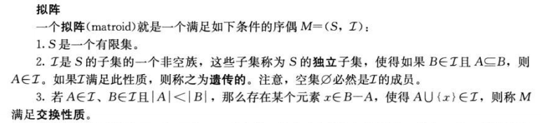
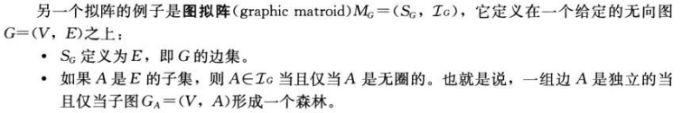

### 贪心算法
 - 确定问题的最优子结构
 - 设计一个递归 算法
 - 证明如果我们做出一个贪心选择，则只剩下一个子问题
 - 证明贪心选择总是安全的(做出贪心选择后，原问题总是存在最优解)
 - 设计一个递归算法实现贪心策略
 - 将递归算法转换为迭代算法

### 贪心选择性质
 - 通过做出局部最优(贪心)来构造全局最优解
 - 贪心算法进行选择时可能依赖之前做出的选择但是不依赖任何将来的选择或是子问题的解

### 最优子结构


### 霍夫曼编码

>>编码。使用最小堆
```
HUFFMAN(C)
{
	n=|C|
	Q=C
	for i=1 to n-1
	   allocate a new node z
	   z.left=x=EXTRACT-MIN(Q)
	   z.right=y=EXTRACT-MIN(Q)
	   z.freq=x.freq+y.freq
	   INSERT(Q,z)
	return EXTRACT-MIN(Q)
}
```
>>原理
 - 引理16.2
   令C为一个字母表，其中每个字符c∈C都有一个频率c.freq.令x和y是C中频率最低的两个字符。那么存在C的一个最优前缀码，x和y的吗子长度相同，且只有最后一个二进制位不同
 - 引理16.3
   令C为一个给定的字母表，其中每个字符c∈C都定义了一个频率c.freq。令x和y是C中频率最低的两个字母。令C‘=C-{x,y}U{z}。类似C，也为C'定义freq,不同之处只是z.freq=x.freq+y.freq。令T'为字母表C'的任意一个最优前缀编码对应的编码树。于是我们可以将T'中叶节点z替换为一个以x和y为孩子的内部节点，得到树T，而T表示字母表C的一个最优前缀码

### 斐波那契数列频率 霍夫曼编码
  - h(c)-1个1,1个0
  - 最后一个都是h(c)个1

### 例题
>>有字母表 C={0,1,...,n-1}上的一个最优前缀码，我们希望用最少的二级制位传输此编码,用2n-1+n[lgn]位表示  
用2n-1位说明编码树的结构，前序遍历，叶子节点1，非叶子节点为0
再用nlgn位保存最优前缀码

## 拟阵

### 性质


 
1. 定理16.5 
   如果G=(V,E)是一个无向图，则M=(S,T)是一个拟阵
2. 扩展
   给定一个拟阵M=(S,T),如果对一个集合A∈T和一个元素x∉A,将x加入A会保持独立性质，则称x是A的一个扩展
3. 最大的
   对拟阵M中的一个独立子集A，如果它不存在扩展，则称它是最大的
4. 定理16.6
   拟阵中所有最大独立子集都有相同大小

```
GREEDY(M,w)
   A=∅
   sort M.S into monotonically decreasing order by weight w
   for each x∈M.S,taken in monotonically decreasing order by weight w(x)
     if A∪{x}∈M.T
       A=A∪{x}
   return A
```

5. 引理16.7(拟阵具有贪心选择性质)
   假设M=(S,T)是一个加权拟阵，加权函数为w，且S已按权重单调递减顺序排序。令x是S中第一个满足{x}独立的元素(如果存在)。如果存在这样的x，那么存在S的一个最优子集A包含x
6. 引理16.8
 令M=(S,T)是一个拟阵，如果x是S中一个元素，而且是S的某个独立子集A的一个扩展，则x也是∅的一个扩展】
6. 引理16.9
  令M=(S,T)是一个拟阵，如果x是S中一个元素，且它不是∅的一个扩展，那么它也不是S的任何独立于子集A的扩展
7. 引理16.10(拟阵具有最优子结构性质)
  令M=(S,T)是一个加权拟阵，x是S中第一个被GREEDY算法选出的元素，则接下来寻找一个包含x的最大权重独立子集的问题归结为寻找加权拟阵M’=(S',T')的一个最大权重独立子集的问题，其中
  `S'={y∈S;{x,y}∈T}`
  `T'={B⊆S-{x};B∪{x}∈T}`
 8. 定理16.11(拟阵上贪心算法的正确性)
   若M=(S,T)是一个加权拟阵，权重函数是w,那么GREEDY(M,w)返回一个最优子结构


### 思考题

>>16.1(找零问题)
  钢条切割问题
  ```cpp
  let c[n] 代表n每分最低的次数
  c[1]=1;
  for(let i=2 to n)
    for(let j=1 to i/2)
      if(n=a[...k])
        c[i]=1;
      else 
        c[i]=min(c[j]+c[i-j]); 


int k = c.size()-1;//减掉填充符
	m[0] = 0;
	for(int i=1;i<=n;i++)
	{
		m[i] = INT_MAX;
		for(int j=1;j<=k && (i>=c[j]);j++)
		{
			if(m[i-c[j]]+1< m[i])
			{
				m[i] = m[i-c[j]]+1; 
				s[i] = j;
			}
		}
	}
```