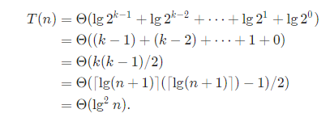
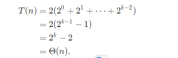
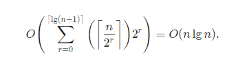
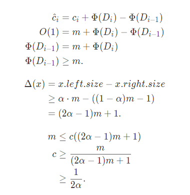

### 17.4-1
由一次成功插入期望探查次数1/αlg1/(1-α)，当α趋于1时，探查次数为无穷大
当阿尔法为常数，期望探查次数为常数，所以摊还代价的期望为O(1),但如果满时要扩张表，需要复制所有数据，插入操作实际代价为O(n);
### 思考题
17.1
>>
a. O(nk)
```c
for(int i=0;i<n;i++){
	int s=0;x=i;
  for(int j=0;j<k;j++)
  {
     s<<=1,s|=x&1,x>>=1;
  }
  if(i<s)
  	swap(a[i],a[j]);
}
```
b. 获取index的位逆序计数器值。然后直接交换
>>
17.2
[答案](https://walkccc.github.io/CLRS/Chap17/Problems/17-2/)
>>
a. (lgn)^2

```c
for i=0 to k-1
  search A[i] binary search util element in A[i];
```
b. 
```c
let a[0] is inserted  element
i=0;
while(A[i] is full)
	merge A[i] and a[i] to be a new a[i];
replace A[i] with a[i];
```
最坏合并所有，O(n);

摊还代价 

c. O(n^2)

17.3
>>
a. O(x.size)
前序遍历，输出到额外数组
然后递归选取中间为根节点，重建树 T(n)=2T(n/2)+1
b. 二叉树，只要α为常数，深度即是O(lgn)
T(n)=T(αn)+T((1-α)n)+1;
d.

e. 
查找需要lg(n),之前是平衡的，所以沿父节点向上即可，二叉搜索树性质可得时间为O(lgn)
>>