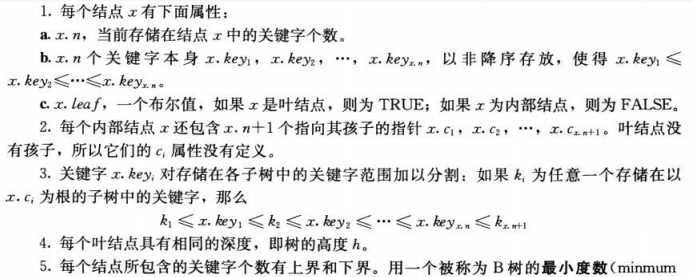
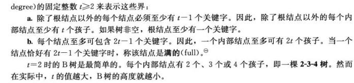
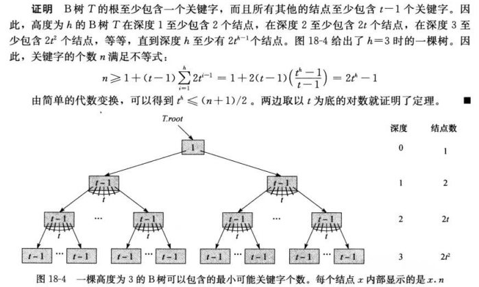
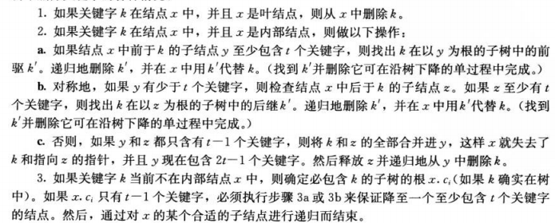
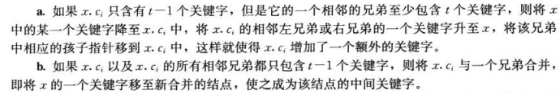
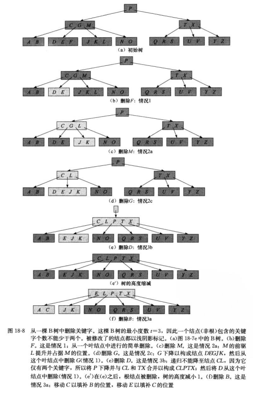
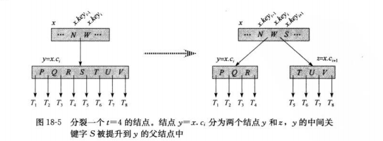
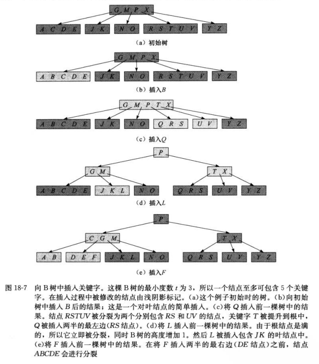

## <center>B树</center>

一个B树结点通常和一个完整磁盘页一样大，并且磁盘页的大小限制了一个B树结点可以含有的孩子个数
```c
x=a pointer to some object
DISK-READ(x)//如果x在内存，为空操作，否则读取磁盘
operations that access and/or modify the attributes of x
DISK-WRITE(x)
other operations that access but do not modify attributes of x
```

### B树的性质





* 定理18.1
如果n≥1，那么对任意一颗包含n个关键字，高度为h、最小度数t≥2的B树，有  
h≤logt((n+1)/2)


由于在一颗树中检查任意一个结点都需要一次磁盘访问，所以B树避免了大量的磁盘访问

## B树上的基本操作


### 将{1,2,...,n}被插入一颗最小度为2的空B树中，最终的B树有 2^(lgn向下取整)
### 找前驱
```c

B-TREE-FIND-PREDECESSOR(x, i)
    if !x.leaf
        DISK-READ(x.c[i])
        return B-TREE-FIND-MAX(x.c[i])
    else if i > 1      // x is a leaf and i > 1
        return x.key[i - 1]
    else
        z = x
        while true
            if z.p == NIL    // z is root
                return NIL   // z.key[i] is the minimum key in T; no predecessor
              y = z.p
              j = 1
              DISK-READ(y.c[1])
              while y.c[j] != x
                  j = j + 1
                  DISK-READ(y.c[j])
              if j == 1
                  z = y
              else
                  return y.key[j - 1]
```

删除结点




### 创建空树
```c
B-TREE-CREAT(T)
  x=ALLOCATE-NODE()
  x.leaf=true
  x.n=0
  DISK-WRITE(x)
  T.root=x
```
### 分裂B树中结点



```c
B-TREE-SPLIT-CHILD(x,i)
   z=ALLOCATE-NODE()
   y=x.ci
   z.leaf=y.leaf
   z.n=t-1
   for j=1 to t-1
      z.key(j)=y.key(j+t)
   for not y.leaf
      for j=1 to t
        z.c(j)=y.c(j+t)
   y.n=t-1
   for j=x.n+1 downto i+1
     x.c(j+1)=x.cj
   x.c(i+1)=z
   for j=x.n downto i
     x.key(j+1)=x.key(j)
   x.keyi=y.keyt
   x.n=x.n+1
   DISK-WRITE(y)
   DISK-WRITE(z)
   DISK-WRITE(x)
```

### 插入

```c
B-TREE-INSERT(T,k)
  r=T.root
  if r.n==2t-1
    s=ALLOCATE-NODE()
    T.root=s
    s.leaf=FALSE
    s.n=0
    s.c1=r
    B-TREE-SPLIT-CHILD(s,1)
    B-TREE-INSERT-NONFULL(s,k)
  else 
    B-TREE-INSERT-NONFULL(r,k)
```

B-TREE-INSERT-NONFULL(x,k)




## [代码](../codes/btree.cpp)