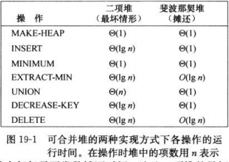
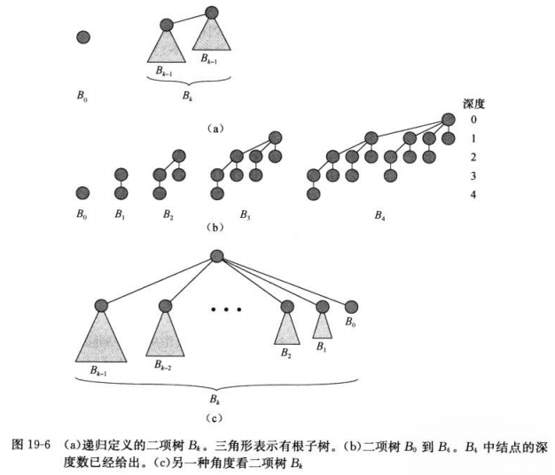

## 
斐波那契堆

* x.mark指示结点x自从上一次成为另一个结点孩子后，是否失去过孩子  
  新产生的结点是未标记的，并且当结点x成为另一个结点的孩子时，它便成为未被标记结点
* 最大结点的度 ≤lgn/lg((1+½5)/2)

### 习题
19.4-1

19.3 二项堆

* 二项树Bk性质
  - 一共2^k结点
  - 树的高度为k
  - 对于i=0,1,2,...,k,深度为i的结点恰有c(k,i)个  
    C(k,i)=C(k-1,i)+C(k-1,i-1)
* 二项堆性质`binomial heap` H
  - 每个结点具有一个关键字
  - H中每个二项树遵循最小堆性质
  - 对于任意的非负整数k,H中最多有一个二项树的根的度数为k
  - n个结点，最多有⌊lgn⌋+1 个二项树组成
    因为大小为n的二进制最多有 ⌊lgn⌋+1 位置为1

19.4 2-3-4堆

### 基本操作 - 伪代码 - 复杂度
* Φ(H)=t(H)+2m(H) //根结点及标记数
* FIB-HEAP-INSERT(H,x)   O(1)
* FIB-HEAP-UNION(H1,H2)  O(1)
* FIB-HEAP-EXTRACT-MIN(H) O(lgn)
* FIB-HEAP-DECREASE-KEY(H,x,k) O(1)
* FIB-HEAP-DELETE(H,x) O(lgn)  

### 代码[c++实现](../codes/fib_heap.cpp)