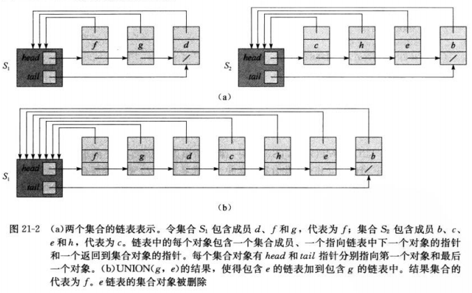

##<center>用于不相交集合的数据结构</center>

### 基本结构
* 不相交集合的链表表示
  - 集合对象 head,tail
  - 成员对象 head,next,key
  

### 基本操作
* MAKE-SET(x)
* UNION(x,y)
* FIND-SET(x)

### 应用
* 确定无向图的连通分量

```
CONNECTED-COMPONENTS(G)
  for each vextex v∈G.V
     MAKE-SET(v)
  for each edge(u,v)∈G.E
     if FIND-SET(u)≠FIND-SET(v)
        UNION(u,v)

SAME-COMPONENT(u,v)
  if FIND-SET(u)==FIND-SET(v)
     return TRUE
  else 
     return FALSE
```

### 习题
* 21.2-1
```
MAKE-SET(x)
	Let o be an object with three fields, next, value, and set
	Let L be a linked list object with head = tail = o
	o.next = NIL
	o.set = L
	o.value = x
	return L

FIND-SET(x)
   return o.set.head.value

UNION(x,y)
	L1= x.set
	L2 = y.set
	if L1.n>L2.n
		L1.tail.next = L2.head
		z = L2.head
		while z.next ≠ NIL do
			z.set = L1
	        z=z.next
		end while
		L1.tail = L2.tail
		return L1
    else
      exchange L1 and L2
```

* 21-1
```
OFF-LINK-MINIMUM(m,n)
  determine j such that i ∈Kj
  if j≠m+1
     extracted[j]=i
     let l be the smallest value greater than j for which set Kl exists
     Kl=Kj∪Kl,destroying Kj
  return extracted
```
* 21-2
```
MAKE-TREE(v)
    v.p = v
    v.rank = 0
    v.d = 0
```

```
FIND-ROOT(v)
    if v.p != v.p.p
        y = v.p
        v.p = FIND-ROOT(y)
        v.d = v.d + y.d
    return v.p

FIND-DEPTH(v)
    FIND-ROOT(v)    // no need to save the return value
    if v == v.p
        return v.d
    else return v.d + v.p.d
```

```
GRAPT(r, v)
    r' = FIND-ROOT(r)
    v' = FIND-ROOT(v)
    z = FIND-DEPTH(v)
    if r'.rank > v'.rank
        v'.p = r'
        r'.d = r'.d + z + 1
        v'.d = v'.d - r'.d
    else r'.p = v'
        r'.d = r'.d + z + 1 - v'.d
        if r'.rank == v'.rank
            v'.rank = v'.rank + 1
```

* 21-3 [参考](https://blog.csdn.net/zilingxiyue/article/details/44921043)
