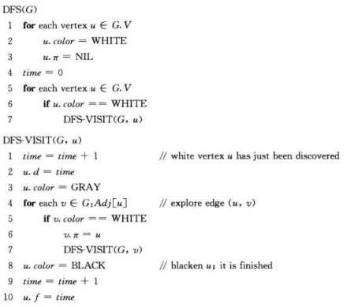
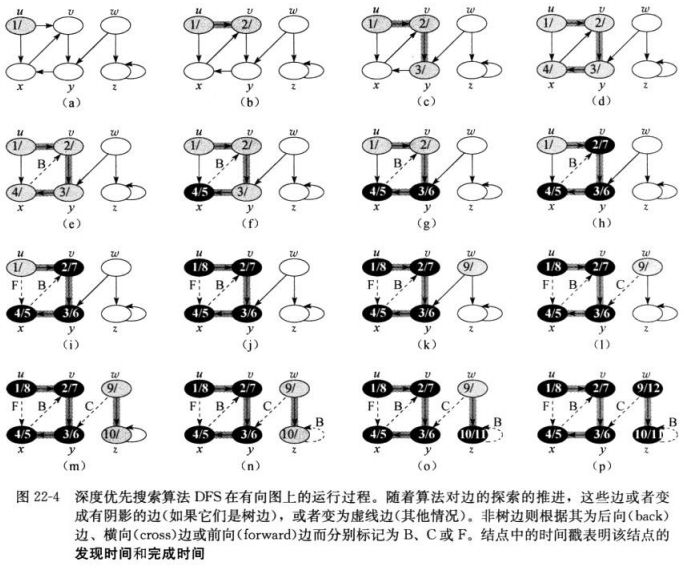
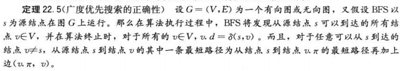
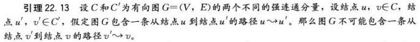
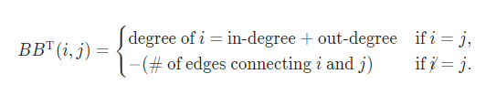

## <center>基本的图算法</center>

### 结构
* 邻接矩阵

* 邻接链表

```c
#define ElementType int
typedef struct V{
    ElementType key;
    struct V *next;
    struct V *π;
    enum color{white,gray,black};
    int d;
} vertex,*vertexLink;

vertexLink adj[|V|];
```
* 深度优先森林G
  1. 树边：为深度优先森林G<sub>π</sub>中的边，如果结点v是因算法对边(u,v)的探索而首先被发现，则(u,v)是一条树边
  2. 后向边(B/back)：后向边(u,v)是将结点u连接到其在深度优先树中(一个)祖先结点v的边，由于有向图周中可以有自循环，自循环也被认为是后向边
  3. 前向边(F/forward)：是将结点u连接到其在深度优先树中一个后台结点v的边
  4. 横向边(C/cross)：指其他所有的边。这些边可以连接同一颗深度优先树中的结点，只要其中一个结点不是另外一个结点的祖先，也可以连接不同深度优先树中的两个结点

* 拓扑排序
  是G中所有结点的一种线性次序
* 强连通分量
  - G=(V,E) 的转置 G<sup>T</sup>=(V,E<sup>T</sup>)  
    这里E<sup>T</sup>={(u,v):(v,u)∈E}
  - 图G和图G<sup>T</sup>的强连通分量完全相同
  - G<sup>SCC</sup>=(VG<sup>SCC</sup>,EG<sup>SCC</sup>)
  - 分量图G<sup>SCC</sup>：  
    通过收缩所有相邻结点都在同一个强连通分量重的边，剩下的图就是G<sup>SCC</sup> 
  - d(U)和 f(U)分别是结点集合U中所有结点里最早的发现时间和最晚的完成时间

### 基本操作
* BFS O(V+E)

```
BFS(G,s)
  for each vertex u∈G.V-{s}
     u.color=WHITE
     u.d=∞
     u.π=NIL
  s.color=GRAY
  s.d=0;
  s.π=NIL
  Q=∅
  ENQUEUE(Q,s)
  while Q≠∅
    u=DEQUEUE(Q)
    for each v∈G.Adj[u]
       if v.color==WHITE
          v.color=GRAY
          v.d=u.d+1
          v.π=u
          ENQUEUE(Q,v)
  u.color=BLACK
```


* PRINT-PATH(G,s,v)
```
PRINT-PATH(G,s,v)
  if v==s
     print s
  elseif v.π==NIL
     print "no path from" s "to " v "exists"
  else PRINT-PATH(G,s,v.π)
     print v
```


* DFS Θ(V+E)




* TOPOLOGICAL-SORT O(V+E)

```
TOPOLOGICAL-SORT(G)
 call DFS(G) to compute finishing times v.f for each vertex v
 as each vertex is finished,insert it onto the frout of a linked list
 return the linked list of vertices
```

* STRONGLY-CONNECTED-COMPONENTS(G)
```
STRONGLY-CONNECTED-COMPONENTS(G)
  call DFS(G) to compute finishing times u.f for each vertex u
  compute G^T
  call DFS(G^T),but in the main loop of DFS,consider the vertices
      in order of decreasing u.f(as computed in line 1)
  output the vertices of each tree in the depth-first forest formed in line3 as a separate strongly connected component
``` 

### 引理
* 22.1
给定G=(V,E),G为一个有向图或无向图，设s∈V为任意结点，则对于任意边(u,v)∈E，δ(s,v)≤δ(s,u)+1

* 22.2
设G=(V,E)为一个有向图或无向图，假定BFS以给定结点s∈V为源节点在图G上运行，那么在BFS终结时，对于每个结点v∈V，BFS所计算出的v.d满足v.d≥δ(s,v)

* 22.3 
假定BFS在图G=(V,E)上运行的过程中，队列Q包含的结点为<v1,v2,...,vr>,这里v1是队列Q的头，vr是队列Q的尾。那么vr.d≤v1.d+1,并且对于i=1,2,...,r-1,vi.d≤vi+1.d

* 22.4
假定在执行BFS时，结点vi和结点vj都加入到队列Q里，并且vi在vj 前面入队，则在vj入队是，我们有vi.d≤vj.d

* 22.5


* 22.6
当运行咋一个有向或无向图G=(V,E)上时，BFS过程所建造出来的π属性使得前驱子图G<sub>π</sub>=(V<sub>π</sub>,E<sub>π</sub>)

* 22.7

在有向图或无向图G=(V,E)进行任意深度优先搜索中，对于任意两个结点u和v来说，下面三种情况只有一种成立  
  - 区间[u.d,u.f]和区间[v.d,v.f]完全分离，在深度优先森林中，结点u不是结点v的后台，结点v也不是结点u的后代
  - 区间[u.d,u.f]完全包含在区间[v.d,v.f]内，在深度优先森林中，结点u是结点v的后台
  - 区间[v.d,v.f]完全包含在区间[u.d,u.f]内，在深度优先森林中，结点v是结点u的后台

* 22.8
在有向图或无向图G的深度优先森林中，结点v是结点u的真后代当且仅当u.d< v.d< v.f< u.f 成立

* 22.9
在有向图或无向图G=(V,E)的深度优先森林中，结点v是结点u的后代当且仅当在发现结点u的时间u.d,存在一条从结点u到结点v的全部由白色结点所构成的路径

* 22.10 
在对无向图G进行深度优先搜索时，每条边要么是树边，要么是后向边

* 22.11
一个有向图G=(V,E)是无环的当且仅当对其进行深度优先搜索不产生后向边

* 22.12
拓扑排序算法TOPOLOGICAL-SORT生成的是有向无环图的拓扑排序 "括号法"

* 22.13



* 22.14
设C和C'为有向图G=(V,E)的两个不同的强连通分量。假如存在一条边(u,v)属于E，这里u∈C,v∈C',则f(C)＞f(C')

* 22.15
设C和C'为有向图G=(V,E)的两个不同的强连通分量。假如存在一条边(u,v)属于E<sup>T</sup>，这里u∈C,v∈C',则f(C)＞f(C')

* 22.16
算法STRONGLY-CONNECTED-COMPONENTS能够正确计算出有向图G的强连通分量 

* 22.17
有向无环图G(V,E),G是半连通的当且仅当有一条路径，这条路径上有图G中所有点


### 习题
* 21.1-3 
  新建数组A[V],遍历旧邻接链表B[V]，i出现在B[k]中，则将k放入A[i]中
* 21.1-4
  ```
  EQUIVALENT-UNDIRECTED-GRAPH
    let Adj'[1..|V|] be a new adjacency-list
    let M be |V| × |V| //可以是一个|V|数组
    for each vertex u ∈ G.V
        for each v ∈ Adj[u]
            if M[u, v] == Ø && u != v
                M[u, v] = true
                INSERT(Adj'[u], v)
  ```
* 21.1-5
```
for u=1 to |V|
 	for each v 属于 Adj[u]
 		Adj1[u].insertAll(Adj[v]);
```
* 21.1-6

  复杂度O(V)
```
IS-SINK(A, k)
    let A be |V| × |V|
    for j = 1 to |V|      // Check for a 1 in row k
        if a[k, j] == 1
            return false
    for i = 1 to |V|      // Check for an off-diagonal 0 in column k
        if a[i, k] == 0 and i != k
            return false
    return true

UNIVERSAL-SINK(A)
    let A be |V| × |V|
    i = j = 1
    while i ≤ |V| and j ≤ |V|
        if a[i, j] == 1
            i = i + 1
        else j = j + 1
    if i > |V|
        return "there is no universal sink"
    else if IS-SINK(A, i) = false
        return "there is no universal sink"
    else return i "is a universal sink"
```

* 21.1-7




* 21.1-8
O(1)  最坏O(V)  
二叉搜索树  查找时间为O(lgV)

* 22.2-6


* 22.2-7
? 两次DFS  
? 两边深度和-1

* 22.3-1

* 22.3-5
  1. 树边或前向边当且仅当 u.d＜v.d＜v.f＜u.f
  2. 后向边当且仅当 v.d≤u.d＜u.f≤v.f
  3. 横向边当且仅当 v.d＜v.f＜u.d＜u.f

* 22.3-7

```
Algorithm 2 DFS-STACK(G)
for every u ∈ G.V do
  u.color = WHITE
  u.π = NIL
end for
time = 0
S is an empty stack
while there is a white vertex u in G do
  S.push(u)
  while S is nonempty do
    v = S.pop
    time++
    v.d = time
    for all neighbors w of v do
      if w.color == WHITE then
        w.color = GRAY
        w.π = v
        S.push(w)
      end if
    end for
    time++
    v.f = time
  end while
end whil
```
* 22.3-10
```
DFS-VISIT-PRINT(G, u)
  time = time + 1
  u.d = time
  u.color = GRAY
  for each v ∈ G.Adj[u]
      if v.color == white
          print "(u, v) is a Tree edge."
          v.π = u
          DFS-VISIT-PRINT(G, v)
      else if v.color == gray
          print "(u, v) is a Back edge."
      else
          if v.d > u.d
              print "(u, v) is a Forward edge."
          else print "(u, v) is a Cross edge."
```

* 22.3-13
DFS，存储 入度和出度

* 22.4-2
  - 从p开始拓扑排序，选择v在其中的一棵树
  - 截取从p到v的一段拓扑排序
  - 从v逆向回溯到p，假设回溯到点x,则继续在片段[v,x]中进行回溯
  - 回溯到v，则路径添加一条
```
SIMPLE-PATHS(G, u, v)
    TOPO-SORT(G)
    let {v[1], v[2]..v[k - 1]} be the vertex between u and v
    v[0] = u
    v[k] = v
    for j = 0 to k - 1
        DP[j] = ∞
    DP[k] = 1
    return SIMPLE-PATHS-AID(G, DP, 0)
```
```
 SIMPLE-PATHS-AID(G, DP, i)
    if i > k
        return 0
    else if DP[i] != ∞
        return DP[i]
    else
       DP[i] = 0
       for v[m] in G.adj[v[i]] and 0 < m ≤ k
            DP[i] += SIMPLE-PATHS-AID(G, DP, m)
       return DP[i]
```

* 22.4-4 
不正确(https://walkccc.github.io/CLRS/Chap22/22.4/)
什么是坏边？就是废除不用的边
拓扑排序从左往右排序，使得边都是从左向右

* 22.4-5
遍历生成顶点入度的数组
选择入度为0的点，然后删除出度树的相应边并将 邻接结点入度减1
直到所有入度为0

若有环，最后会剩余下环
      
```
TOPOLOGICAL-SORT(G)
    // Initialize in-degree, Θ(V) time.
    for each vertex u ∈ G.V
        u.in-degree = 0
    // Compute in-degree, Θ(V + E) time.
    for each vertex u ∈ G.V
        for each v ∈ G.Adj[u]
            v.in-degree = v.in-degree + 1
    // Initialize Queue, Θ(V) time.
    Q = Ø
    for each vertex u ∈ G.V
        if u.in-degree == 0
            ENQUEUE(Q, u)
    // while loop takes O(V + E) time.
    while Q != Ø
        u = DEQUEUE(Q)
        output u
        // for loop executes O(E) times total.
        for each v ∈ G.Adj[u]
            v.in-degree = v.in-degree - 1
            if v.in-degree == 0
                ENQUEUE(Q, v)
    // Check for cycles, O(V) time.
    for each vertex u ∈ G.V
        if u.in-degree != 0
            report that there's a cycle
    // Another way to check for cycles would be to count the vertices 
    // that are output and report a cycle if that number is < |V|.
```

* 22.5-3
G<sup>T</sup> 可保证沿f(C)>f(C')的顺序执行
G 不能保证从 f(C)>f(C')执行，因为min(f)可能在较大的f(C)中

* 22.5-7

```
IS-SEMI-CONNECTED(G)
  Compute the component graph of G, call it G0
  Perform a topological sort on G0
  to get the ordering of its vertices v1, v2, . . . , vk.
    for i=1..k-1 do
      if there is no edge from vi to vi+1 then
        return FALSE
      end if
    end for
  return TRUE
```

