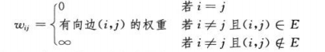
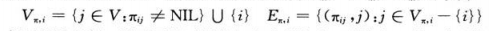
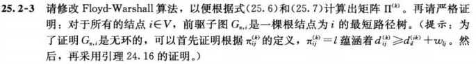

## <center>所有结点对的最短路径问题</center>

### 基础概念

* W=(w<sub>ij</sub>)



* 前驱子图 G<sub>π,i</sub>=(V<sub>>π,i</sub>,E<sub>>π,i</sub>)



### program

* PRINT-ALL-PAIRS-SHORTEST-PATH(∏,i,j)
```
PRINT-ALL-PAIRS-SHORTEST-PATH(∏,i,j)
   if i=j
      print i
   elseif πij==NIL
      print "no path from"i"to"j"exists"
   else PRINT-ALL-PAIRS-SHORTEST-PATH(∏,i,πij)
      print j
```

* TRANSITIVE-CLOSURE(G)
```
RANSITIVE-CLOSURE(G)
  n=|G.V|
  let T(0)=(tij(0)) be a new nXn matrix
  for i=1 to n
    for j=1 to n
      if i==j or (i,j)∈G.E
         tij(0)=1
      else 
         tij(0)=0
  for k=1 to n
   let T(k)=(tij(k)) be a new nXn matrix
   for i=0 to n
     for j=1 to n
       tij(k)=tij(k-1)V(tik(k-1)∧tkj(k-1))
  return T(n)
```

* JOHNSON(G,w)
```
JOHNSON(G,w)
  compute G',where G'.V=G.V∪{s}
     and G'.E=G.E∪{(s,v),v∈G.V},
     and w(s,v)=0 for all v∈G.V
  if BELLMAN-FORD(G',w,s)==FALSE
     print "the input graph contains a negative-weight cycle"
  else for each vertex v∈G'.V
     set h(v) to the value of δ(s,v)
       computed by the Bellman-ford algorithm
     for each edge(u,v)∈G'.E
       w'(u,v)=w(u,v)+h(u)-h(v)
     let D=(dij) be a new nXn matrix
     for each vertex u∈G.V
        run  DIJKSTRA(G,w',u) to compute δ'(u,v) for all v∈G.V
        for each vertex v∈G.V
           dij=δ'(u,v)+h(v)-h(u)
  return D
```

### 难题
* 25.1-10
* 25.2-3

* 26.2-6
   - dii<0
   - 再次执行Floyd-Warshall,矩阵依旧变化
* 26.2-10
   - DFS删除后向边，前向边，横向边，并保存     
   - 传递闭包算法
   - 遍历删除的边(u,v)及v可以到达的所有顶点，记录
     最多O(V+E\*)

* 26.3-3
   如果边都非负，则 w'(u,v)=w(u,v)

* 26.3.4
   导致每条边减小同样的长度，如果有两条路径，经过的边不同，则每条路径减小的总长不同，最短路径会变化

* 26.3-5 
???