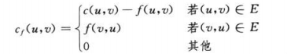
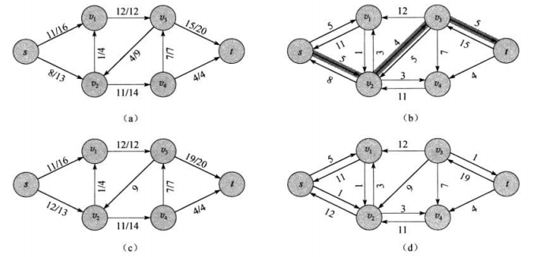
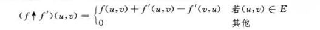
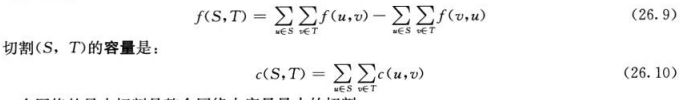
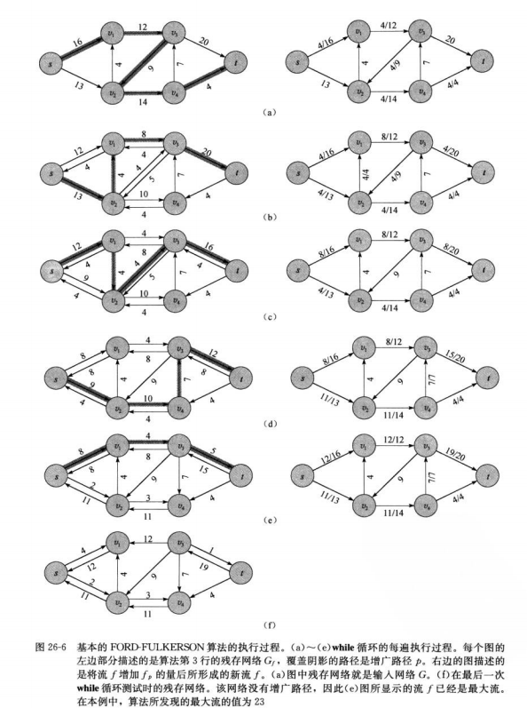
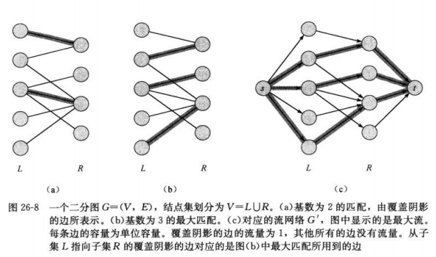
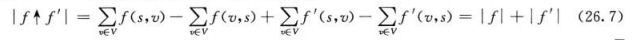
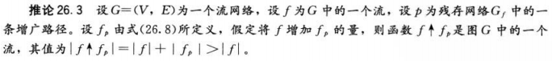
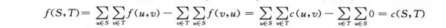

## <center>最大流</center>


### 疑惑
* 什么是等价的网络？最大流具有相同的值？？？
* 首先证明流量限制，再证明流量守恒

### 流网络
*  概念
  -  G=(V,E) 有向图
  - 每条边(u,v)∈E 有非负的容量值c(u,v)≥0
  - 如果(u,v)∈E，则(v,u)∉E
  - 如果(u,v)∉E，则c(u,v)=0
  - 不允许自循环
  - 源节点 s 和 汇结点 t
    - 假定每个结点都在从源节点到汇结点的某条路径上
* 定义
  - 设G=(V,E)为一个流网络，其容量函数为c。设s为网络的源节点，t为汇点。G中的流是一个实值函数
  `f:VxV->R` 满足下面两条性质
    - 容量限制  
      对于所有的结点u,v∈V，0 ≤f(u,v)≤c(u,v)
    - 流量守恒  
      对于所有的结点u∈V-{s,t},要求 ∑(v∈V)f(v,u)=∑(v∈V)f(u,v)
  

* Ford-Fulkerson
   - 核心思想：沿着增广路径重复增加路径上的流量,直到找到一个最大流为止
   - 残存网络
     - 给定一个流网络G=(V,E)和一个流f,则由f所诱导的图G的残存网络为Gf=(V,Ef),其中  
       Ef={(u,v)∈V x V：cf(u,v)＞0},有|E<sub>f</sub>|≤2|E|

     
     

     - 递增(26.4)

       

     - 残存容量:在一条增广路径p上能够为每条边增加的流量的最大值为路径p的残存容量  
       cf(p)=min(cf(u,v):(u,v)属于路径p)

   - 增广路径   
     增广路径p是残存网络G<sub>f</sub>中一条从源节点s到汇点t的简单路径。

   - 切割
      - 流网络G=(V,E)中的一个切割(S,T)将结点集合V划分为S和T=V-S两个集合，是的s∈S,t∈T。
      - 切割(S,T)的净流量 `f(S,T)` 和 容量c(S,T)
     
      

      - 一个网络的最小切割是整个网络中容量最小的切割
  
   -  FORD-FULKERSON算法分析
      - 流的值会随着后续的递增而增加，但它却不一定收敛于最大的流值
      - 只有当边的容量为无理数时，Ford-Fulkerson方法才有可能不能终止
      - 如果容量为有理数，则可以通过乘以某个系数将其转换成整数
      - while循环的次数最多为|f* |次，因为流量值在每次迭代中最少增加一个单位  
      - 运行时间O(E|f* |)

      
   
      - 潜在问题 O(E|f* |)，如果容量差太大，导致效率极低 
      
      

* Edmonds-Karp
  - 使用BFS寻找增广路径
  
* 最大二分配问题
  - 二分图的最大匹配问题
  - V'=V∪{s,t}
  - E'={(s,u):u∈L}∪{(u,v):(u,v)∈E}∪{(v,t):v∈R}
  
  -  

* 推送-重贴标签算法
  - 结点u是一个溢出结点，cf(u,v)＞0,并且h(u)=h(v)+1
  - u.e 超额流
  - u.h u的高度
  - 重贴标签操作
    - 结点u溢出，且对所有的边(u,v)∈Ef,有u.h≤v.h,则基本操作RELABEL(u)适用于u
  - 通用算法 初始化 INITIALIZE-PREFLOW 

### 伪码

* FORD-FULKERSON-METHOD(G,s,t)
```
FORD-FULKERSON-METHOD(G,s,t)
  initialize flow f to 0
  while there exists an augmenting path p in the residual network Gf
    augment flow f along p
  return f
```

* FORD-FULKERSON(G,s,t)
```
FORD-FULKERSON(G,s,t)
  for each edge(u,v)∈G.E
    (u,v).f=0
  while there exists a path p from s to t in the residual network Gf //DFS
    cf(p)=min{cf(u,v),(u,v) is in p}
    for each edge(u,v) in p
      if(u,v)∈E
        (u,v).f=(u,v).f+cf(p)
      else 
        (u,v).f=(u,v).f-cf(p)
```

* PUSH(u,v)
```
PUSH(u,v)
  //applies when:u is overflowing ,cf(u,v)＞0,and u.h=v.h-1
  //action:push Δf(u,v)=min(u.e,cf(u,v) units of flow from u to v)
  Δf(u,v)=min(u.e,cf(u,v))
  if(u,v)∈E
    (u,v).f=(u,v).f+Δf(u,v)
  else
    (u,v).f=(u,v).f+Δf(u,v)
  u.e=u.e-Δf(u,v)
  v.e=v.e+Δf(u,v)
```

* RELABEL(u)
```
RELABEL(u)
  	//applies when:u is overflowing and for all v∈V such that (u,v)∈Ef
  	   we have u.h≤v.h
  	//action：Increase the height of u
  	u.h=1+min(v.h:(u,v)∈Ef)
```

* INITIALIZE-PREFLOW(G,s)
```
INITIALIZE-PREFLOW(G,s)
  for each vertex v∈G.V
    v.h=0;
    v.e=0
  for each edge(u,v)∈G.E
    (u,v).f=0
  s.h=|G.V|
  for each vertex v∈s.Adj
    (s,v).f=c(s,v)
    v.e=c(s,v)
    s.e=s.e-c(s,v)
```

* GENERIC-PUSH-RELABEL(G)
```
GENERIC-PUSH-RELABEL(G)
  INITIALIZE-PREFLOW(G,s)
  while there exists an applicable push or relabel operation
    select an applicable push or relabel operation and perform it
```

* DISCHARGE(u)
```
DISCHARGE(u)
  while u.e>0
    v=u.current
    if v==NIL
      RELABL(u)
      u.current=u.N.head
    elseif cf(u,v)＞0 and u.h==v.h+1
      PUSH(u,v)
    else
      u.current=v.next-neighbor
```

* RELABEL-TO-FRONT(G,s,t)
```
RELABEL-TO-FRONT(G,s,t)
  INITIALIZE-PREFLOW(G,s)
  L=G.V-{s,t},in any order
  for each vertex u∈G.V-{s,t}
     u.current=u.N.head
  u=L.head
  while u≠NIL
    old-height=u.h
    DISCHARGE(u)
    if u.h＞old-height
       move u to the front of list L
       u=u.next
```

### 结论
* 假定流网络G 包含边(u,v)，我们以如下方式创建一个新的流网络G',创建一个新结点x，用新的边(u,x)和(x,v)来替换原来的边(u,v),并设置c(u,x)=c(x,v)=c(u,v)。得到一个等价的网络

* 在多源结点多汇点流网络中，任意流均对应于通过增加一个超级源节点和超级汇点形成的具有相同值的流网络中，反之亦然

* 引理26.1
设G=(V,E)为一个流网络，源节点为s,汇点为t,设 f 为G中的一个流。设Gf为由流 f 所诱导的G的残存网络,设f'为G<sub>f</sub>中的一个流。那么式(26.4)所定义的函数 `f↑f'`是G的一个流,其值为`|f↑f'|=|f|+|f'|`。



*  引理26.2


* 推论26.3



* 引理26.4
设f为网络G的一个流，改流网络的源节点为s,汇点为t,设(S,T)为流网络G的任意切割，则横跨切割(S,T)的净流量为f(S,T)=|f|。

* 推论26.5
流网络G中任意流f的值不能超过G的任意切割的容量


* 定理26.6(最大流最小切割定理)
设f为流网络G=(V,E)中的一个流，改流网络的源节点为s,汇点为t.则下面的条件是等价的：
   1. f是G的一个最大流
   2. 残存网络G<sub>f</sub>不包括任何增广路径
   3. 存在切割(S,T),|f|=c(S,T),其中(S,T)是流网络G的某个切割。



--------------------------------------------------------

*  引理 26.7
如果Edmonds-Karp算法运行在流网络G=(V,E)上，改网络的源节点为s汇点为t，则对于所有的结点v∈V-{s,t}，残存网络G<sub>f</sub>中的最短路径距离δ<sub>f</sub>(s,v)随着每次流量的递增而单调递增。

* 定理26.8
如果Edmonds-Karp算法运行在源节点为s汇点为t的流网络G=(V,E)上，则改算法所执行的流量递增操作的总次数为O(VE)

  - 对|E|中的每条边来说，其成为关键边的次数最多为|V|/2次

  - 

  - 从边(u,v)成为关键边到下一次成为关键边，从源节点s到结点u的距离至少增加了2个单位
    初始0，最多|V|-2;
  - 在Edmonds-Karp算法 执行过程中，关键边的总数为O(E)* O(V)=O(VE),即需要O(VE)次寻找最短路径，每次为O(E),所以该算法执行时间为O(VE^2)

  ------------------------------------------------------

