## <center>矩阵运算</center>

## 概念
* LUP分解 
  - 解方程 `Ax=b`,A和b已知
  - 找出三个 n X n矩阵L、U、P，满足 `PA=LU`
  - L 是单位下三角矩阵(主对角线全1，上方全0)
  - U 是上三角矩阵(主对角线下全0)
  - P 是置换矩阵(每行每列只有一位为1)
  - 若找出 P(π[1...n],P<sub>i,π[i]</sub>=1)、L、U，
  - 设 y=Ux ,则 Ly=Pb
  - 解y，得 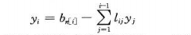
  - 解x，得   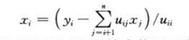
  - LUP-SOLVE(L,U,π,b) 

    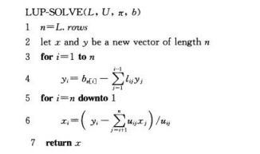

* LU分解
  - 分解基础 

    

    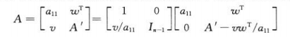

  - 舒尔补(Schur complement)  
    A'-νω<sup>T</sup>/a<sub>11</sub>

    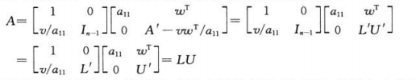

  - 主元：处于矩阵U的对角线上
  - 选主元：采用置换来避免除数为0(或一个很小的数，可能会引起数值不稳定性)的操作成为选主元

  - LU-DECOMPOSITION(A)
    ```
    LU-DECOMPOSITION(A)
      let L and U be new nXn matrices
      initialize U with 0s below the diagonal
      initialize L with 1s on the diagonal and 0s above the diagonal
      for k=1 to n
         u(kk)=a(kk)
         for i=k+1 to n
            l(ik)=a(ik)/u(kk)
            u(ki)=a(ki)
         for i=k+1 to n
           for j=k+1 to n
             a(ij)=a(ij)-l(ik)u(kj)
    return L and U
    ```
  - LUP分解

    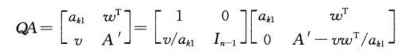

    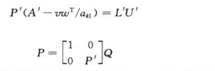

    

  - LUP-DECOMPOSITON(A)
    ```
    LUP-DECOMPOSITON(A)
       n=A.rows
       let π[1...n] be a new array
       for i=0 to n
         π[i]=i
       for k=1 to n
         p=0
         for i=k to n
           if |a(ik)|>p
              p=|a(ik)|
              k'=i
         if p==0
            error "singular matrix"
         exchange π[k] with π[k']
         for i=1 to n
            exchange a(ki) with a(k'i)
         for i=k+1 to n
            a(ik)=a(ik)/a(kk)
            for j=k+1 to n
               a(ij)=a(ij)-a(ik)*a(kj)
    ```

* 矩阵求逆
  - 在O(n^3)时间内求得 A 的LUP分解
  - AA<sup>-1</sup>=I<sub>n</sub>
  - AX<sub>i</sub>=e<sub>i</sub> 
  - 定理28.1(矩阵乘法不比矩阵求逆困难)  
    如果能在 I(n)时间内求出一个nXn矩阵的逆，其中I(n)=Ω(n^2)且I(n)满足正则性条件I(3n)=O(I(n)),那么可以在O(I(n))时间内求出两个nXn矩阵的乘积。
    
    对任意常数c ＞0和 d≥0，只要I(n)=θ(n^clg^d(n))，I(n)就满足正则性条件
    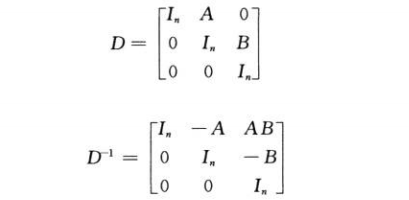  

  - 定理28.2(矩阵求逆运算不比矩阵乘法运算更难)  
    如果能在M(n)时间内计算出两个nXn实数矩阵的乘积，其中M(n)=Ω(n^2)且M(n)满足两个正则性条件：对任意的k(0≤k≤n),M(n+k)=O(M(n));对某个常数c<1/2,M(n/2)≤cM(n),那么可以在O(M(n))时间内计算出任何一个nXn非奇异实数矩阵的逆

   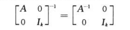
    
   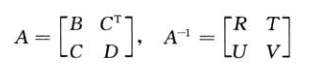
    
   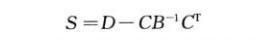

   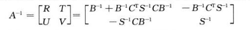

    - 计算步骤

   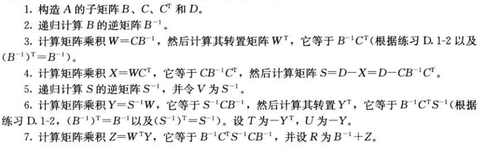

   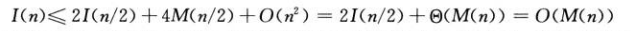

* 对称正定矩阵和最小二乘逼近
  - 引理28.3  
    任何对称正定矩阵都是非奇异矩阵
  - 引理28.4  
    如果A是一个对称正定矩阵，那么A的每一个主子矩阵都是对称正定的
  - 引理28.5(舒尔补定理)  
    如果A是一个对称正定矩阵，A<sub>k</sub>是A的kXk主子矩阵，那么A关于A<sub>k</sub>的舒尔补是对称正定的。

    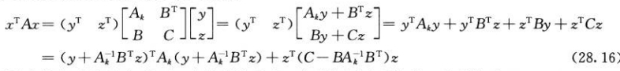

  - 推论28.6  
    一个对称正定矩阵的LU分解永远不会出现除数为0的情形

  - 最小二乘逼近法

    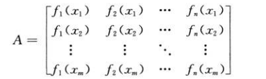

    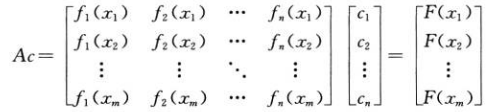

    