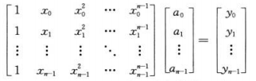
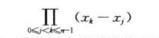
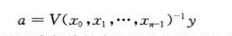
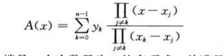
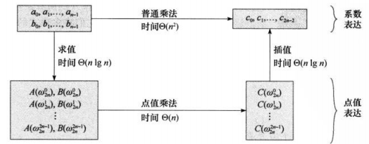
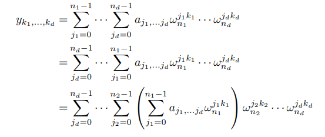
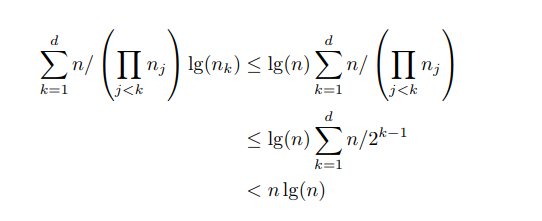
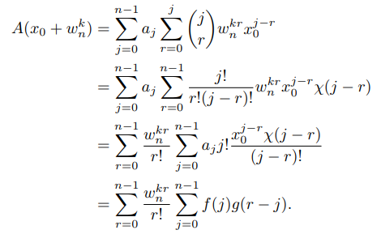

## <center>多项式与快速傅里叶变换</center>

### 概念
* 范德蒙德矩阵



* 矩阵V(x0,x1,...,xn-1),成为范德蒙矩阵，行列式为



* 系数确定



* 拉格朗日公式



* 方法



### 算法

* RECURSIVE-FFT(a)
```
RECURSIVE-FFT(a)
  n=a.length
  if n==1
    return a
  wn=e^(2πi/n)
  w=1
  a[0]=(a0,a2,...,an-2)
  a[1]=(a1,a3,...,an-1)
  y[0]=RECURSIVE-FFT(a[0])
  y[1]=RECURSIVE-FFT(a[1])
  for k=0 to n/2-1
     yk=yk[0]+wyk[1]
     yk+(n/2)=yk[0]-wyk[1]
     w=wwn
  return y
```
* BIT-REVERSE-COPY(a,A)
```
BIT-REVERSE-COPY(a,A)
  n=a.length
  for k=0 to n-1
    A[rev(k)=ak]
  return A
```

* BIT-REVERSE-COPY(a,A)
```cpp
vector<Complex> BIT_REVERSE_COPY(vector<Complex>&a,vector<Complex>&A)
{
	//show(a);
	unsigned n=a.size();
	for(unsigned i=0,j=0;i<n;i++)
	{
		A[j]=a[i];
		unsigned bit=~i&(i+1);
		unsigned rev=(n/2)/bit;
		j^=(n-1)&~(rev-1);
	}
	//show(A);
	return A;
}
```
* ITERATIVE-FFT

```
ITERATIVE-FFT(a)
  BIT-REVERSE-COPY(a,A)
  n = a.length // n is a power of 2
  for s = 1 to lgn
	  m = 2^s
	  wm = e^(2πi/m)
	  for k = 0 to n - 1 by m
		  w = 1
		  for j = 0 to m=2 - 1
			  t = w A[k+j+m]=2
			  u = A[k+j]
			  A[k+j] = u+t
			  A[k+j+m]=2 = u - t
 w = w wm
return A
```
[code](../codes/md30.cpp)

### 习题[answer](https://blog.csdn.net/z84616995z/article/details/24308087)
* 30.3





* 30.4

  3. 应用二项式定理

  
