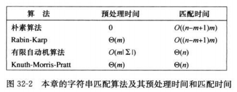
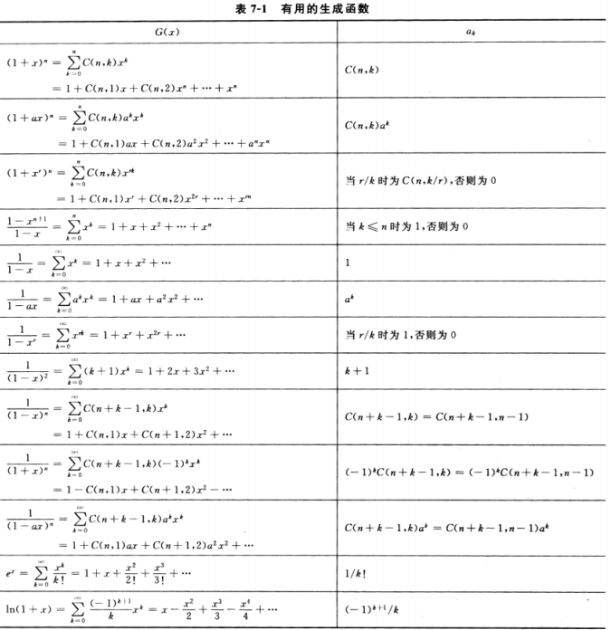

## <center>字符串匹配</center>



## 定理和引理及推论
* 引理32.1(后缀重叠引理)  
  假设x,y和z是满足x⊐z和y⊐z的字符串。如果|x|≤|y|,那么x⊐y;如果|x|≥|y|,那么y⊐x;如果|x|=|y|,那么x=y;
* 引理32.2(后缀函数不等式)  
  对任意字符串x和字符a,σ(xa)≤σ(x)+1  

* 引理32.3(后缀函数递归引理)  
  对任意x和字符a.若q=σ(x),则σ(xa)=σ(P<sub>q</sub>a)  

* 定理32.4
  如果φ是字符串匹配自动机关于给定模式P的终态函数，T[1...n]是自动机的输入文本，则对i=0,1,...,n,φ(Ti)=σ(Ti)

### 朴素字符串匹配算法

* NAIVE-STRING-MATCHER(T,P)
```
NAIVE-STRING-MATCHER(T,P)
  n=T.length
  m=P.length
  for s=0 to n-m
    if P[1..m]=T[s+1..s+m]
       print "Pattern occurs with shift" s
```
* 最坏 O((n-m+1)m)

* 如果P字符都不同。则 O(n)
```
NAIVE-STRING-MATCHER(T,P)
  n=T.length
  m=P.length
  for s=0 to n-m
     for k=1 to m
        if P[k]!=T[s+k]
           s=k
           continue
     print "Pattern occurs with shift" s
     s=s+m;
```

### Rabin-Karp 算法
* t<sub>s+1</sub>=10(t<sub>s</sub>-10<sup>m-1</su>T[s+1])+T[s+m+1]
* t<sub>s+1</sub>=(d(t<sub>s</sub>-T[s+1]h)+T[s+m+1])mod q
* RABIN-KARP-MATCHER(T,P,d,q)
* 复杂度 O(n)+O(m(v+n/q)) v是有效偏移量，如果v=O(1)并且q≥m,算法时间O(n)

```
RABIN-KARP-MATCHER(T,P,d,q)
  n=T.length
  m=P.length
  h=d^(m-1) mod q
  p=0
  t0=0
  for i=1 to m
    p=(dp+p[i])mod q
    t0=(dt0+T[i])mod q
  for s=0 to n-m
    if p==ts
      if P[1..m]==T[s+1..s+m]
         print "pattern occurs with shift" s
    if s<n-m
      ts+1=(d(ts-T[s+1]h)+T[s+m+1]) mod q
```

### 利用有限自动机进行字符串匹配
* 有限自动机 M
  - 是一个5元组(Q,q0,A,∑,δ)
  - Q是状态的有限集合
  - q0∈Q是初始状态
  - A⊆Q是一个特殊的接受状态集合
  - ∑是有限输入字母表
  - δ是一个从QX∑到Q的函数，成为M的转移函数
  - φ(ε)=q0
  - φ(ωa)=δ(φ(ω),a) , ω∈∑* ，a∈∑
  - δ(q,a)=σ(P<sub>q<sub>a)
  
* 代码

```
FINITE-AUTOMATON-MATCHER(T,δ,m)
   n=T.length
   q=0
   for i=0 to n
      q=δ(q,T[i])
      if q== m
         print "pattern occurs with shift" i-m

COMPUTE-TRANSITION-FUNCTION(P,∑) //O(m^3|∑|)
   m=P.length
   for q=0 to m
     for each charater a∈∑
        k=min(m+1,q+2)
        repeat
          k=k-1
        until Pk⊐Pqa
        δ(q,a)=k
   return δ
```

### 习题
* 32.1-4
```
OCCURANCE(T, P, t = 0, p = 0)
    if p == P.length
        return true
    if t == T.length
        return false
    if P[p] == '◇'
        return OCCURANCE(T, P, t, p + 1) || OCCURANCE(T, P, t + 1, p)
    else if T[t] == P[p]
        return OCCURANCE(T, P, t + 1, p + 1)
    else if p == 0
        return OCCURANCE(T, P, t + 1, p)
    return false
```




