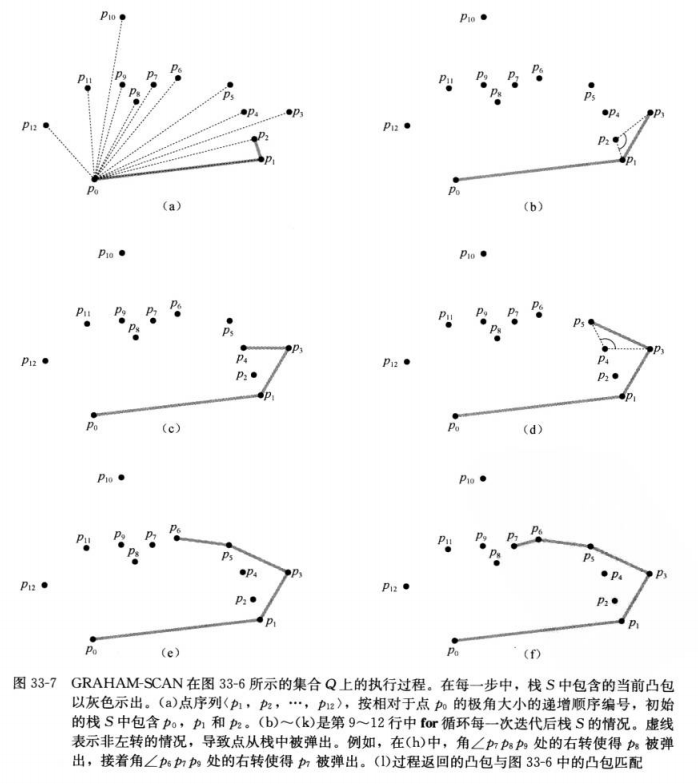
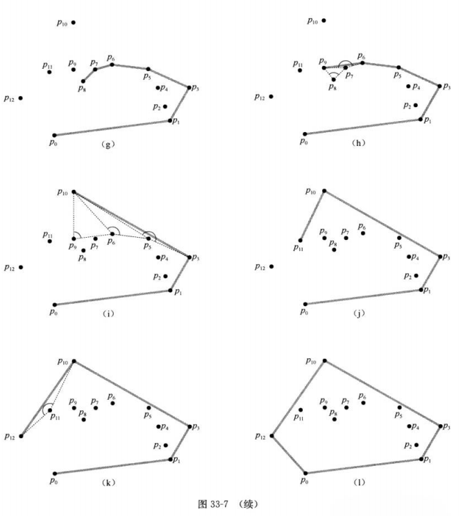
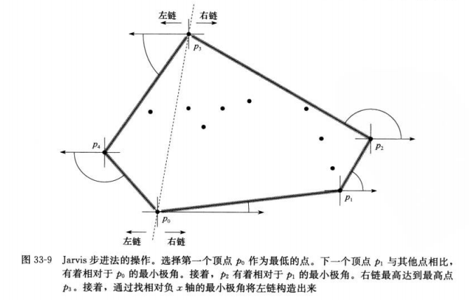

## <center>计算几何学</center>

## 寻找凸包

### GRAHAM 法

```
GRAHAM-SCAN(Q)
1	   let p0 be the point in Q with the minimum y-coordinate,
	       or the leftmost such point in case of a tie
2	   let <p1,p2,...,pm> be the remaining points in Q
	       sort by polar angle in counterclockwise order around p0
	       (if more thean one point has the same angle,remove all but 
	       the one that is farthest from p0)
3	   if m＜2
4	       return "convex hull is empty"
5	   else let S be an empty stask
6	       PUSH(p0,S)
7	       PUSH(p1,S)
8	       PUSH(p2,S)
9	       for i=3 to m
10	          while the angle formed by points NEXT-TO-TOP(S),TOP(S) and pi   makes a nonleft turn
11	              POP(S)
12	          PUSH(pi,S)
13	       return S
```






### Jarvis步进法



### 定理
* 定理33.1(Graham扫描算法的正确性)  
  如果在一个|Q|≥3的点集上运行GRAHAM-SCAN，则在过程终止时，栈S从底部到顶部包含了按逆时针方向排列在CH(Q)中的各个顶点。


### show me your code
[codes](../codes/md33.cpp)