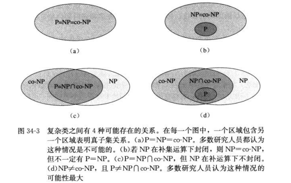

## 
 NP完全性 

### 定义
* P  polynomial多项式
  复杂类P为多项式时间内可解的具体判定问题的集合
* 形式语言体系
  - 字母表∑ 是符号的有限集合
  - 语言L 是由表中符号组成的串的任意集合
  - 接受和验证不同
* 哈密顿回路问题
  - HAM-CYCLE={<G>:G是哈密顿图}
  - 多项式时间内验证但不能在多项式时间内给出解 

* NP
  - 复杂类NP是能被一个多项式时间算法验证的语言类。
  - 一个语言类L属于NP，当且仅当存在一个两输入的多项式时间算法A和常数c，满足  
   L={x∈{0,1}*:存在一个证书y,|y|=O(|x|^c),满足A(x,y)=1}
  - P包含于NP

  
* NP完全性与可规约性
  - 可规约性 L1≤L2
  - 规约函数 如果存在一个多项式时间可计算函数f:{0,1}* →{0,1}* ，满足对所有的x∈{0,1}* ，x∈L1 当且仅当f(x)=L2,则称函数f为可规约算法
  - 归约算法 计算f的多项式算法F称为归约算法
  - 语言L⊆{0,1}* 是NP完全的，如果
    1. L∈NP
    2. 对每一个L'∈NP,有L'≤pL
  - L满足2但不一定满足1，L为NP难度的，同时，定义NPC为NP完全语言类
### 定理
* 定理34.1  
  设Q是定义在一个实例集I上的一个抽象判定问题，e1和e2是I上多项式相关的编码，则e1(Q)∈P当且仅当e2(Q)∈P。
* 定理34.2
  P={L:L能被一个多项式时间算法所接受}
* 类P在被看做是一个语言集合时，在并集、交集、连接、补集和LIeene星运算下是封闭的。也就是说，如果L1，L2∈P，则：L1∪L2∈P，L1∩L2∈P，L1L2∈P，L1补集∈P，L1* ∈P

* 引理 34.3  
  如果L1，L2包含于{0,1}* 是满足L1≤pL2 的语言，则L2∈P蕴含着L1∈P

* 定理34.4  
  如果任何NP完全问题是多项式时间求解 ，则P=NP。等价的，如果存在某一NP中的问题不是多项式时间可求解的，则所有NP完全问题都不是多项式时间可求解的。