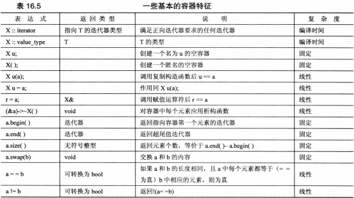
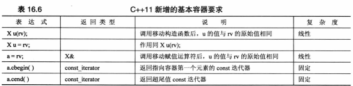
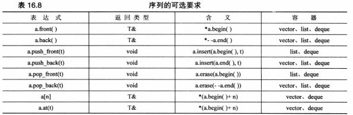
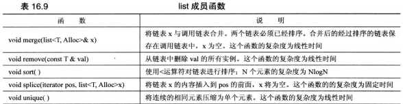
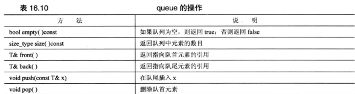
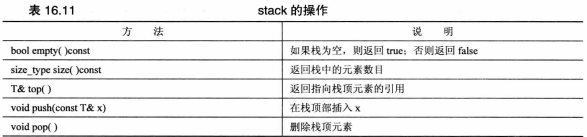
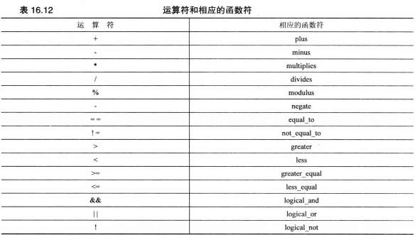

### string
* 移动构造函数
* `string (initializer_list<char>il)` 让将列表初始化语法用于string类
```cpp
string p={'L','i','s','t'};
string c{'L','i','s','p'};
```
* getline(cin,string &s)
* c-风格字符串的函数时istream类的方法，而string版本是独立的函数
c-风格字符串输入，cin是调用对象，而对于string对象输入，cin是一个函数参数的原因
* string版本的getline()函数从输入中读取字符，并将其存储在string中，直到发生下面三种情况
  - 到达文件尾，输入流的eofbit被设置，fail()和eof()返回true。
  - 遇到分界字符(\n),将把分界字符从输入流中删除，但不存储它
  - 达到最大允许值，设置failbit,方法fail()将返回true
* 输入流统计系统
  - 文件尾 eofbit寄存器
  - 输入错误 failbit寄存器
  - 无法识别的故障 badbit寄存器
  - 一切顺利 goodbit寄存器
* string版本opreator>>()函数不断读取直到遇到空白字符(空格换行符制表符)并将其留在输入队列中，而不是不断读取将分界字符丢弃
* windows路径
```cpp
fin.open("C:\\CPP\\Progs\\tobuy.txt");//file=C:\CPP\Progs\tobuy.txt
```
* 指定分解符后，换行符为常规字符
* capacity()返回当前分配给字符串的内存块的大小
* reserve()能够请求内存块的最小长度
* open()要求使用一个c-风格字符串作为参数，c_str()返回返回一个指向c-风格字符串的指针。
```cpp
string filename;
cout<<"Enter file name";
cin>>filename;
ofstream fout;
fout.open(filename.c_str());
```
* string库基于一个模板类
 - traits类描述关于选定字符类型的特定情况，比如如何对值进行比价
 - Allocator是一个管理内存分配的类
```cpp
template <class charT,class traits=char_traits<charT>,class Allocator=allocator<charT>>
basic_string{...}
typedef basic_string<char> string;
typedef basic_string<wchar_t>wstring;
typedef basic_string<char16_t>u16string;
typedef basic_string<char32_t>u32string;
```

### 智能指针模板类
auto_ptr/unique_str/shared_ptr


* 使用智能指针
  - 必需包含memory
  - 将指向string的指针替换为指向string的智能指针对象
  - 删除delete语句
```cpp
#include <memory>
void remodel(std::string &str)
{
	std::auto_ptr<std::string> ps (new std::string(str));
	if(weird_thing())
		throw exception();
	str=*ps;
	return;
}
```
* 普通指针不能赋值给智能指针但是可以以普通指针为参数生成智能指针
* 不允许非堆内存 &a
* 防止将指针赋值给另一个指针，造成多次删除同一个对象两次
  - 深度复制
  - 建立所有权概念unique_ptr 赋值转让所有权
  - 引用计数 shared_ptr 每次引用计数加1
* unique_ptr允许临时右值赋值,move()
```cpp
using namespace std;
unique_str<string>pu1(new string"Hi ho");
unique_str<string>pu2;
pu2=pu1;//不允许
unique_str<string>pu3;
pu3=unique_str<string>(new string"yo");
```
* unique_ptr可以将delete和new配对
```cpp
std::unique_str<double[]>pad(new double[5]);
```

### 标准模板库
与string类相似，各种STL容器模板都接受一个可选的模板参数，该参数指定使用哪个分配器对象来管理内存
```cpp
template <class T,class Allocator=allocator<T>>class vector{...}
```
* size()
* swap()
* begin()
* end()

* 每个容器类都定义了一个合适的迭代器，该迭代器的类型是一个名为iterator的typedef,作用域为整个类
 `vector<double>::iterator pd;`
* push_back()将元素添加到矢量末尾
* crase()方法删除矢量中给定区间的元素,不包括最后一个 
  `scores.erase(scores.begin(),scores.begin()+2)`
* 如果it1和it2是迭代器，则STL文档使用[p1,p2)便是从p1到p2的区间
  [p1,p1)为空
* insert(old,new_bg,new_end)
* for_each()
  ```cpp
  for_each(books.begin(),books.end(),ShowReview)
  ```
* random_shuffle() 随机排列该区间中的元素，容器类可随机访问
  ```cpp
  random_shuffle(books.begin(),books.end())
  ```
* sort() 容器类可随机访问
  ```cpp
  sort(books.begin(),books.end())
  ```
  如果容器元素是用户定义的对象，则要使用sort(),必需定义能够处理该类型的operator<()函数
  ```cpp
  bool WorseThan(const Review &r1,const Review &r2)
  {
  	if(r1.rating<r2.rating)
  		return true;
  	else
  		return false;
  }
  sort(books.begin(),books.end(),WorseThan);
  ```
* 基于访问的for循环(c++11)可以修改容器的内容
```cpp
for(auto x:books)ShowReview(x);

//改变容器内容
void InflateReview(Review &r){r.rating++;}
for(auto &x:books)InflateReview(x);
```

### 泛型编程

迭代器 遍历需要条件
>
* 应能够对迭代器执行解除引用的操作
* 应该能够将一个迭代器赋给另一个
* 应能够将一个迭代器与另一个进行比较
* 能够使用迭代器遍历容器 中所有元素 ++p或p++
>

>
operator++(int)为后缀版本
operator++()为前缀版本
>

迭代器
>
* 输入迭代器
  - 输入是从程序的角度说的，输入迭代器可被程序用来读取容器中的信息
  - 输入迭代器的算法将不会修改容器中的值
  - 应当是单通行的，可以递增不可以倒退
* 输出迭代器
  - 程序的输出就是容器的输入
  - 解除引用让程序能够修改容器的值，而不能读取
* 正向迭代器
  - 只使用++运算符来遍历容器
  - 按相同的顺序遍历一系列值前面的迭代器解除引用
  - 将正向迭代器递增后仍然可以对
* 双向迭代器
* 随机访问迭代器
  
>
迭代器层次结构


概念。改进和模型
>
* 概念
  - 用来描述一系列的要求
  - 概念可以具有类似继承的关系
* 改进
  - 表示概念继承
* 模型
  - 概念的具体实现被称为模型

* 预定义迭代器
  - copy(begin,end,pt)
  - ostream_interator 输出迭代器概念的一个模型，也是一个适配器，可以将一些其他接口转换为STL使用的接口
  ```cpp
  #include<iterator>
  ostream_interator<int,char>out_iter(cout," ");
  //第一个参数发送到输入流的数据类型，第二个为输入流使用的类型最后一个参数时发送给输出流的每个数据项后显示的分隔符
  istream_iterator<int,char>(cin)
  //第一个参数指出要读取的数据类型，第二个参数指出输入流使用的字符类型
  copy(istream_iterator<int,char>(cin),istream_iterator<int,char>(),dice.begin());

  ```
  - reverse_iterator
    反向 `copy(dice.rbegin(),dice.rend(),out_iter)`,反向补偿
  - back_insert_iterator 将元素插入到容器尾部 vector
  - front_insert_iterator 将容器插入到容器的前端 queue
  - insert_iterator 将元素插入构造函数参数指定的位置前面
    `insert_iterator<vector<int>>insert_iter(dice,dice.begin())`
    可以用insert_iterator将复制数据的算法转换成插入数据的算法
* 迭代器将容器类型作为模板参数将实际的容器标识符作为构造函数参数
 ```cpp
 back_insert_iterator<vector<int>>back_iter(dice)
 ```
* copy()是一个独立的函数，没有重新调整容器大小的权限，但前面的声明让back_iter能够使用vector<int>::push_back()，该方法有这样的权限
>

容器种类
>
* 概念 - 是具有名称(如容器、序列容器、关联容器等)的通用类别
* 容器 - 是可用于创建具体容器对象的模板
* 容器类型
  - deque
  - list
  - queue
  - priority_queue
  - stack
  - vector
  - map
  - multimap
  - set
  - multimap
  - bitset
  -
  - forward_list
  - unordered_map
  - unordered_multimap
  - uordered_set
  - unordered_multiset
* 容器是存储其他对象的对象。被存储的对象必需是同一种类型的。
* 类型必需是可复制构造的和可赋值的
* c++11添加 可复制插入和可移动插入
* 容器特性,从快到慢编译时间->固定时间->线性时间
  
  
>
序列
>
* 序列按严格的线性顺序排列，如数组和链表



* a.at[n] 落在区间外执行边界检查，并引发out_of_range异常
>

### vector
* vector 头文件
* 数组的类表示
* 提供了自动内存管理功能，可以动态改变vector对象的长度
* 支持随机访问，线性时间更快
* 在头部插入和随机插入为线性时间
* 可以反转容器

### deque
* duque头文件声明
* 双端队列
* 支持随机访问
* 从deque两端执行插入和删除操作的时间为固定的
* 随机访问，线性时间

### list
* list头文件
* 双向链表
* 在任意位置进行插入和删除的时间都是固定的
* 可以反转容器
* 不支持数组表示法和随机访问
* 强调快速插入和删除

* splice()方法执行后迭代器仍有效
* 不能将非成员函数sort()用于链表

### forword_list(C++11)
* 单链表

### queue
* queue头文件
* 适配器
* 不允许随机访问队列元素
* 不允许遍历队列


### priority_queue
* 适配器
* 支持操作与queue相同
* 最大的元素被移动到队首
```cpp
priority_queue<int>pq1;
priority_queue<int>pq2(greater<int>);
```
* 默认底层类为vector

### stack
* stack头文件
* 适配器
* 不允许遍历和随机访问栈元素


### array
* 头文件 array
* 非STL容器，长度固定的

-------------

关联容器
>
* 通常使用某种树实现的
* 类别
  - set (<set>)
  - multiset (<set>)
  - map (<map>)
  - multimap (<map>)
>

### set
* 将结果放到集合C中，而不是显示它，最后一个参数时一个指向C的迭代器
* 关联集合将键看做常量，而不能做输出迭代器
* 覆盖内容需要有足够的空间容纳新信息
* 用insert_iterator，将复制转换为插入
```cpp
set<string> A;

set_union(A.begin(),A.end(),B.begin(),B.end(),ostream_interator<string,char>out(cout," "));

set_union(A.begin(),A.end(),B.begin(),B.end(),insert_iterator<set<string>>(C,C.begin()));
```
* set_intersection() 查找交集
* set_difference() 获取差集
* lower_bound() 将键作为参数并返回一个迭代器，指出第一个不小于键参数的成员
* upper_bound() 第一个大于键参数的成员

### multimap
* 可反转
* 经过排序的关联容器
* `multimap<int,string>codes;`
  - 键类型为int，存储的值类型为string
  - 第三个参数指出对于键进行排序的比较函数和对象，默认less<>
  - pair<class T,class U>将两种值存储在一个对象中
```cpp
multimap<int,string>codes;
pair<const int,string>item(213,"Losangeles");
codes.insert(item);

//或者
codes.insert(pair<const int,string>item(213,"Losangeles"))
```
* 数据项按键排序，所以不需要指出插入位置
* first访问键second访问值
```cpp
count()//键参数，返回具有该键的元素数
lower_bound()
upper_bound()
equal_range()//键参数，返回两个迭代器，它们表示的区间与改键匹配

pair<multimap<KeyType,string>::iterator,
     multimap<KeyType,string>::iterator> range=codes.equal_range(718);
std::multimap<KeyType,std::string>::iterator it;
for(it=range.first;it!=range.second;++it)
    cout<<(*it).second<<endl;
```

### 无序关联容器(C++11)
* 基于哈希表
* 无序关联容器
  - unordered_set
  - unordered_multiset
  - unordered_map
  - unordered_multimap


-------------------------

## 函数对象

函数对象-函数符(functor)
  - 函数名
  - 指向函数的指针
  - 重载了()运算符的类对象

```cpp
template<class InputIterator,class Function>
Function for_each(InputIterator first,InputIterator last,Function f);

void ShowReview(const Review &);
//原型  void(*)(const Review &)
```
函数符
>
* 生成器(generator)是不用参数就可以调用的函数符
* 一元函数(unary function) 是用一个参数可以调用的函数符
* 二元函数(binary function) 是用两个参数可以调用的函数符
>

预定义的函数符
>
* functional定义了多个模板类对象
* 
>

自适应函数符和函数适配器
>
* 自适应生成器
* 自适应一元函数
* 自适应二元函数
* 自适应谓词
* 自适应二元谓词
```cpp
binder1st(f2,val)f1;
f1(x)==f2(val,x);
```
>

算法库
>
* 非修改式序列操作 <algorithm>
* 修改式序列操作  <algorithm>
* 排序和相关操作  <algorithm>
* 通用数字运算 <numeric>

>

>
* 就地版本
* 复制版本 _copy()结尾
  - 返回一个迭代器，该迭代器指向复制的最后一个值后面的一个位置
* 根据函数应用于容器元素得到的结果来执行操作 _if结尾
* 不是成员函数，不会调整链表长度
>
其他库
>
* vector  
  - vector<double>ved(10);
* valarray
  - valarray<double> val(10);
  - 对象，按值
* array
  - array<double,1o> vod;
>