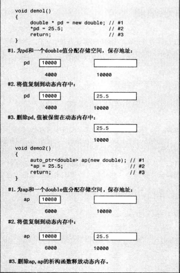
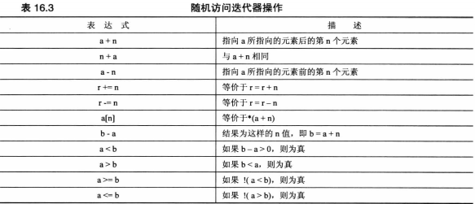
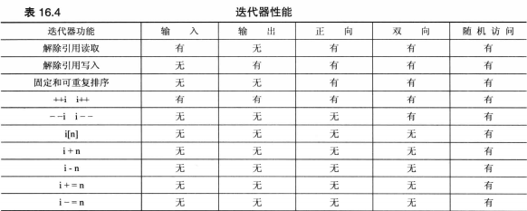

### string
* 移动构造函数
* `string (initializer_list<char>il)` 让将列表初始化语法用于string类
```cpp
string p={'L','i','s','t'};
string c{'L','i','s','p'};
```
* getline(cin,string &s)
* c-风格字符串的函数时istream类的方法，而string版本是独立的函数
c-风格字符串输入，cin是调用对象，而对于string对象输入，cin是一个函数参数的原因
* string版本的getline()函数从输入中读取字符，并将其存储在string中，直到发生下面三种情况
  - 到达文件尾，输入流的eofbit被设置，fail()和eof()返回true。
  - 遇到分界字符(\n),将把分界字符从输入流中删除，但不存储它
  - 达到最大允许值，设置failbit,方法fail()将返回true
* 输入流统计系统
  - 文件尾 eofbit寄存器
  - 输入错误 failbit寄存器
  - 无法识别的故障 badbit寄存器
  - 一切顺利 goodbit寄存器
* string版本opreator>>()函数不断读取直到遇到空白字符(空格换行符制表符)并将其留在输入队列中，而不是不断读取将分界字符丢弃
* windows路径
```cpp
fin.open("C:\\CPP\\Progs\\tobuy.txt");//file=C:\CPP\Progs\tobuy.txt
```
* 指定分解符后，换行符为常规字符
* capacity()返回当前分配给字符串的内存块的大小
* reserve()能够请求内存块的最小长度
* open()要求使用一个c-风格字符串作为参数，c_str()返回返回一个指向c-风格字符串的指针。
```cpp
string filename;
cout<<"Enter file name";
cin>>filename;
ofstream fout;
fout.open(filename.c_str());
```
* string库基于一个模板类
 - traits类描述关于选定字符类型的特定情况，比如如何对值进行比价
 - Allocator是一个管理内存分配的类
```cpp
template <class charT,class traits=char_traits<charT>,class Allocator=allocator<charT>>
basic_string{...}
typedef basic_string<char> string;
typedef basic_string<wchar_t>wstring;
typedef basic_string<char16_t>u16string;
typedef basic_string<char32_t>u32string;
```

### 智能指针模板类
auto_ptr/unique_str/shared_ptr


* 使用智能指针
  - 必需包含memory
  - 将指向string的指针替换为指向string的智能指针对象
  - 删除delete语句
```cpp
#include <memory>
void remodel(std::string &str)
{
	std::auto_ptr<std::string> ps (new std::string(str));
	if(weird_thing())
		throw exception();
	str=*ps;
	return;
}
```
* 普通指针不能赋值给智能指针但是可以以普通指针为参数生成智能指针
* 不允许非堆内存 &a
* 防止将指针赋值给另一个指针，造成多次删除同一个对象两次
  - 深度复制
  - 建立所有权概念unique_ptr 赋值转让所有权
  - 引用计数 shared_ptr 每次引用计数加1
* unique_ptr允许临时右值赋值,move()
```cpp
using namespace std;
unique_str<string>pu1(new string"Hi ho");
unique_str<string>pu2;
pu2=pu1;//不允许
unique_str<string>pu3;
pu3=unique_str<string>(new string"yo");
```
* unique_ptr可以将delete和new配对
```cpp
std::unique_str<double[]>pad(new double[5]);
```

### 标准模板库
与string类相似，各种STL容器模板都接受一个可选的模板参数，该参数指定使用哪个分配器对象来管理内存
```cpp
template <class T,class Allocator=allocator<T>>class vector{...}
```
* size()
* swap()
* begin()
* end()

* 每个容器类都定义了一个合适的迭代器，该迭代器的类型是一个名为iterator的typedef,作用域为整个类
 `vector<double>::iterator pd;`
* push_back()将元素添加到矢量末尾
* crase()方法删除矢量中给定区间的元素,不包括最后一个 
  `scores.erase(scores.begin(),scores.begin()+2)`
* 如果it1和it2是迭代器，则STL文档使用[p1,p2)便是从p1到p2的区间
  [p1,p1)为空
* insert(old,new_bg,new_end)
* for_each()
  ```cpp
  for_each(books.begin(),books.end(),ShowReview)
  ```
* random_shuffle() 随机排列该区间中的元素，容器类可随机访问
  ```cpp
  random_shuffle(books.begin(),books.end())
  ```
* sort() 容器类可随机访问
  ```cpp
  sort(books.begin(),books.end())
  ```
  如果容器元素是用户定义的对象，则要使用sort(),必需定义能够处理该类型的operator<()函数
  ```cpp
  bool WorseThan(const Review &r1,const Review &r2)
  {
  	if(r1.rating<r2.rating)
  		return true;
  	else
  		return false;
  }
  sort(books.begin(),books.end(),WorseThan);
  ```
* 基于访问的for循环(c++11)可以修改容器的内容
```cpp
for(auto x:books)ShowReview(x);

//改变容器内容
void InflateReview(Review &r){r.rating++;}
for(auto &x:books)InflateReview(x);
```

### 泛型编程

迭代器 遍历需要条件
>
* 应能够对迭代器执行解除引用的操作
* 应该能够将一个迭代器赋给另一个
* 应能够将一个迭代器与另一个进行比较
* 能够使用迭代器遍历容器 中所有元素 ++p或p++
>

>
operator++(int)为后缀版本
operator++()为前缀版本
>

迭代器
>
* 输入迭代器
  - 输入是从程序的角度说的，输入迭代器可被程序用来读取容器中的信息
  - 输入迭代器的算法将不会修改容器中的值
  - 应当是单通行的，可以递增不可以倒退
* 输出迭代器
  - 程序的输出就是容器的输入
  - 解除引用让程序能够修改容器的值，而不能读取
* 正向迭代器
  - 只使用++运算符来遍历容器
  - 按相同的顺序遍历一系列值前面的迭代器解除引用
  - 将正向迭代器递增后仍然可以对
* 双向迭代器
* 随机访问迭代器
  
>
迭代器层次结构
