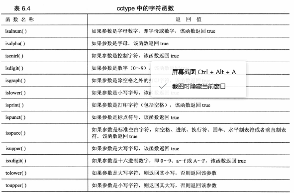

### ctype

```cpp
#include <cctype>
isalpha()  //是否是字母
isdigits() //是否是数字
isspace() //是否空白
ispunct() //是否为标点符号
```


```cpp
(i < 2) ? !i ? x[i] : y : x[1]
===
(i < 2) ?( !i ? x[i] : y ): x[1]
```
* 文件I/O

```cpp
#include <iostream>
#include <fstream>
using namespace std;
int main()
{
	ofstream outFile; //定义ofstream对象
	outFile.open("fish.text"); //不存在则新建，否则截断将改对象和特定文件关联
	outFile.precision(2) //设定输出浮点数的精度值
	outFile.setf(ios_base::showpoint);//强制显示小数点输出
	char filename[50];
	cin>>filename;
	fout.open(filename);
}
```
