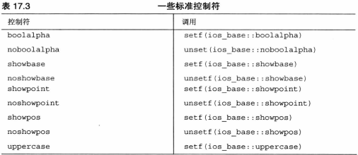
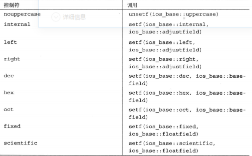

八个流
>
* cin
* cout
* cerr
* clog
* wcin
* wcout
* wcerr
* wclog
>
>
seekg() 将输入指针移到指定的文件位置
seekp() 将输出指针移到指定的文件位置
ios_base::beg 相对于文件开始处的偏移量
ios_base::cur 相对于当前位置的偏移量
ios_base::end 相对于文件尾的偏移量
tellg() 对输入流，检查指针的当前位置
tellp() 对输出流 ...
```cpp
basic_istream<charT,traits>&seekg(off_type,ios_base::seekdir);
basic_istream<charT,traits>&seekg(pos_type);

istream &seekg(streamoff,ios_base::seekdir);
istream &seekg(streampos)
```
>

临时文件
>
* 创建一个临时文件名并放在pszName指向的字符串中 
* L_tmpnam 文件名包含的字符串
* TMP_MAX 确保要求情况下，函数可被调用的最多次数
```cpp
char * tmpnam(char * pszName)
```