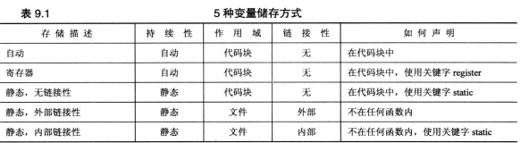
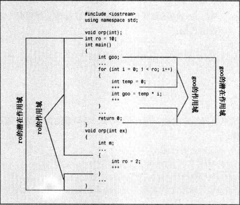

## 单独编译

头文件包含的内容
> 
* 函数原型
* 使用#define或const定义的符号常量
* 结构声明
* 类声明
* 模板声明
* 内联函数
>

存储持续性
>
* 自动存储持续性，两种
* 静态存储持续性，3种，在程序整个运行环境中都存在
* 线程存储持续性 thread_local
* 动态存储持续性 new->delete heap/free store
>

作用域和链接
>
* 链接性为外部的名称可以再文件间共享
* 链接性为内部的名称只能由一个文件中的函数共享
* 自动变量的名称没有链接性，不能共享
* 全局作用域在文件结尾之间都可用
* 名称空间中声明的变量的作用域为整个名称空间
* 全局作用域是名称空间作用域的特例
* 类中声明的变量是整个类
* C++函数的作用域是整个类或整个名称空间但不可能是局部的
* auto指出当前变量为局部自动变量c++11之前
>
静态持续变量
>
* 分配估计的内存块来存储所有的静态变量，没初始化默认0
* 外部链接性 - 外部声明
* 内部链接性 - 外部声明 static
* 无链接性 - 内部声明 static
>


静态持续性、外部链接性
>
* 单定义规则 - 变量只能定义一次ODR
* extern 引用已定义的变量，不初始化，必需引用才能使用外部变量
* 作用域解析运算符(::),放在变量前面表示使用变量的全局版本
* 在多文件程序中，可以再一个文件(只能是一个文件)中定义一个外部变量。使用该变量的其他文件碧玺使用关键字extern声明它
>
静态持续性，内部链接性
>
* 静态变量将隐藏常规外部变量
* 多文件链接后的机制？函数调用函数？顺序？
>
静态存储持续性、无链接性
>
* 只在程序启动时进行一次初始化。
>
说明符和限定符
>
* cv-限定符
  - const 全局变量的链接性为内部的，extern const int states=0 将const变量声明为全局
  - volatile 其值在寄存器中变化
  - mutable 即使使用const，某个变量还可以被修改 mutable int accesses
  - 
>

存储方案和动态分配
>
* 分配 `float *p_fees=new float[20]`
* 初始化 `int *ar=new int[4]{2,3,4,5}`
* 运算符
  - `void * operator new(std::size_t)`
  - `void * operator new[](sad::size_t)`
  - `void operator delete(void *)`
  - `void opetator delete[](void *)`
* 定位new运算符 `new (buffer) int[20]`
  - buffer为开始的地址，会覆盖已有的内容
  - delete只能释放常规new运算符分配的堆内存不能是静态内存
  - 返回传递给它的地址并将其强制转换为void *
* `(void *)buffer`改变 `char *`的默认行为(输出字符串)
>

名称空间
>
* 作用域-变量对程序而言可见的范围被称为作用域
* 全局变量-声明区为整个文件
* 局部变量-声明区为代码块内
* 每个声明区域都可以声明名称，这些名称独立于在其他声明区域中声明的名称
* 名称空间可以是全局的也可以位于另一个名称空间但不能位于代码块
* 全局名称空间(global namespace)-文件级声明区域
* 包含名称空间的名称为限定的名称
  - using声明 `using Jill::fetch` ::fetch全局
  - 在函数外面使用using声明，添加到全局声明空间
  - using编译指令 `using namespace Jack`,都可用
  - global ,namespace,local
* 假设名称空间和声明区域定义了相同的名称，如果试图使用using声明将名称空间的名称导入改声明区域，则这两个名称会冲突，如果using编译指令将改名称空间的名称导入该声明区域，则局部版本将隐藏名称空间版本。（导入机制不同）
* 名称空间嵌套 elements::fire::flame
```cpp
namespace elements
{
	namespace fire
	{
		int flame;
		...
	}
	float water;
}
```
* using 编译指令可传递
* 别名
```cpp
namespace myth
{
	using namespace elements;
}
namespace my_very_favorite_setting {...}
namespace mvfs=my_very_favorite_setting;
namespace MEF=myth::elements::fire;
using MEF::flame;
```
* 未命名的名称空间
因为么有名称不能再未命名名称空间所属文件之外使用，可代替static
>
