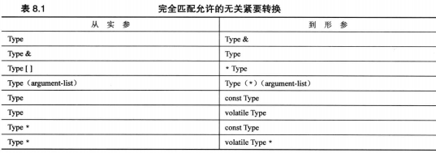

### 函数
* 如果实参与引用参数不匹配，C++将生成临时变量，当前仅当参数为const引用时，C++才允许这样做。
 - 实参的类型正确，但不是左值
 - 实参的类型不正确，但可以转化为正确的类型
* 常规变量和const变量都可视为左值，因为可通过地址访问它们
* 临时变量需要类型和命名，否则临时变量

### 内联函数
inline
#### 引用参数
* 实际上是基于指针的代码的另一个接口
* 对象是数组，只能使用指针
* 引用不可以做数组中的元素 比如int& b[3]，但允许
int (&b)[3]
* 如果一个类(如ofstream)是从另一个类(如ostream)派生的，则基类引用可以指向派生类对象
### 默认参数
当函数调用中省略了实参时自动使用的一个值
* `char *left(const char *str,int n=1);`
* 必需从右向左提供默认值，实参按从左到右的顺序依次被赋给相应的形参，而不能跳过任何参数

#### 函数重载
函数重载的关键是函数的参数列表-函数特征标
* 没有匹配，尝试使用标准类型转换强制进行匹配(仅有一个原型)
* double 与double &x 同
即编译器在检查函数特征标时，将把类型引用和类型本身视为同一个特征标  
不区分const和非const变量(限一个原型)  
将非const值赋给const变量是合法的，相反是非法的
* 是特征标而不是函数类型

#### 函数模板
通过将类型作为参数传递给模板，可以编译器生成该类型的函数
* 基本定义
```cpp
template <typename AnyType>
//template <class AnyType>
void Swap(AnyType &a,AnyType &b)
{
	AnyType temp;
	temp=a;
	a=b;
	b=temp;
}
```
* 最后生成独立的函数定义
* 具体化的原型和定义以 template<>打头，并通过名称来指出类型
* 非模板函数>具体化>常规模板
```cpp
void Swap(job &,job &);

template<typename T> 
void Swap(T &,T &);

template<> void Swap<job>(job &,job &);
template<> void Swap<>(job &,job &);
```
* 实例化和具体化
 - 显示实例化 `template void Swap<int>(int,int)`
 - 显示具体化 `template<> void Swap<int>(int &,int &)`

* 编译器选择使用哪个函数版本
 - 创建候选函数列表
 - 使用候选函数列表创建可行函数列表，实参类型和相应的形参类型完全匹配的情况
 - 确定是否有最佳的可行函数
 - 最佳顺序排序
   - 完全匹配
   - 提升转换 char与shorts自动转换为int，float自动转换为double
   - 标准转换 int转换char,long 转换为double
   - 用户定义的转换

* 完全匹配和最佳匹配



* const 和非const之间的区别只适用于指针和引用指向的数据
* 自己选择
在调用时 函数名<>
* decltype 声明变量类型
decltype(x+y) xpy=x+y
 - 没被扩号括起来的标识符，类型相同
 - 函数调用，和返回值类型同
 - 左值，类型引用，扩号内的标识符
 - 与表达式类型同
```cpp
template <class T1,class T2>
void ft(T1 x,T2 y)
{
	...
	typedef decltype(x+y) xytype;
	xytype xpy =x+y;
	xytype arr[10];
	xytype & rxy= arr[2];
	...
}
```
* 必需在声明参数后使用decltype
* 后置返回类型
```cpp
auto h(int x,float y) ->double

template <class T1,class T2>
auto gt(T1 x,T2 y) ->decltype(x+y)
{
	return x+y
}
```