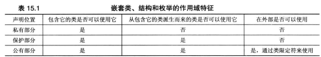

### 友元

定义
>
* 在类中定义 `friend class Remote;`
* 友元成员函数 `friend void Remote::set_chan(Tv &t,int c);`
  ```cpp
  //定义，前向声明
  class Tv;
  class Remote {...};
  class Tv {
    public:
       friend void Remote::set_chan(Tv &t,int c);
  };
  ```
* 避免引用未提前声明的方法，可以将声明放在后面
* 内联分数链接性是内部的，这意味着函数定义必需在使用函数的文件中
[参考示例](../code/inline.h)
* 共同友元
  ```cpp
  class Analyzer;
  class Prove
  {
  	friend void sync(Analyzer & a,const Probe & p);
  	friend void sync(Probe &p,const Analyzer&a);
  }
  class Analyzer
  {
  	friend void sync(Analyzer & a,const Probe & p);
  	friend void sync(Probe &p,const Analyzer&a);
  }

  inline void sync(Analyzer & a,const Probe & p);
  inline void sync(Probe &p,const Analyzer&a);  
  ```
>

### 嵌套类
* 在另一个类中声明的类为嵌套类，通过提供新的类型类作用域来避免名称混乱。
* 包含类的成员函数可以创建和使用被嵌套类的对象  
  而仅当声明位于公有部分，才能在包含类的外面使用嵌套类
```cpp
class Queue
{
   class Node
   {
   public:
   	 Item item;
   	 Node *next;
   	 Node(const Item&i):item(i),next(0){}
   };
};
class Queue::enqueue(cosnt Item &item)
{
	if(isfull)
		return false;
    Node *add =new Node(item);
    ...
}

//类外定义
Queue::Node::Node(const Item &i):item(i)next(0){}
```
嵌套类访问权限

>
* 在私有部分声明，只在类中可用(对象或对象的指针)，派生类不知道
* 在保护部分声明，类中和派生类可用
* 在类的公有部分声明，允许类、类的派生类和外部世界使用它，需要使用类限定符
```cpp
class Team
{
public:
	class Coach{...}
	...
}

Team::Coach forhire;
```
* 嵌套结构和枚举的作用域与此相同。


* 访问控制
  - 类只能显示访问嵌套类对象的公有成员
  - 访问控制规则(公有、保护、私有、友元)决定程序对嵌套类成员的访问权限
>