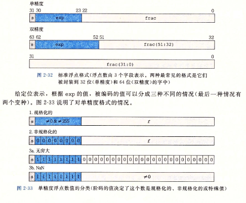

### 基本类型

char16_t,char_32_t

>>
linux>g++ --std=c++0x file.c  
win>g++ file.c
>>

const type name=value  
coont可以来声明数组长度

浮点数 M*2^E
 - Bias 单精度 127 双精度 1023
 - 规格化 E=e-Bias M=1+f
 - 非规格化 E=1-Bias M=f
 - 特殊值 指阶码全为1，小数域全为0 正负无穷大



有效位不依赖域小数点的位置，float至少32位，double至少48位，long double至少和double一样多

float 2^23=8388608 保证6位精度不保证7位以上
double 2^54=18014398509481980(有效位数) 保证16位精度不保证17位以上

存储默认为double  
a%b 符号(a/b)\*b+a%b=a

* 以{}方式初始化进行转换要严格
```c++
const int code=66;
int x=66;
char c1 {31325} //narrowing,not allowed
char c2 ={66}   //allowed
char c3 {code}  //ditto
char c4 ={x}    //x不是固定值，可能很大
x=31325；
char c5=x;      //这种形式可以
```
* 运算转换
当运算涉及两种类型是，较小的类型将被转换为较大的类型
浮点向上-》整形提升-》符号不同转包含更大的

* 传递参数转换
在将参数传递给取消原型对参数控制传递的函数时，C++将float参数提升为double

* 强制类型转换
不会更改变量本身二十创建一个新的、指定类型的值
(typeName) value
typeName (value)
static_cast<long> (value)
static_cast<typeName> (value)