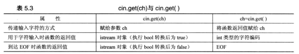

### 注意点
* 编译器不会检查使用的下标是否有效。比如定义a[10]但赋值a[10]=11,溢出
* sizeof 用于数组名得到的是整个数组中的字节数
* 初始化数组时，可省略等号 =
* 列表初始化禁止缩窄转换
* 字符常量不能与字符串常量互换，'S'为83,"S"为 'S'和'\0',实际为字符串所在的内存地址;
* 空白：空格，制表符，换行符
* cin.getline(name,strlen)将丢弃换行符,get()将换行符保留在输入序列中
* cin.get(name,strlen).get()
  cin.get(dessert,strlen)
* C++允许函数有多个版本，条件是这些版本的参数列表不同
* get()空行后设置失效位，接下来的输入将被阻断，可用cin.clear()恢复
* cin>>number 会将换行符留在里面 (cin>>number ).get()
* getline() 入股输入行包含的字符数比指定的多这设置失效位，关闭后面的输入
* get() 空行失效位   多保存剩余继续  保存换行符
  getline()空行继续  多失效位  丢弃换行符

* 数组不能赋值但string可以
* 未初始化的数组内容是未定义的，其次，函数strlen()从数组的第一个元素开始计算字节数，直到遇到空字符
* 未被初始化的string对象长度设置为0 getline(cin,str)
* wchar_t title[]=L"agagafg";  
  char16_t name[]=u"agafgag";  
  char32_t car[]=U"nagagfafg";  

* raw字符串，用"()"作定界符，前缀R  
  R"(Jim "king" Tutt uses "\n" instead of endl.)"  
  R"+\*("(who would't?)",she whispered.)+\*"  
  " 和 ( 或 )之间的(包括"()")字符表示界定符
* 不能直接输出 结构体

```c++
//定义结构，创建结构变量和初始化结构变量
struct inflatable
{
  char name[20];
  float volume;
  double price;
};
struct perks
{
  int key_number;
  char car[12];
} mr_glits{7, "Packard"};
inflatable gifts[100]; //结构数组  
```
* 结构中的位字段

```c++
struct torgle_register
{
  unsigned int SN : 4;
  unsigned int : 4;
  bool goodIn : 1;
  bool goodTorgle : 1;
};
```
* 共同体
匿名共同体-其成员将成为位于相同地址处的变量
```cpp
struct widget
{
  char brand[20];
  int type;
  union {
    long id_num;
    char id_char[20];
  };
};
widget prize;
if(prize.type==1)
	cin>>prize.id_num;
else
	cin>>prize.id_char;
```
* 枚举 enum
只定义了赋值运算符，么有定义算数运算符
可以转换为int但int不可以转化为枚举类型

* new,delete
  - 不要用delete释放不是new分配的内存
  - 不要使用delete释放同一个两个内存两次
  - new [] 用delete 【】释放
  - 对空指针delete释放是安全的
  - 不能用sizeof 确定动态分配的数组包含的字节数
```cpp
int * psome=new int [10];
delete [] psome;
```
* C++将数组名解释为地址
* 对数组名取地址
```cpp
short tell[10];
tell+1 //将地址加2，&tell[0]是一个2字节内存地址的地址
&tell+1 //将地址加20，&tell是一个20字节内存块地址
```

* 变量类型
  - 不支持对自动数组和自动结构的初始化
  - 为什么无法访问自由存储空间中的结构？？？指针为何无效

* 数组名是指针，数组成员是变量，n_elem可以是变量
* 模板内vector - vector<int>vi --类似强制类型转换
  ```cpp
  #include <vector>
  vector<typeName> vt(n_elem)
  ```
* 模板类array,n_elem不能是变量
  ```cpp
  #include<array>
  using namespace std;
  array<typeName,n_elem> arr;
  ```
  * for(for-init-statement condition;expression)
     statement
  在for-init-statement中声明的变量只存在于for语句中，只有条件为0才为false，负数也是true
  * 完整表达式：while循环中检测条件的表达式
  * 前缀版本将值加1后返回结构，后缀版本复制一个副本然后加1返回，因此前缀版本效率高
  * 优先级 符号在的位置为方向
  后缀递增 后缀递减 从左往右
  前缀递增 前缀递减 解除引用 从右往左
  * 逗号运算符是一个顺序点，从左往右，优先级最低
    cats=(17,240) => cats为240
  * strcmp(a,b) 比较字符串,a,b可以为数组名、字符字面量、指针
  0 相等 <0 a小于b, >0 a大于b,根据'\0'前比较  
    但string直接用==比较（至少一个string对象）
  * 字符串直接比较
  * '\0' 为0或false
  * 时间
  ```cpp
  #include<iostream>
  #include<ctime>
  int main()
  {
  using namespace std;
  float secs;
  cin>>secs;
  clock_t delay = secs*CLOCKS_PER_SEC;//每秒系统时间
  clock_t secs; //系统时间
  clock_t start=clock(); //当前时间
  while(clock()-start<delay)
    ;
  }
  ```
* 别名
```cpp
#define aliasName typeName;
typedef typeName aliasName;
```

* cin读取char字符的时候忽略空格和换行符
* cin.get(ch)检查每个字符，包括空格、制表符和换行符
  //换行符代表开始读取缓存区，但会忽略换行符
  cin.get()将变量声明为引用类型，可以直接修改变量的值
```cpp
//函数重载，允许创建多个同名函数，但参数列表不同
cin.get()
cin.get(char)
cin.get(char *,size);
```
* 文件末尾
检测到EOF后，cin将两位(eofbit和failbit)都设置为1.
cin.eof()，cin.fail() 检测到EOF返回true，否则false
cin.clear()清除EOF标记，使输入继续，Ctrl+Z可以，Ctrl+C不可以
while(cin)替代!cin.fail()和!cin.eof()
* while(cin.get(ch))
先调用cin.get(ch),如果成功，将值放到ch中，然后，程序获得函数调用的返回值，即cin,然后对cin进行转换，如果输入成功为true，否则为false；  
当cin 出现在需要bool值的地方是，调用可以将iostream对象转换成bool值的函数，然后得到bool值
```cpp
//注意系统 unsigned char ，用cin.get()不能读取-1，必需赋值给int
int ch;
ch=cin.get(ch);
while(ch!=EOF)
{
  cout.put(ch);
  ++count;
  ch=cin.get();
}
```


* 逻辑or和逻辑and运算符的优先级都低于关系运算符，！运算符的优先级高于所有的关系运算符和算术运算符
! > 关系运算符 > && > ||

* cin类型不匹配 int收到char
变量不变，不匹配的字符串仍然留在输入缓存区中，cin一个错误标志被设置，cin方法转换成的bool类型返回值为false
非数字错误标记意味着必需重置该标记，程序才能继续读取输入
```cpp
  int golf[Max];
  int i;
  for (i = 0; i < Max; i++)
  {
    cout << "round #" << i + 1 << ": ";
    while (!(cin >> golf[i]))
    {
      cin.clear();
      while (cin.get() != '\n')
        continue;
      cout << "please enter a number: ";
    }
  }
```

```cpp
//函数调用strlen()慢
#include <cstring>
int len=strlen(str);
n=(n<len)?n:len;
char *p=new char[n+1];
p[n]='\0'
//
int m=0;
while(m<=n&&str[m]!='\0')//while(m<n&&str[m])
 m++;
char * p=new char[m+1];
```

```cpp
while (cin) //cin是对之前的判断
  {
    cin.get(next);//不放过所有的符号，不同于两个参数-会读取换行符失败
    while (next != '\n')
      cin.get(next);
    //strcount(input);
    cout << "Enter next line(empty line to quit):\n";
    cin.get(input, ArSize);//读取空行导致出错
  }
```