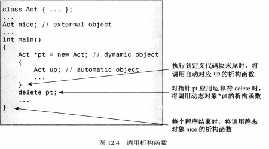
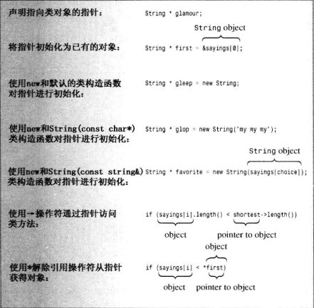
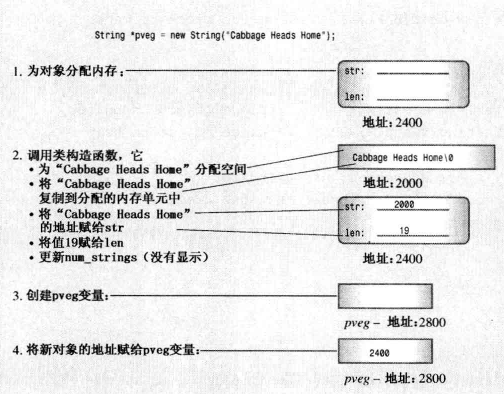

### 对象和类

访问控制
>
* 公有成员函数时程序和对象的私有成员之间的桥梁
* 类声明中关键字private是默认访问控制
* 定义成员函数时，使用作用域解析运算符(::)来标识函数所属的类
* 类方法可以访问类的private组件
* 非限定名只能在类作用域中使用
* 其定义位于类声明中的函数都将自动成为内联函数
  等价于在原型替换定义然后类声明后将定义改写为内联函数
>

所创建的每个对象都有自己的存储空间，用于存储内部变量和类成员，但同一个类的所有对象共享同一组类方法

类的构造函数和析构函数
>
* 不能初始化是因为数据部分的访问状态是私有
* 类构造函数，专门构造新对象，将值赋给它们的数据成员
* 构造函数与类名相同
* 程序在声明对象时，将自动调用构造函数
* 调用
  - `Stock fluffy_the_cat = Stock("World cabbage", 250, 1.25);`
  - `Stock fluffy_the_cat("Furry Mason", 50, 2.5);
  `
  - `Stock *pstock=new Stock("Electroshock",18,19.0)`
  * 无法使用对象来调用构造函数，因为在构造函数构造出对象之前，对象时不存在的。
  * 默认构造函数 - 如果没提供任何构造函数，则自动提供默认构造函数 `Stock::Stock(){}`
  * 默认构造函数没有初始化，必需提供默认构造函数(不提供任何参数)
   - 提供默认值 `Stock::Stock(const std::string &co="Error", long n=0, double pr=0.0)`
   - 函数重载定义另一个构造函数
  * 隐式的调用默认构造函数不适用扩号
>
析构函数
>
* 对象过期后清理，如new delete
* Stock::~Stock() 类名前加~
* 析构函数也可以没有返回值和声明类型
* 析构函数没有参数
* Stock stock2 = Stock("Boffo Objects", 2, 2.0);
  - 创建并初始化
  - 创建临时对象，然后复制到stock2中，并丢弃临时变量。
  - 对已存在的赋值创建临时对象
* 列表初始化
* const 
  - 声明 void show() const;
  - 定义 void stock::show() const
* 接受一个参数的构造函数允许使用赋值语句将对象初始化为一个值 `Classneme object=value;`
>

this 指针
>
* this指针指向用来调用成员函数的对象 this->成员
* 每个成员函数(包括构造函数和析构函数)都有一个this指针，this指向调用对象 \*this,在函数的扩号后面使用const限定符将this限定为const
* 举例
```cpp
const Stock &Stock::topval(const Stock &s) const
{
  if (s.total_val > total_val)
    return s;
  else
    return *this;
}
```
>


存储格式
>
* 全局数据区
* 代码区 - 类成员函数和非成员函数
* 栈区
* 堆区
>

重载运算符
>
* operatorop(argument-list) operator+(),operator[]()
```cpp
//头文件声明
Time operator+(const Time &t) const;
//定义
Time Time::operator+(const Time &t) const
{
  Time sum;
  sum.minutes = minutes + t.minutes;
  sum.hours = hours + t.hours + sum.minutes / 60;
  sum.minutes %= 60;
  return sum;
}
//使用
total = coding + fixing;
total = coding.operator+(fixing);

total=t1+t2+t3 
     =t1.operator+(t2+t3)
     =t1.operator+(t2.operator+(t3))
```
>

重载限制
>
* 重载后的运算符必需至少有一个操作数是用户定义的类型，防止用户为标准类型重载运算符
* 使用运算符时不能违反运算符原来的句法规则
* 不能创建新运算符，不能修改运算符的优先级
* 不能重载下面的运算符
  - sizeof
  - . 成员运算符
  - .* 成员指针运算符
  - :: 作用域运算符
  - ?: 条件运算符
  - typeid 一个RTTI运算符
  - const_cast 强制类型转换运算符
  - dynamic_cast 强制类型转换运算符
  - reinterpret_cast 强制类型转换运算符
  - static_cast 强制类型转换运算符
* 可重载运算符(只能通过成员函数进行重载)
  - = 赋值运算符
  - () 函数调用运算符
  - [] 下标运算符
  - -> 通过指针访问类成员运算符
* 可重载运算符

 
 
>

友元
>
* 友元函数 友元类 友元成员函数
* 将圆形放在类声明中，并在原型声明前加上关键字friend
 - `friend Time opreator*(double m,const Time &t);`
 - 虽在类声明中声明但不是成员函数，不能用成员运算符调用
 - 虽不是成员函数，但它与成员函数的访问权限相同
* 可以再非友元函数中使用友元函数
* << 重载 (操作数和类型)
 - `void opreator<<(ostream &os,const Time &t){} - cout<<trip`;
 - ostream & opreator<<(ostream &os,const Time &t){return os }
>

重载运算符:友元还是非友元函数
>
* 非成员版本的重载运算符函数所需的形参数目与运算符使用的操作符数目相同
* 成员版本所需的参数数目少一个
* 只能声明其中一种情况
>

>
* 重载运算符 []
```cpp
char & String::opreator[](int i)
{
	return str[i];
}

const char & String::opreator[](int i) const
{
	return str[i];
}
```
>

静态类成员函数
>
* 不能通过对象调用静态成员函数，不能用this指针---在private中
* 可以通过类名和作用域解析运算符来调运---在public中
* 静态成员函数只能使用静态数据成员
* 只有一个参数的构造函数被用作转换函数
* 必须在程序开头初始化 Class::static=0;
>

构造函数使用new
>
* 构造函数有new初始化指针成员，则在析构函数中用delete
* new 对于delete ，new[]对应delete[]
* delete 可以用于空指针
* 定义一个复制构造函数，深度复制(创建新对象)
  ```cpp
  String::String(const String &st)
	{
	  num_strings++;
	  len = st.len;
	  str = new char[len + 1];
	  std::strcpy(str, st.str);
	}
  ```
* 赋值运算，深度复制，检查自我赋值，删除旧的
 ```cpp
 String &String::operator=(const String &st)
	{
	  if (this == &st)
	    return *this;
	  delete[] str;
	  len = st.len;
	  str = new char[len + 1];
	  std::strcpy(str, st.str);
	  return *this;
	}
 ```
* 默认构造函数
 ```cpp
 String::String()
 {
 	len=0;
 	str=0;//or ,with C++11,str=nullptr;
 }
 String::String()
 {
 	num_strings++;
 	static const char *s="C++";
 	len = std::strlen(s);
  str = new char[len + 1];
  std::strcpy(str, st.str);
 }
 ```
 * 返回引用避免复制构造函数，但引用必需存在
 * operator<<(cout,sl)的返回类型必须是ostream &，因为ostream类没有公有的复制构造函数
 * 如果被返回的对象是被调用函数中的局部变量，不应按引用方式返回
 * 允许右值赋值，通过临时对象
 * Class_name * pclass=new Class_name(value)
   调用 Class_name(Type_name);
   Class_name \*ptr=new Class_name调用默认构造函数



* 静态只能访问静态，动态可以访问静态和动态
>

new 定位符用于对象
>
* 在创建第二个对象时，定位new运算符使用一个新对象来覆盖用于第一个对象的内存单元
* delete []buffer时，不会为使用定位new运算符创建的对象调用析构函数
* delete ptr时(第一个定位),删除的是buffer，同时delete[]
与delete可能冲突
* 显示的调用析构函数 pc1->~JustTesting();
>
在类声明中声明的结构、类或枚举被称为是被嵌套在类中，其作用域为整个类。这种声明不会创建数据对象，而只是指定了可以再类中使用的类型
如果声明是在类的私有部分进行的，则只能在这个类使用被声明的类型
如果声明是在公有部分进行的，可以从类的外部通过作用域解析运算符使用被声明的类型
---
初始化列表
>
* 初始化列表：对常量初始化,只有构造函数可以使用这种方式     被声明为const类成员和引用的类成员，必须这种语法
```cpp
Queue::Queue(int qs):qsize(qs)
{
	front=rear=NULL;
	items=0;
}
Queue::Queue(int qs):qsize(qs),front(NULL),rear(NULL),items(0)
{
}
```
* 初始化是在对象创建时完成，此时还未执行扩号中的任何代码
* 这种格式只能用于构造函数
* 必需用这种格式来初始化非静态const数据成员
* 必须用这种格式初始化引用数据成员
* 数据成员被初始化的顺序与他们出现在类声明中的顺序相同，与初始化器中的顺序无关
* c++11允许类内初始化
	```cpp
	class Queue
	{
		private:
		...
		  Node * front=NULL;
		  enum{Q_SIZE=10};
		  Node *rear=NULL;
		  int items=0;
		  const int qsize=Q_SIZE;
	}
	```
>