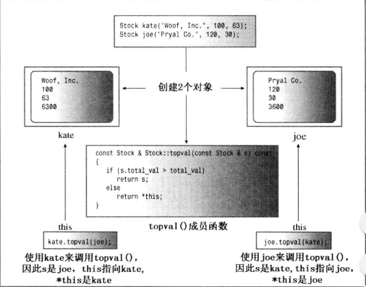
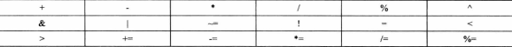
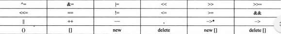

### 对象和类

访问控制
>
* 公有成员函数时程序和对象的私有成员之间的桥梁
* 类声明中关键字private是默认访问控制
* 定义成员函数时，使用作用域解析运算符(::)来标识函数所属的类
* 类方法可以访问类的private组件
* 非限定名只能在类作用域中使用
* 其定义位于类声明中的函数都将自动成为内联函数
  等价于在原型替换定义然后类声明后将定义改写为内联函数
>

所创建的每个对象都有自己的存储空间，用于存储内部变量和类成员，但同一个类的所有对象共享同一组类方法

类的构造函数和析构函数
>
* 不能初始化是因为数据部分的访问状态是私有
* 类构造函数，专门构造新对象，将值赋给它们的数据成员
* 构造函数与类名相同
* 程序在声明对象时，将自动调用构造函数
* 调用
  - `Stock fluffy_the_cat = Stock("World cabbage", 250, 1.25);`
  - `Stock fluffy_the_cat("Furry Mason", 50, 2.5);
  `
  - `Stock *pstock=new Stock("Electroshock",18,19.0)`
  * 无法使用对象来调用构造函数，因为在构造函数构造出对象之前，对象时不存在的。
  * 默认构造函数 - 如果没提供任何构造函数，则自动提供默认构造函数 `Stock::Stock(){}`
  * 默认构造函数没有初始化，必需提供默认构造函数(不提供任何参数)
   - 提供默认值 `Stock::Stock(const std::string &co="Error", long n=0, double pr=0.0)`
   - 函数重载定义另一个构造函数
  * 隐式的调用默认构造函数不适用扩号
>
析构函数
>
* 对象过期后清理，如new delete
* Stock::~Stock() 类名前加~
* 析构函数也可以没有返回值和声明类型
* 析构函数没有参数
* Stock stock2 = Stock("Boffo Objects", 2, 2.0);
  - 创建并初始化
  - 创建临时对象，然后复制到stock2中，并丢弃临时变量。
  - 对已存在的赋值创建临时对象
* 列表初始化
* const 
  - 声明 void show() const;
  - 定义 void stock::show() const
* 接受一个参数的构造函数允许使用赋值语句将对象初始化为一个值 `Classneme object=value;`
>

this 指针
>
* this指针指向用来调用成员函数的对象 this->成员
* 每个成员函数(包括构造函数和析构函数)都有一个this指针，this指向调用对象 \*this,在函数的扩号后面使用const限定符将this限定为const
* 举例
```cpp
const Stock &Stock::topval(const Stock &s) const
{
  if (s.total_val > total_val)
    return s;
  else
    return *this;
}
```
>



存储格式
>
* 全局数据区
* 代码区 - 类成员函数和非成员函数
* 栈区
* 堆区
>

重载运算符
>
* operatorop(argument-list) operator+(),operator[]()
```cpp
//头文件声明
Time operator+(const Time &t) const;
//定义
Time Time::operator+(const Time &t) const
{
  Time sum;
  sum.minutes = minutes + t.minutes;
  sum.hours = hours + t.hours + sum.minutes / 60;
  sum.minutes %= 60;
  return sum;
}
//使用
total = coding + fixing;
total = coding.operator+(fixing);

total=t1+t2+t3 
     =t1.operator+(t2+t3)
     =t1.operator+(t2.operator+(t3))
```
>

重载限制
>
* 重载后的运算符必需至少有一个操作数是用户定义的类型，防止用户为标准类型重载运算符
* 使用运算符时不能违反运算符原来的句法规则
* 不能创建新运算符，不能修改运算符的优先级
* 不能重载下面的运算符
  - sizeof
  - . 成员运算符
  - .* 成员指针运算符
  - :: 作用域运算符
  - ?: 条件运算符
  - typeid 一个RTTI运算符
  - const_cast 强制类型转换运算符
  - dynamic_cast 强制类型转换运算符
  - reinterpret_cast 强制类型转换运算符
  - static_cast 强制类型转换运算符
* 可重载运算符(只能通过成员函数进行重载)
  - = 赋值运算符
  - () 函数调用运算符
  - [] 下标运算符
  - -> 通过指针访问类成员运算符
* 可重载运算符

 
 
>

友元
>
* 友元函数 友元类 友元成员函数
* 将圆形放在类声明中，并在原型声明前加上关键字friend
 - `friend Time opreator*(double m,const Time &t);`
 - 虽在类声明中声明但不是成员函数，不能用成员运算符调用
 - 虽不是成员函数，但它与成员函数的访问权限相同
* 可以再非友元函数中使用友元函数
* << 重载 (操作数和类型)
 - `void opreator<<(ostream &os,const Time &t){} - cout<<trip`;
 - ostream & opreator<<(ostream &os,const Time &t){return os }
>

重载运算符:友元还是非友元函数
>
* 非成员版本的重载运算符函数所需的形参数目与运算符使用的操作符数目相同
* 成员版本所需的参数数目少一个
* 只能声明其中一种情况
>
