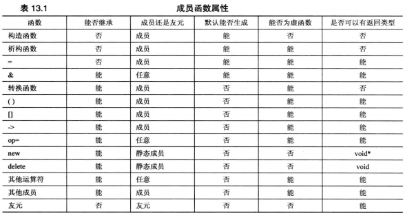

### 类继承
>
* 默认构造函数
  - 派生类会调用基类构造函数，所有基类要有构造函数
* 复制构造函数
  - 将新对象初始化为一个同类对象
  - 按值将对象传递给函数
  - 函数按值返回对象
  - 编译器生成临时对象
* 转换的二义性，要用显示转换，避免隐式转换 explict
* 按引用传递对象的另外一个原因是，在继承使用虚函数时，被定义为接受基类引用参数的函数接受派生类
* 使用const
  ```cpp
  Star::Star(const char *s){}//不改变参数
  void Star::show()const{} //不改变调用他的对象，const Star *this;
  ```
* 什么不能继承
  - 构造函数，通常会使用基类的默认构造函数初始化基类部分数据
  - 析构函数，首先调用派生类析构对象然后调用基类的
  - 赋值运算符是不能继承的
* 赋值运算
  - 基类赋给派生类，一般不支持，为防止为基类使用派生类方法，除非有转换构造函数将基类转换成派生类或赋值给派生类的赋值运算符
  ```cpp
  BrassPlus & BrassPlus::operator=(const Brass &){}
  ```
* 强制类型转换
dynamic_cast<const baseDMA &>(hs);
>

>
* 派生类构造函数必需使用基类构造函数
* 显示调用和隐式调用
```cpp
R:R(r1,r2,r3,r4):B(r2,r3,r4){r1=c;};
R:R(r1,r2,r3,r4){r1=c;}
R:R(r1,r2,r3,r4):B(){r1=c;}
R:R(r1,B &b):B(){r1=c;}
```
* 类智能将值传递回相邻的基类
* 继承：is-a(is a kind of)
* 公有继承不建立has-a关系
* 公有继承不能建立is-like-a关系
* 公有继承不建立is-implemented-as-a(作为--来实现)
* 公有继承不建立uses-a关系
>
实现多态公有继承
>
* 在派生类中重定义基类的方法
* 使用虚方法
* 虚方法(vitual)，使用引用或指针指向的对象的类型来选方法
* 无虚方法,程序将根据引用类型或指针类型选择方法(左边的)
* 方法在基类中被声明为虚的后，它在派生类中将自动成为虚方法
* 虚析构函数，确保释放派生对象时，按正确顺序调用析构函数
* 派生类方法可以调用公有的基类方法
* 没有定义新方法不用使用作用域解析符
>
虚函数virtual
>
* 在基类方法的声明中使用关键字virtual可使该方法在基类以及所有的派生类中是虚的
* 如果使用指向对象的引用或指针来调用虚方法，程序将使用为对象类型定义的方法，而不使用为引用或指针类型定义的方法
* 如果定义的类将被用作基类，则应将那些要在派生类中重新定义的类方法声明为虚的
* 构造函数不能是虚函数，自动调用派生类的构造函数
* 析构函数应当是虚函数，否则调用指针或引用类的构造函数
* 友元不能是虚函数
* 如果派生类没有重新定义函数将使用该函数的基类版本，如果派生类位于派生链中，则将使用最新的虚函数版本
* 重定义将隐藏方法，重新定义继承的方法并不是重载。如果在派生类中重定义函数，并不是使用相同的函数特征标覆盖基类声明，二十隐藏同名的基类方法，不管参数特征标如何

* 返回类型协变，允许返回类型随类类型的变化而变化，返回类型为指向 派生类的引用或指针 ，参数为参数类型，然而基类不可以赋值给派生类（除构造函数）
* 如果基类被重载了，则在派生类中重新定义所有的基类版本
>

访问控制 projected
>
* 在类外只能用公有类成员来访问projected部分的成员
* 派生类的成员可以直接访问基类的保护成员，但不能直接访问基类的私有成员
>
抽象基类(abstract base class,ABC)
>
* 纯虚函数声明
  ```cpp
  virtual double Area()const =0;
  ```
* 当类声明中包含纯虚函数时，不能创建该类的对象
* c++允许纯虚函数有定义
>

继承和动态内存分配
>
* 派生类不使用new
  默认析构函数合适
  默认复制构造函数-->基类的
  默认赋值运算符-->基类的
* 派生类使用new
  必须为派生类定义显示析构函数、复制构造函数、赋值运算符
  ```cpp
  baseDMA::~baseDMA()
  {
  	delete []label;
  }
  hasDMA::~hasDMA()
  {
  	delete []style;
  }
  ```
  ```cpp
  显示调用基类的复制构造函数
  hasDMA::hasDMA(const hasDMA & hs):baseDMA(hs)
  {
  	style=new char[std::strlen(hs.style)+1];

  }
  ```
  赋值运算符，显示调用基类对象的复制运算符
  ```cpp
  baseDMA &baseDMA::operator=(const baseDMA &rs)
  {
  	if(this==&rs)
  		return *this;
    delete [] label;
    label=new char[std::strlen(hs.label)+1];
    std::strcpy(label,hs.label);
    return *this;
  }
  hasDMA & hasDMA::operator=(const hasDMA &hs)
  {
  	if(this==&hs)
  		return *this;
    baseDMA::operator=(hs);//*this=hs
    delete []style;
    style=new char[std::strlen(hs.style)+1];
    std::strcpy(style,hs.style);
    return *this;
  }
  ```
* 派生类析构函数自动调用基类的析构函数

>