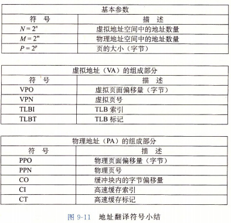
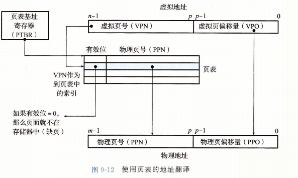
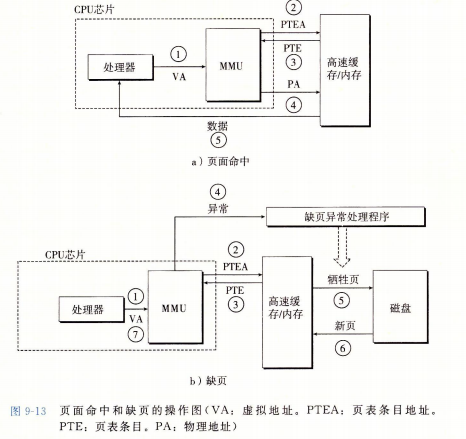

## 
虚拟内存

### 基本概念
* 主存的每个字节都有一个选自虚拟地址空间的虚拟地址和衣一个选自物理地址空间的物理地址

### 地址翻译
* 地址翻译符号

* 使用页表的地址翻译

* 页面命中时，CPU硬件执行的步骤
  1. 处理器生成一个虚拟地址，并把它传送给MMU
  2. MMU生成PTE地址，并从高速缓存/主存请求得到它
  3. 高速缓存/主存向MMU返回返回PTE
  4. MMU构造物理地址并把它传送给高速缓存/主存
  5. 高速缓存/主存返回所请求的数据字给处理器

* 页面未命中
  1. 1-3同命中
  4. PTE中的有效位为0，所以MMU触发一次异常，传递给CPU中的控制到操作系统内核中的缺页异常处理程序
  5. 缺页处理程序找出牺牲页，已修改的换出磁盘
  6. 缺页处理程序调入新页面，并更新内存中的PTE
  7. 再次执行导致缺页的指令，同命中