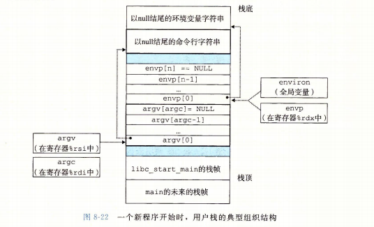
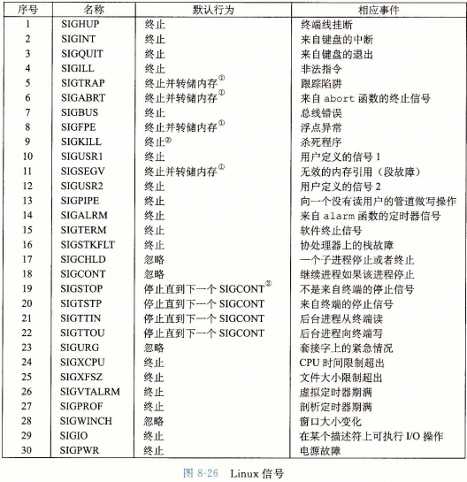
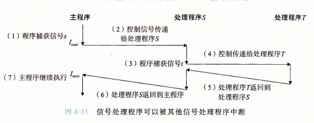

```sh
$ g++ -E main.cpp -o main.i

$ g++ -S main.i -o main.s
$ g++ -S main.i -o main.debug.s --ggdb -g3

$ as main.s -o main.as.o
$ as main.debug.s -o main.as.debug.o

$ gcc -c #编译和汇编但不要链接
$ gcc -static -o prog2c main2.o -L. -lvector # -static 告诉编译器驱动程序，链接器应该构建一个完全链接的可执行目标文件，-lvector 是 libvector.a 的缩写，-L.参数告诉链接器在当前目录下查找libvector.a

$ gcc -shared -fpic -o libvector.so addvec.c multvec.c # -fpic指示编译器生成与位置无关的代码，-shared指示链接器创建一个共享的目标文件
```

### 处理目标文件的工具
* AR 创建静态库，插入、删除、列出和提取成员
* STRINGS 列出一个目标文件中所有可打印的字符串
* STRIP 从目标文件中删除符号表信息
* NM 列出一个目标文件的符号表中定义的符号
* SIZE 列出目标文件中节的名字和大小
* READELF 显示一个目标文件的完整结构，包括ELF头中的所有信息。
* OBJDUMP 所有二进制工具之母。能够显示一个目标文件中的所有的信息。最大作用是反汇编.text节中的二进制指令
* LDD 列出一个可执行文件在运行时所需的共享库

### 异常处理
* 获取进程ID 
```c
#include <sys/types.h>
#include <unistd.h>
pid_t getpid(void);
pid_t getppid(void);
```
* 创建和终止进程
  - 运行 可被调度
  - 停止 挂起不可被调度,SIGSTOP,SIGTSTP,SIGTTIN,SIGTTOU进程终止，SIGCONT进程开始运行
  - 终止 1) 信号终止 2)从主程序返回 3)调用exit函数
  - 创建子进程 fork() 执行一次返回两次，分别在父进程中自己的PID 自己进程0
* 等待它的子进程终止或停止
  - options[WNOHANG,WUNTRACED,WCONTINUED]
```c
#include <sys/types.h>
#include <sys/wait.h>
/*如果成功，为子进程PID，如果WNOHANG,则为0，如果其他错误，为-1*/
/*如果pid>0 单独子进程，如果pid=-1，那么等待集合就是由父进程所有的子进程组成的*/
pid_t waitpid(pid_t pid,int *statusp,int options);
```
**waitpid()会暂时听指挥目前进程的执行，直到有信号来到或子进程结束，如果调用时子进程已经结束，则wait()会立即返回子进程结束状态值，子进程的状态值会由参数statusp返回，而子进程的进程识别码也一同返回。如果不在意结束状态值，则参数status可以设成NULL，参数pid为欲等待的子进程识别码，成功返回pid失败返回-1如果有错误发生失败原因存于errno**

|参数|含义|返回
|----|---|----
|**pid**|**|**
|<-1|等待进程组识别码为pid绝对值的任何子进程|
|=-1|等待任何子进程相当于wait|
|>0|单独子进程，进程id等与pid|
|=-1|所有子进程组成|
|**statusp**|**|**
|WIFEXITED(status)|子进程exit或return正常终止|真
|WEXITSTATUS(status)|只有WIFEXITED()为真|正常终止的子进程的退出状态
|WIFSIGNALED(status)|子进程未被捕获信号终止|真
|WTERMSIG(status)|只有在WIFSIGNALED()为真|导致终止的信号的编号
|WIFSTOPPED(status)|引起返回的子进程当前是停止的|真
|WSTOPSIG(status)|WIFSTOPPED()为真|引起子进程停止的信号的编号
|**options**|**|**
|WNOHANG|等待集合中任何子进程都没终止立即返回|0
|WUNTRACED|挂起调用进程的执行，直到一个进程变成已终止或停止|被终止进程的pid
|WCONTINUED|挂起调用进程,直到一个正在运行的进程终止或收到SIGCONT重新开始|
|WNOHANG \| WCONTINUED |或|0或pid


* wait(\*status)相当于 waitpid(-1,&status,0)
```c
#include <sys/types.h>
#include <sys/wait.h>
pid_t wait(int *statusp);
```

* 让进程休眠
```c
/*返回0或还要休眠的秒数*/
#include <unistd.h>
unsigned int sleep(unsigned int secs);
```

* 让进程暂停
```c
#include <unistd.h>
int pause(void);
```

* 在当前上下文中加载并运行程序

```c
/*成功不返回，错误返回-1*/
#include <unistd.h>
#include <stdlib.h>
int execve(const char *filename,const char *argv[], const char *envp[]);
/*argc argv[]数组中非空指针的数量*/
int main(int argc,char **argv,char **envp);
int main(int argc,char *argv,char *envp[]);
/*在环境数组中搜索字符串name=value*/
//如果找到返回否则NULL
char *getenv(const char *name);

int setenv(const char *name,const char *newvalue,int overwrite);
void unsetenv(const char *name);
```




* 信号



```c
#include <unistd.h>
//获得进程组id
int getpgrp(void);
//改变自己活其他进程的进程组 0 成功 -1失败
//pid 0 使用当前进程PID,pgid 0 用pid指定的进程的PID作为进程组ID
int setpgid(pid_t pid,pid_t pgid);
```

* /bin/kill -9 15213  进程  
/bin/kill -9 -15213 进程组中所有进程

```c
#include <sys/types.h>
#include <signal.h>
//pid >0 进程pid =0 调用进程所在组所有进程 <0 进程组|pid|中每个进程
int kill(pid_t pid,int sig);
```

* alarm 发出信号
```c
#include <unistd.h>
unsigned int alarm(unsigned int secs);
```

* signal
```c
#include <signal.h>
typedef void(*sighandler_t)(int);
//成功 指向前次处理程序的指针，出错为SIG_ERR
//handler SIG_IGN 忽略 SIG_DFL 恢复默认 其他 调用
sighandler_t signal(int signum,sighandler_t handler);
```


* 阻塞和解除阻塞信号

```c
#include <signal.h>

//0 成功 -1 出错
//how SIG_BLOCK blocked=blocked|set SIG_UNBLOCK blocked=blocked&~set SIG_SETMASK block=set
int sigprocmask(int how,const sigset_t *set,sigset_t *oldset);
//初始化set为空
int sigemptyset(sigset_t *set);
//把每个信号都添加到set中
int sigfillset(sigset_t *set);
//把signum添加到set
int sigaddset(sigset_t *set,int signum);
//从set删除signum
int sigdelset(sigset_t *set,int signum);
//1 signum是set成员 0 不是 -1 出错
int sigismember(const sigset_t *set,int signum);
```


* sigsuspend函数
暂时用mask替换当前的阻塞集合，然后挂起该进程，知道收到一个信号  
处理程序：从处理程序返回
终止程序：直接终止

```c
#include <signal.h>
int sigsuspend(const sigset_t *mask);
//相当于下面的原子版本
sigprocmask(SIG_SETMASK,&mask,&prev);
pause();
sigprocmask(SIG_SETMASK,&prev,NULL);
```

### 非本地跳转
* `setjmp`在env缓存区中保存当前调用环境，以供后面的longjmp使用，并返回0
* 调用环境包括程序计数器、栈指针、通用目的寄存器
* setjmp返回的值不能被赋值给变量，但可以用在switch或条件语句测试中

* longjmp从env缓存区中恢复调用环境，然后触发一个从最近一次初始化env的setjmp调用的返回

```c
#include <setjmp.h>
int setjmp(jum_buf env);
int sigsetjmp(sigjmp_buf env,int savesigs);

void longjmp(jum_buf env,int retval);
void siglongjmp(sigjmp_buf env,int retval);
```
[setjmp.c](./setjmp.c)

### 操作进程的工具
* STRACE 
* ps 列出当前系统中的进程(包括僵死进程)
* top 打印出关于当前进程资源使用的信息
* pmap 显示进程的内存映射