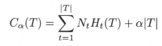

### 评估方法(数据量足够，前两个)
  * 留出法 - 均匀分布/数据分布的一致性
  * 交叉验证法
  * 自助法 lim(1-1/m)^m = 1/e ≈ 0.368

### 性能度量
  * 均方误差  1/m ∑(f(xi)-yi)^2 ( 0< i ≤ m)
  * 错误率与精度

  

  * 查准率、查全率与F1

  

  

  

  * ROC与AUC

    - 真正例率 TPR=TP/(TP+FN)
    - 假正例率 FNR=FP/(TN+FP)

    

  * 代价敏感错误率与代价曲线

    
    
    

    - ROC每个点 绘制一条线  (TPR,FPR) ->FNR -> (0,FPR) ~ (1,FNR)

    

### 比较检验
  * 错误率为性能度量 ε
  * 已知测试错误率，泛化错误率的分布
  
  

  

  * t检测
  * 交叉验证t检验
  * McNemar检验
  * Friedman检验与Nemenyi后续检验

### 偏差与方差
  

